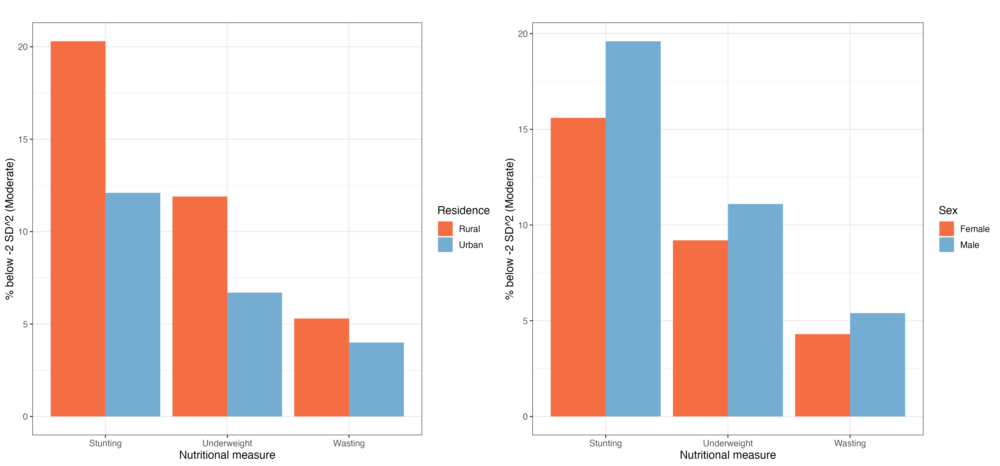
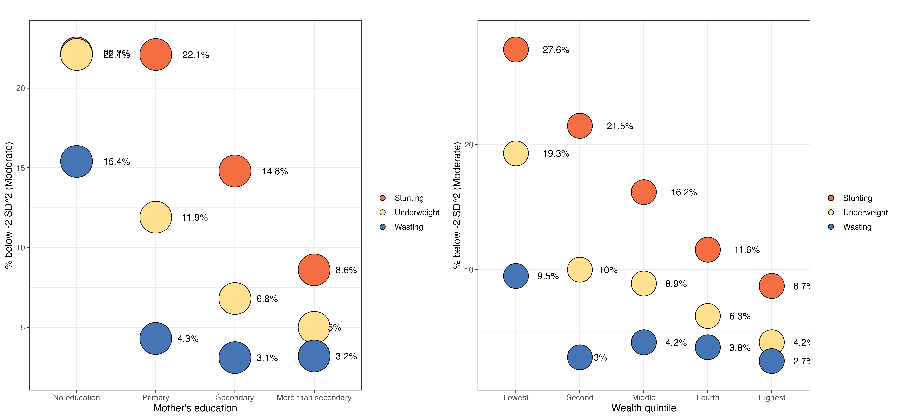
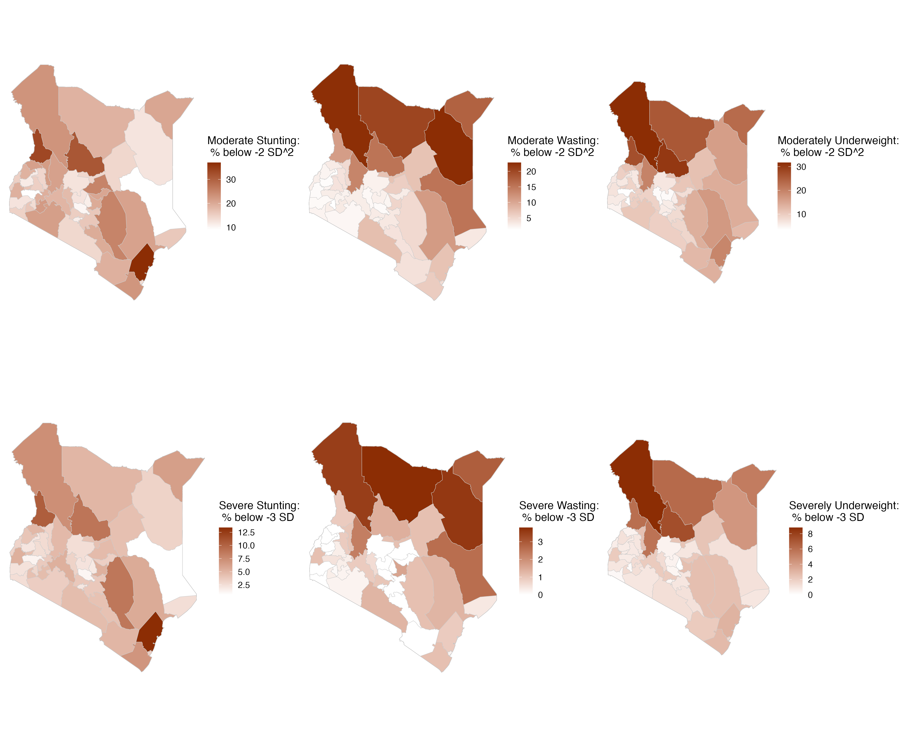
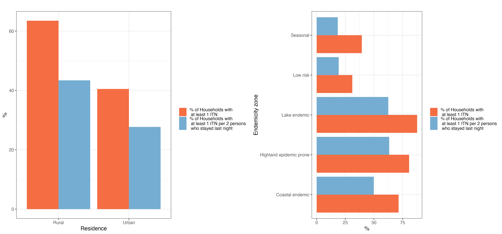
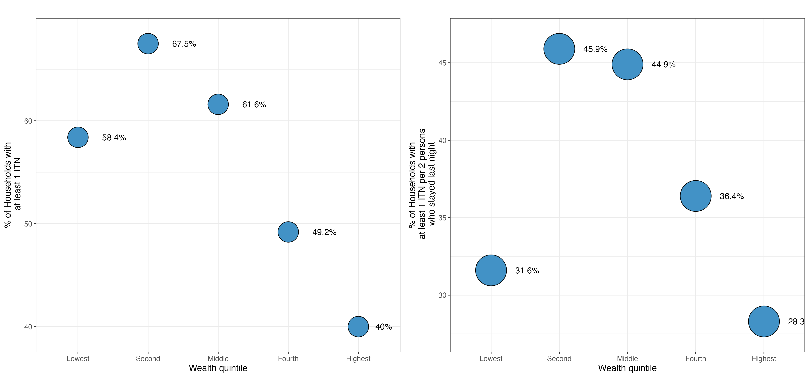
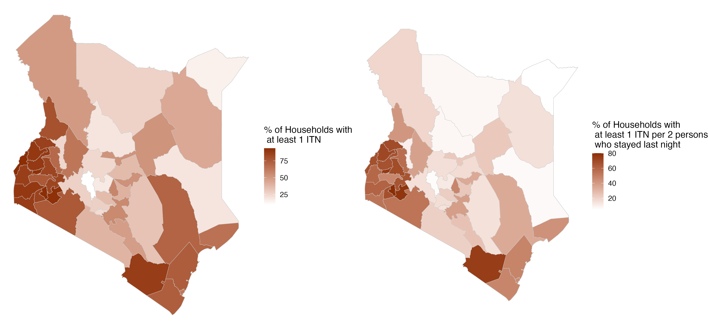
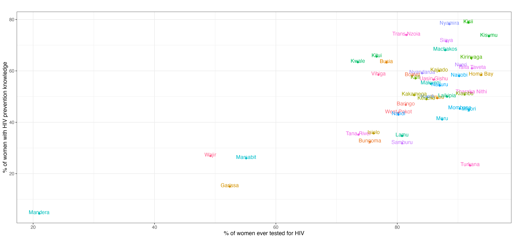

```{r setup, include=FALSE}
knitr::opts_chunk$set(echo = TRUE)

## Load packages
library(foreign)
library(tidyverse)
library(janitor)
library(haven)
library(sjPlot)
library(arsenal)
library(sf)
library(knitr)
library(DHS.rates)
library(gghighlight)
library(tidyverse)
library(haven)
```

```{r, include=FALSE}
## call data
nut_age <- read_csv("table14_nutr_status_by_age.csv")
nut_sex <- read_csv("table14_nutr_status_by_sex.csv")%>%
  mutate(measure=ifelse(indicator%in%"HFA","Stunting", ifelse(indicator%in%"WFH","Wasting","Underweight")))%>%
  mutate(lab = str_c(perc_below2sd,"%"))
nut_res <- read_csv("table14_nutr_status_by_residence.csv")%>%
  mutate(measure=ifelse(indicator%in%"HFA","Stunting", ifelse(indicator%in%"WFH","Wasting","Underweight")))%>%
  mutate(lab = str_c(perc_below2sd,"%"))
nut_motedu <- read_csv("table14_nutr_status_by_mother_edu.csv")%>%
  mutate(`Mother's education`=as.factor(fct_relevel(`Mother's education`, c("No education", "Primary", "Secondary", "More than secondary"))))%>%
  mutate(measure=ifelse(indicator%in%"HFA","Stunting", ifelse(indicator%in%"WFH","Wasting","Underweight")))%>%
  mutate(lab = str_c(perc_below2sd,"%"))
nut_wealth <- read_csv("table14_nutr_status_by_wealth.csv")%>%
  mutate(`Wealth quintile`=as.factor(fct_relevel(`Wealth quintile`, c("Lowest", "Second", "Middle", "Fourth", "Highest"))))%>%
  mutate(measure=ifelse(indicator%in%"HFA","Stunting", ifelse(indicator%in%"WFH","Wasting","Underweight")))%>%
  mutate(lab = str_c(perc_below2sd,"%"))
nutc <- read_csv("table14C_nutr_status_by_county.csv")%>%
  mutate(County=recode(County,"Tharaka-Nithi"="Tharaka Nithi", "Elgeyo/Marakwet"="Elgeyo Marakwet","Murang’a"="Muranga",
                       "Nairobi City"="Nairobi","Taita/Taveta"="Taita Taveta"))

itn_res <- read_csv("table18_ITN_by_residence.csv")%>%
  mutate(lab1 = str_c(perc_atleast_1itn,"%"))%>%
  mutate(lab2 = str_c(perc_atleast_1itn_2pple,"%"))
itn_endem <- read_csv("table18_ITN_by_endemicity_zone.csv")%>%
  mutate(lab1 = str_c(perc_atleast_1itn,"%"))%>%
  mutate(lab2 = str_c(perc_atleast_1itn_2pple,"%"))
itn_wealth <- read_csv("table18_ITN_by_wealth_quintile.csv")%>%
  mutate(`Wealth quintile`=as.factor(fct_relevel(`Wealth quintile`, c("Lowest", "Second", "Middle", "Fourth", "Highest"))))%>%
  mutate(lab1 = str_c(perc_atleast_1itn,"%"))%>%
  mutate(lab2 = str_c(perc_atleast_1itn_2pple,"%"))
itnc <- read_csv("table18C_ITN_by_county.csv")%>%
  mutate(County=recode(County,"Tharaka-Nithi"="Tharaka Nithi", "Elgeyo/Marakwet"="Elgeyo Marakwet","Murang’a"="Muranga",
                       "Nairobi City"="Nairobi","Taita/Taveta"="Taita Taveta"))

county <- st_read("./Kenya County shapefiles/County.shp")%>%
  mutate(region=ifelse(Name%in%c("Kilifi","Kwale","Lamu", "Mombasa", "Taita Taveta", "Tana River"),"Coast", ifelse(Name%in%c("Garissa", "Mandera", "Wajir"),"North Eastern", ifelse(Name%in%c("Marsabit","Isiolo","Meru","Tharaka Nithi","Embu","Kitui","Machakos","Makueni"),"Eastern", ifelse(Name%in%c("Kiambu", "Kirinyaga","Muranga","Nyandarua", "Nyeri"),"Central", ifelse(Name%in%c("Bungoma",
 "Busia","Kakamega","Vihiga"),"Western", ifelse(Name%in%c("Kisumu", "Siaya","Homa Bay","Kisii", "Migori","Nyamira"),"Nyanza", ifelse(Name%in%"Nairobi","Nairobi", "Rift Valley"))))))))%>%
  rename(County=Name)
```

```{r nutrition, include=FALSE}
### maps
nutc1 <- full_join(county, nutc, by="County")%>%
  mutate(names1=paste0(County,", ", perc_below3sd,"%"))%>%
  mutate(names2=paste0(County,", ", perc_below2sd,"%"))

hfa_map1 <- ggplot(nutc1%>%filter(indicator%in%"HFA"))+
  geom_sf(data=nutc1, aes(geometry=geometry), fill=NA)+
  geom_sf(aes(fill=perc_below3sd),color="grey80", size=0.0)+
  theme_void()+
  scale_fill_gradient(low = "white", high = "#8c2d04")+
  labs(x="", y="",fill="Severe Stunting:\n % below -3 SD")+
  theme(text=element_text(size=14))

hfa_map2 <- ggplot(nutc1%>%filter(indicator%in%"HFA"))+
  geom_sf(data=nutc1, aes(geometry=geometry), fill=NA)+
  geom_sf(aes(fill=perc_below2sd),color="grey80", size=0.0)+
  theme_void()+
  scale_fill_gradient(low = "white", high = "#8c2d04")+
  labs(x="", y="",fill="Moderate Stunting:\n % below -2 SD^2")+
  theme(text=element_text(size=14))

wfh_map1 <- ggplot(nutc1%>%filter(indicator%in%"WFH"))+
  geom_sf(data=nutc1, aes(geometry=geometry), fill=NA)+
  geom_sf(aes(fill=perc_below3sd),color="grey80", size=0.0)+
  theme_void()+
  scale_fill_gradient(low = "white", high = "#8c2d04")+
  labs(x="", y="",fill="Severe Wasting:\n % below -3 SD")+
  theme(text=element_text(size=14))

wfh_map2 <- ggplot(nutc1%>%filter(indicator%in%"WFH"))+
  geom_sf(data=nutc1, aes(geometry=geometry), fill=NA)+
  geom_sf(aes(fill=perc_below2sd),color="grey80", size=0.0)+
  theme_void()+
  scale_fill_gradient(low = "white", high = "#8c2d04")+
  labs(x="", y="",fill="Moderate Wasting:\n % below -2 SD^2")+
  theme(text=element_text(size=14))

wfa_map1 <- ggplot(nutc1%>%filter(indicator%in%"WFA"))+
  geom_sf(data=nutc1, aes(geometry=geometry), fill=NA)+
  geom_sf(aes(fill=perc_below3sd),color="grey80", size=0.0)+
  theme_void()+
  scale_fill_gradient(low = "white", high = "#8c2d04")+
  labs(x="", y="",fill="Severely Underweight:\n % below -3 SD")+
  theme(text=element_text(size=14))

wfa_map2 <- ggplot(nutc1%>%filter(indicator%in%"WFA"))+
  geom_sf(data=nutc1, aes(geometry=geometry), fill=NA)+
  geom_sf(aes(fill=perc_below2sd),color="grey80", size=0.0)+
  theme_void()+
  scale_fill_gradient(low = "white", high = "#8c2d04")+
  labs(x="", y="",fill="Moderately Underweight:\n % below -2 SD^2")+
  theme(text=element_text(size=14))

#nutrc_maps<-gridExtra::grid.arrange(hfa_map2,wfh_map2,wfa_map2,hfa_map1,wfh_map1,wfa_map1,nrow=2,ncol=3)
#ggsave("Nutrition maps.png",nutrc_maps, width = 16, height=13)

### bars

nut_res_plot <- ggplot(nut_res,aes(x=measure, y=perc_below2sd, fill=Residence))+
  geom_bar(position="dodge", stat="identity")+
  theme_bw()+
  labs( y="% below -2 SD^2 (Moderate)", title="", x="Nutritional measure", fill="Residence")+
  scale_fill_manual(values = c("#f46d43","#74add1"))+
  theme(text=element_text(size=12))#+
  #geom_text(aes(label = lab), nudge_y = 0.5)+
  #coord_flip()

nut_sex_plot <- ggplot(nut_sex,aes(x=measure, y=perc_below2sd, fill=Sex))+
  geom_bar(position="dodge", stat="identity")+
  theme_bw()+
  labs( y="% below -2 SD^2 (Moderate)", title="", x="Nutritional measure", fill="Sex")+
  scale_fill_manual(values = c("#f46d43","#74add1"))+
  theme(text=element_text(size=12))

# nut_plots <- gridExtra::grid.arrange(nut_res_plot,nut_sex_plot,nrow=1)
# ggsave("Nutrition plots.png",nut_plots, width = 15, height=7)

### dots
nut_motedu_plot <- ggplot(nut_motedu, aes(x=`Mother's education`, y=perc_below2sd, fill=measure)) + 
  geom_dotplot(binaxis='y', stackdir='center', binwidth = 2)+
  #geom_jitter()+
  theme_bw()+
  labs( y="% below -2 SD^2 (Moderate)", title="", x="Mother's education", fill="")+
  scale_fill_manual(values = c("#f46d43","#fee090","#4575b4"))+
  theme(text=element_text(size=12))+
  geom_text(aes(label = lab), hjust=-1.0, size=4) 

nut_wealth_plot <- ggplot(nut_wealth, aes(x=`Wealth quintile`, y=perc_below2sd, fill=measure)) + 
  geom_dotplot(binaxis='y', stackdir='center', binwidth = 2)+
  theme_bw()+
  labs( y="% below -2 SD^2 (Moderate)", title="", x="Wealth quintile", fill="")+
  scale_fill_manual(values = c("#f46d43","#fee090","#4575b4"))+
  theme(text=element_text(size=12))+
  geom_text(aes(label = lab), hjust=-1.0, size=4) 

# nut_dots <- gridExtra::grid.arrange(nut_motedu_plot,nut_wealth_plot,nrow=1)
# ggsave("Nutrition dots.png",nut_dots, width = 15, height=7)
```

```{r ITN, include=FALSE}
### maps
itnc1 <- full_join(county, itnc, by="County")%>%
  mutate(names1=paste0(County,", ", perc_atleast_1itn,"%","\n","Average number of ITNs per HH: ", avrg_itn_hh))%>%
  mutate(names2=paste0(County,", ", perc_atleast_1itn_2pple,"%","\n","Number of HHs with 1 person staying overnight: ", no_hhs_1person_overnight))

itn_map1 <- ggplot(itnc1)+
  geom_sf(data=itnc1, aes(geometry=geometry), fill=NA)+
  geom_sf(aes(fill=perc_atleast_1itn),color="grey80", size=0.0)+
  theme_void()+
  scale_fill_gradient(low = "white", high = "#8c2d04")+
  labs(x="", y="",fill="% of Households with\n at least 1 ITN")+
  theme(text=element_text(size=14))

itn_map2 <- ggplot(itnc1)+
  geom_sf(data=itnc1, aes(geometry=geometry), fill=NA)+
  geom_sf(aes(fill=perc_atleast_1itn_2pple),color="grey80", size=0.0)+
  theme_void()+
  scale_fill_gradient(low = "white", high = "#8c2d04")+
  labs(x="", y="",fill="% of Households with\n at least 1 ITN per 2 persons\n who stayed last night")+
  theme(text=element_text(size=14))

# itn_maps <- gridExtra::grid.arrange(itn_map1,itn_map2,nrow=1)
# ggsave("ITN maps.png",itn_maps, width = 15, height=7)

### plots
itn_res_x <- itn_res%>%
  pivot_longer(cols=c(perc_atleast_1itn,perc_atleast_1itn_2pple), names_to = "classification", values_to = "proportions")%>%
  mutate(classification=recode(classification,"perc_atleast_1itn"="% of Households with\n at least 1 ITN","perc_atleast_1itn_2pple"="% of Households with\n at least 1 ITN per 2 persons\n who stayed last night"))

itn_res1 <- ggplot(itn_res_x,aes(x=Residence, y=proportions, fill=classification))+
  geom_bar(position="dodge", stat="identity")+
  theme_bw()+
  labs( y="%", title="", x="Residence", fill="")+
  scale_fill_manual(values = c("#f46d43","#74add1"))+
  theme(text=element_text(size=12))

# itn_res1 <- ggplot(itn_res,aes(x=reorder(Residence,perc_atleast_1itn), y=perc_atleast_1itn))+
#   geom_col(fill="#4292c6")+
#   theme_bw()+
#   labs( y="% of Households with\n at least 1 ITN", title="", x="Residence")+
#   #scale_fill_brewer(palette = "Set1")+
#   theme(text=element_text(size=12))+
#   coord_flip()+
#   geom_text(aes(label = lab1), nudge_y = 4)
# 
# itn_res2 <- ggplot(itn_res,aes(x=reorder(Residence,perc_atleast_1itn_2pple), y=perc_atleast_1itn_2pple))+
#   geom_col(fill="#4292c6")+
#   theme_bw()+
#   labs( y="% of Households with\n at least 1 ITN per 2 persons\n who stayed last night", title="", x="Residence")+
#   #scale_fill_brewer(palette = "Set1")+
#   theme(text=element_text(size=12))+
#   coord_flip()+
#   geom_text(aes(label = lab2), nudge_y = 4)

# itn_plots <- gridExtra::grid.arrange(itn_res1,itn_res2,nrow=1)
# ggsave("ITN plots.png",itn_plots, width = 15, height=7)

itn_endem_x <- itn_endem%>%
  pivot_longer(cols=c(perc_atleast_1itn,perc_atleast_1itn_2pple), names_to = "classification", values_to = "proportions")%>%
  mutate(classification=recode(classification,"perc_atleast_1itn"="% of Households with\n at least 1 ITN","perc_atleast_1itn_2pple"="% of Households with\n at least 1 ITN per 2 persons\n who stayed last night"))

itn_end1 <- ggplot(itn_endem_x,aes(x=`Endemicity zone`, y=proportions, fill=classification))+
  geom_bar(position="dodge", stat="identity")+
  theme_bw()+
  labs( y="%", title="", x="Endemicity zone", fill="")+
  scale_fill_manual(values = c("#f46d43","#74add1"))+
  theme(text=element_text(size=12))+
  coord_flip()

 #itn_plots2 <- gridExtra::grid.arrange(itn_res1,itn_end1,nrow=1)
 #ggsave("ITN plots2.png",itn_plots2, width = 15, height=7)

# itn_end1 <- ggplot(itn_endem,aes(x=reorder(`Endemicity zone`,perc_atleast_1itn), y=perc_atleast_1itn))+
#   geom_col(fill="#4292c6")+
#   theme_bw()+
#   labs( y="% of Households with\n at least 1 ITN", title="", x="Endemicity zone")+
#   #scale_fill_brewer(palette = "Set1")+
#   theme(text=element_text(size=12))+
#   coord_flip()+
#   geom_text(aes(label = lab1), nudge_y = 4)
# 
# itn_end2 <- ggplot(itn_endem,aes(x=reorder(`Endemicity zone`,perc_atleast_1itn_2pple), y=perc_atleast_1itn_2pple))+
#   geom_col(fill="#4292c6")+
#   theme_bw()+
#   labs( y="% of Households with\n at least 1 ITN per 2 persons\n who stayed last night", title="", x="Endemicity zone")+
#   #scale_fill_brewer(palette = "Set1")+
#   theme(text=element_text(size=12))+
#   coord_flip()+
#   geom_text(aes(label = lab2), nudge_y = 4)

# itn_plots1 <- gridExtra::grid.arrange(itn_end1,itn_end2,nrow=1)
# ggsave("ITN plots1.png",itn_plots1, width = 15, height=7)

### dots
itn_wealth_plot1 <- ggplot(itn_wealth, aes(x=`Wealth quintile`, y=perc_atleast_1itn)) + 
  geom_dotplot(binaxis='y', stackdir='center', binwidth = 2, fill="#4292c6")+
  theme_bw()+
  labs( y="% of Households with\n at least 1 ITN", title="", x="Wealth quintile", fill="")+
  #scale_fill_manual(values = c("#f46d43","#fee090","#4575b4"))+
  theme(text=element_text(size=12))+
  geom_text(aes(label = lab1), hjust=-1.0, size=4) 

itn_wealth_plot2 <- ggplot(itn_wealth, aes(x=`Wealth quintile`, y=perc_atleast_1itn_2pple)) + 
  geom_dotplot(binaxis='y', stackdir='center', binwidth = 2, fill="#4292c6")+
  theme_bw()+
  labs( y="% of Households with\n at least 1 ITN per 2 persons\n who stayed last night", title="", x="Wealth quintile", fill="")+
  #scale_fill_manual(values = c("#f46d43","#fee090","#4575b4"))+
  theme(text=element_text(size=12))+
  geom_text(aes(label = lab2), hjust=-1.0, size=4) 

# itn_dots <- gridExtra::grid.arrange(itn_wealth_plot1,itn_wealth_plot2,nrow=1)
# ggsave("ITN dots.png",itn_dots, width = 15, height=7)
```

## 2022 KDHS Visualizations

### 3.13	Child Nutritional Status (Tables 14 & 14C)







### 3.16: Malaria (Tables 18 & 18C)







```{r comp, include=FALSE, eval=FALSE}
### datasets

#nutrition
nutc <- read_csv("table14C_nutr_status_by_county.csv")%>%
  mutate(County=recode(County,"Tharaka-Nithi"="Tharaka Nithi", "Elgeyo/Marakwet"="Elgeyo Marakwet","Murang’a"="Muranga","Nairobi City"="Nairobi","Taita/Taveta"="Taita Taveta"))

#ITN
itnc <- read_csv("table18C_ITN_by_county.csv")%>%
  mutate(County=recode(County,"Tharaka-Nithi"="Tharaka Nithi", "Elgeyo/Marakwet"="Elgeyo Marakwet","Murang’a"="Muranga","Nairobi City"="Nairobi","Taita/Taveta"="Taita Taveta"))

#family planning
fpc <- read_csv("table8c_fpusemarriedbycounty.csv")%>%
  mutate(County=recode(County,"Tharaka-Nithi"="Tharaka Nithi", "Elgeyo/Marakwet"="Elgeyo Marakwet","Murang’a"="Muranga","Nairobi City"="Nairobi","Taita/Taveta"="Taita Taveta"))

#teenage pregnancy
teenpregc <- read_csv("table6_teenpregnancybycounty.csv")%>%
  mutate(County=recode(County,"Tharaka-Nithi"="Tharaka Nithi", "Elgeyo/Marakwet"="Elgeyo Marakwet","Murang’a"="Muranga","Nairobi City"="Nairobi","Taita/Taveta"="Taita Taveta"))

#violence
violencec <- read_csv("./table_29C-Experience_of_physical_violence_by_county/table_29C_Women.csv")%>% 
  rename(County=`Background characteristic`)%>%
  mutate(County=recode(County,"Tharaka-Nithi"="Tharaka Nithi", "Elgeyo/Marakwet"="Elgeyo Marakwet","Murang’a"="Muranga","Nairobi City"="Nairobi","Taita/Taveta"="Taita Taveta"))%>%
  filter(!County%in%c("Total",NA))

#maternal care  
matcarec <- read_csv("./Edwin Tables/table10Cmaternalcarecounty.csv")%>% 
  rename(County=`NAME_1`)%>%
  mutate(County=recode(County,"Tharaka-Nithi"="Tharaka Nithi", "Elgeyo/Marakwet"="Elgeyo Marakwet","Murang’a"="Muranga","Nairobi City"="Nairobi","Taita/Taveta"="Taita Taveta"))

#vaccination 
vacc <- read_csv("./Edwin Tables/table11C_vaccinationbycounty.csv")%>% 
  rename(County=`NAME_1`)%>%
  mutate(County=recode(County,"Tharaka-Nithi"="Tharaka Nithi", "Elgeyo/Marakwet"="Elgeyo Marakwet","Murang’a"="Muranga","Nairobi City"="Nairobi","Taita/Taveta"="Taita Taveta"))%>%
  mutate(CountyFullyVaccinated24=round(as.numeric(CountyFullyVaccinated24)))

#hiv knowledge
hivc <- read_csv("./Edwin Tables/table23_hiv_count_data.csv")%>% 
  #rename(County=`NAME_1`)%>%
  mutate(County=recode(County,"Tharaka-Nithi"="Tharaka Nithi", "Elgeyo/Marakwet"="Elgeyo Marakwet","Murang’a"="Muranga","Nairobi City"="Nairobi","Taita/Taveta"="Taita Taveta"))

#hiv testing
hiv_testc <- read_csv("./Edwin Tables/table25C .1 and .2_HIV_test_bind.csv")%>% 
  #rename(County=`NAME_1`)%>%
  mutate(County=recode(County,"Tharaka-Nithi"="Tharaka Nithi", "Elgeyo/Marakwet"="Elgeyo Marakwet","Murang’a"="Muranga","Nairobi City"="Nairobi","Taita/Taveta"="Taita Taveta"))

## combine datasets
comb <- nutc%>%left_join(itnc, by="County")%>%
  left_join(fpc, by="County")%>%
  left_join(teenpregc, by="County")%>%
  left_join(violencec, by="County")%>%
  left_join(matcarec, by="County")%>%
  left_join(vacc, by="County")%>%
  left_join(hivc, by="County")%>%
  left_join(hiv_testc, by="County")%>%
  mutate(lab=County)


plot2 <- ggplot(comb%>%filter(indicator%in%"HFA"), aes(x=perc_below2sd, y=Contraceptive_use_any_method,color=County)) + 
  geom_point()+
  theme_bw()+
  labs( y="Contraceptive use", title="", x="% of children severely wasted", fill="")+
  #scale_fill_manual(values = c("#f46d43","#fee090","#4575b4"))+
  theme(text=element_text(size=12), legend.position = "none")+
  geom_text(aes(label = lab), nudge_y = 0.5)

#ggsave("Comparison trial.png",plot2, width = 15, height=7)

plot3 <- ggplot(comb, aes(x=Ever_pregnant, y=Contraceptive_use_any_method,color=County)) + 
  geom_point()+
  theme_bw()+
  labs( y="Contraceptive use", title="", x="Pregnancy history", fill="")+
  #scale_fill_manual(values = c("#f46d43","#fee090","#4575b4"))+
  theme(text=element_text(size=12), legend.position = "none")+
  geom_text(aes(label = lab), nudge_y = 0.5)

#ggsave("Cont_Preg.png",plot3, width = 15, height=7)

plot4 <- ggplot(comb%>%filter(indicator%in%"HFA")%>%filter(!is.na(CountyFullyVaccinated24)), aes(x=perc_below2sd, y=CountyFullyVaccinated24,color=County)) + 
  geom_point()+
  theme_bw()+
  labs( y="Proportion fully vaccinated", title="", x="% of children severely wasted", fill="")+
  #scale_fill_manual(values = c("#f46d43","#fee090","#4575b4"))+
  theme(text=element_text(size=12), legend.position = "none")+
  geom_text(aes(label = lab), nudge_y = 0.5)

#ggsave("maln_vacc.png",plot4, width = 15, height=7)

plot5 <- ggplot(comb%>%filter(Participants.x%in%"Women_15-24")%>%filter(Participants.y%in%"Women"), aes(x=ever_tested, y=hivprevention_knowledge,color=County)) + 
  geom_point()+
  theme_bw()+
  labs( y="% of women with HIV prevention knowledge", title="", x="% of women ever tested for HIV", fill="")+
  #scale_fill_manual(values = c("#f46d43","#fee090","#4575b4"))+
  theme(text=element_text(size=12), legend.position = "none")+
  geom_text(aes(label = lab), nudge_y = 0.5)

#ggsave("hivknow_hivtest.png",plot5, width = 15, height=7)
```

### Comparison of indicators by county (Examples)




### Table 2C: Background xtics by county

```{r}
### men
men_background_xtics_county <- read_csv("table2C_men_backgroundxtics_by_county.csv")

men_background_xtics_county1 <- full_join(county, men_background_xtics_county, by="County")%>%
  mutate(names=paste0(County,", ", weighted_perc,"%"))

men_background_xtics_map <- ggplot(men_background_xtics_county1)+
  geom_sf(data=men_background_xtics_county1, aes(geometry=geometry), fill=NA)+
  geom_sf(aes(fill=weighted_perc),color="grey80", size=0.0)+
  theme_void()+
  scale_fill_gradient(low = "white", high = "#8c2d04")+
  labs(x="", y="",fill="% distribution of men")+
  theme(text=element_text(size=14))

### women
women_background_xtics_county <- read_csv("table2C_women_backgroundxtics_by_county.csv")

women_background_xtics_county1 <- full_join(county, women_background_xtics_county, by="County")%>%
  mutate(names=paste0(County,", ", weighted_perc,"%"))

women_background_xtics_map <- ggplot(women_background_xtics_county1)+
  geom_sf(data=women_background_xtics_county1, aes(geometry=geometry), fill=NA)+
  geom_sf(aes(fill=weighted_perc),color="grey80", size=0.0)+
  theme_void()+
  scale_fill_gradient(low = "white", high = "#8c2d04")+
  labs(x="", y="",fill="% distribution of women")+
  theme(text=element_text(size=14))
```


### Table 6: Teenage pregnancy by background xtics

```{r}
### Age
teen_preg_age <- read_csv("table6_teenpregnancybyage.csv")%>%
  #select(Age, Ever_pregnant, Live_birth)%>%
  #pivot_longer(cols = c(Ever_pregnant, Live_birth), names_to = "classification", values_to = "proportion")%>%
  #mutate(classification=recode(classification,"Ever_pregnant"="% of teenagers who\n have ever been pregnant","Live_birth"="% of teenagers who\n have ever had a live birth"))%>%
  mutate(lab=paste0(Ever_pregnant,"%"))
  

teen_preg_age_plot <- ggplot(teen_preg_age,aes(x=Age, y=Ever_pregnant))+#, fill=classification))+
  geom_col(fill="#74add1")+
  theme_bw()+
  labs( y="Percent (%)", title="", x="Age", fill="")+
  #scale_fill_manual(values = c("#f46d43","#74add1"))+
  theme(text=element_text(size=12))+
  geom_text(aes(label = lab), nudge_y = 0.5)

### Residence
teen_preg_residence <- read_csv("table6_teenpregbyresidence.csv")%>%
  #select(Age, Ever_pregnant, Live_birth)%>%
  #pivot_longer(cols = c(Ever_pregnant, Live_birth), names_to = "classification", values_to = "proportion")%>%
  #mutate(classification=recode(classification,"Ever_pregnant"="% of teenagers who\n have ever been pregnant","Live_birth"="% of teenagers who\n have ever had a live birth"))%>%
  mutate(lab=paste0(Ever_pregnant,"%"))
  

teen_preg_residence_plot <- ggplot(teen_preg_residence,aes(x=Residence, y=Ever_pregnant))+#, fill=classification))+
  geom_col(fill="#74add1")+
  theme_bw()+
  labs( y="Percent (%)", title="", x="Residence", fill="")+
  #scale_fill_manual(values = c("#f46d43","#74add1"))+
  theme(text=element_text(size=12))+
  geom_text(aes(label = lab), nudge_y = 0.5)

### Education
teen_preg_edu <- read_csv("table6_teenpregnancybyeducationstatus.csv")%>%
  #select(Age, Ever_pregnant, Live_birth)%>%
  #pivot_longer(cols = c(Ever_pregnant, Live_birth), names_to = "classification", values_to = "proportion")%>%
  #mutate(classification=recode(classification,"Ever_pregnant"="% of teenagers who\n have ever been pregnant","Live_birth"="% of teenagers who\n have ever had a live birth"))%>%
  mutate(lab=paste0(Ever_pregnant,"%"))%>%
  mutate(Education_status=as.factor(fct_relevel(Education_status, c("No education", "Primary", "Secondary", "More than secondary"))))

teen_preg_edu_plot <- ggplot(teen_preg_edu, aes(x=Education_status, y=Ever_pregnant)) + 
  geom_dotplot(binaxis='y', stackdir='center', binwidth = 2, fill="#4292c6")+
  theme_bw()+
  labs( y="Percent (%)", title="", x="Education Status", fill="")+
  #scale_fill_manual(values = c("#f46d43","#fee090","#4575b4"))+
  theme(text=element_text(size=12))+
  geom_text(aes(label = lab), hjust=-1.0, size=4) 

### Wealth quintile
teen_preg_wealth <- read_csv("table6_teenpregnancybywealthquintile.csv")%>%
  #select(Age, Ever_pregnant, Live_birth)%>%
  #pivot_longer(cols = c(Ever_pregnant, Live_birth), names_to = "classification", values_to = "proportion")%>%
  #mutate(classification=recode(classification,"Ever_pregnant"="% of teenagers who\n have ever been pregnant","Live_birth"="% of teenagers who\n have ever had a live birth"))%>%
  mutate(lab=paste0(Ever_pregnant,"%"))%>%
  mutate(Wealth_quintile=as.factor(fct_relevel(Wealth_quintile, c("Lowest", "Second", "Middle", "Fourth", "Highest"))))

teen_preg_wealth_plot <- ggplot(teen_preg_wealth, aes(x=Wealth_quintile, y=Ever_pregnant)) + 
  geom_dotplot(binaxis='y', stackdir='center', binwidth = 2, fill="#4292c6")+
  theme_bw()+
  labs( y="Percent (%)", title="", x="Wealth Quintile", fill="")+
  #scale_fill_manual(values = c("#f46d43","#fee090","#4575b4"))+
  theme(text=element_text(size=12))+
  geom_text(aes(label = lab), hjust=-1.0, size=4) 
```

### Table 7: Fertility preferences according to no of living children

```{r}
fertility_preferences <- read_csv("table7_fertilitypreferences.csv")%>%
  filter(!`Number of children`%in%"V9")#%>%
fertility_preferences$Desire_children <- gsub("[[:digit:]]", "",fertility_preferences$Desire_children)

fertility_preferences_plot <- ggplot(fertility_preferences,aes(x=`Number of children`, y=Percent, fill=Desire_children))+
  geom_bar(position="dodge", stat="identity")+
  theme_bw()+
  labs( y="Percent (%)", title="", x="Number of children", fill="")+
  scale_fill_brewer(palette = "Set1")+
  theme(text=element_text(size=12))
```

### Table 10: Maternal care indicators by background xtics

```{r}
### Mother's age at birth
matcare_motage_1birth <- read_csv("table10_maternalcare_by_motherage_atbirth.csv")

### Residence
matcare_residence <- read_csv("table10_maternalcare_by_residence.csv")

### Mother's education
matcare_motedu <- read_csv("table10_maternalcare_by_education.csv")

### Wealth
matcare_wealth <- read_csv("table10_maternalcare_by_wealth.csv")

```

