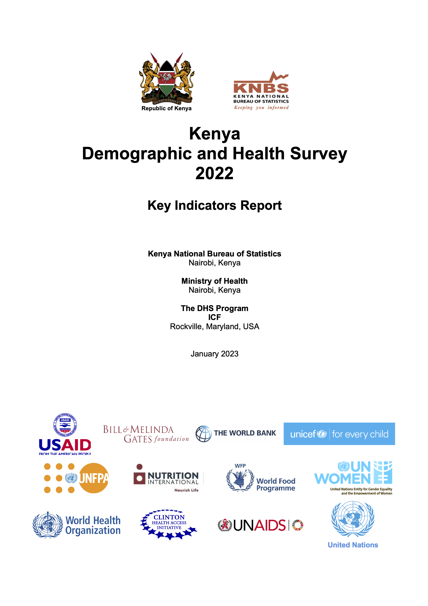

# About

## Column {data-width="400"}

### Report

```{r, fig.width=7.5, fig.height=7.5, fig.align = 'center', fig.cap= "**KNBS and ICF. 2022. Kenya Demographic and Health Survey 2022. Key Indicators Report. Nairobi, Kenya, and Rockville, Maryland, USA: KNBS and ICF.**"}


```

[Link to the report](https://www.knbs.or.ke/download/2022-kdhs-key-indicators-report/#)


## <br>

### About

-   The App uses data from the Key Indicators Report of the 2022 Kenya Demographic and Health Survey (2022 KDHS). The survey was implemented by the Kenya National Bureau of Statistics (KNBS) in collaboration with the Kenya's Ministry of Health (MoH) and other stakeholders.

-   It provides easy-to-use interface to explore 2022 KDHS data using tools such as choropleth maps, bar plots, trend plots. This is a living app that is continuously developed to include comparisons of the current results with those from Demographic and Health Surveys.

-   The analytics and visualizations are created by the [Center for Epidemiological Modelling and Analysis (CEMA)](http://cema-africa.uonbi.ac.ke) at the University of Nairobi, Kenya.

```{r, include=FALSE}

#setwd("~/")
# load all the required packages
library(pacman)
p_load(shiny,flexdashboard, tidyverse,ggiraph, scales, sf, reshape2, cowplot, data.table, classInt)
```

# Sample survey

## Row {data-width="200"}

<br>

###  {.value-box}

```{r}

valueBox(
  value = paste("37,911"),
  caption = "Total Number of Households Interviewed)",
  color = "black"
)
```

###  {.value-box}

```{r}

valueBox(
  value = paste("32,156"),
  caption = "Total Number of Women Interviewed"
)
```

###  {.value-box}

```{r}

valueBox(
  value = paste("14,453"),
  caption = "Total Number of Men Interviewed",
  color = "darkgreen"
)
```

<br>

<br>

## Row {data-height="900"}


### **Summary of the households selected, occupied, and interviewed for the 2022 Kenya Demographic and Health Survey**

The numbers are presented by:

-   Type of questionnaire (full or short questionnaires)
-   Residence: Rural and urban
-   Participants: Men and women

**Choose the category to display:**

```{r, fig.height=10,fig.height=22}

selectInput("quest", "",
             c("Response Rates"="Response Rate",
               "Households"="All",
               "Participants: Men (15-54 years)"="Male",
               "Participants: Women (15-49 years)"="Female"
               ))


totalinterviewvisuals <-fread("data/table_1/table1_kdhshouseholdinterviews1.csv") 


renderPlot({if(input$quest%in%"Response Rate"){
  ggplot(totalinterviewvisuals[totalinterviewvisuals$Participant%in%"Response Rate",], aes(x=Respondents, y=numbers)) + 
  geom_bar(stat = "identity", position = position_dodge(), fill="cyan4") + 
  theme_bw() +
  geom_text(aes(label=paste0(round(numbers), "%")), size=5,hjust=1.5, color="white")+scale_y_continuous(label=comma)+
  coord_flip() + labs(x="Households", y="", fill="Residence")+
  facet_grid(residence~selection) +
  theme(text= element_text(size = 20, colour = "black", face = "bold")) +
  theme(strip.background =element_rect(fill="darkorange"))
        
} else
 ggplot(totalinterviewvisuals[totalinterviewvisuals$Gender%in%input$quest & totalinterviewvisuals$Participant!="Response Rate",], aes(x=Respondents, y=numbers)) + 
  geom_bar(stat = "identity", position = position_dodge(), fill="cyan4") + 
  theme_bw() +
  geom_text(aes(label=format(numbers, big.mark=",")), size=5,hjust=1.5, color="white")+scale_y_continuous(label=comma)+
  coord_flip() + labs(x="Households", y="", fill="Residence")+
  facet_grid(residence~selection) +
  theme(text= element_text(size = 20, colour = "black", face = "bold")) +
  theme(strip.background =element_rect(fill="darkorange"))
        }, width = 1200, height=600) %>%
  bindCache(input$quest)
 


```


<br>

# Household characteristics {data-navmenu="Key Indicators"}

## Row {data-width="400"}

<br>

###  {.value-box}

```{r}

valueBox(
value = paste("26%"),
   caption = "Of women have a form of health insurance",
   color = "#b15928", 
   icon='fa-female,' 
 ) 
```

###  {.value-box}

```{r}
 valueBox( 
   value = paste("26.5%"), 
   caption = "Of men have a form of health insurance", 
   color = "darkgreen", 
   icon='fa-male' 
 )
```

## Column {.tabset .tabset-fade data-height="900"}

### **Health Insurance Coverage**

*Health insurance improves access to quality health care by reducing the costs associated with illness, treatment and care incurred by persons and/or families. The graphics show the percentage of de jure household members with insurance and the type of insurance.*

**Choose the characteristics to display (which will be colored in the legend): **

```{r}
selectInput("health", "",
              c("Age in Years"="Age", 
                "Residence"="Residence", 
                "Wealth quintile"="Wealth quintile"))
```

```{r, include=F}

insurance_county <- fread("data/table_2/table_2_20C_insurance_by_county.csv") 

county <- st_read("shapefiles/County.shp")
insurance_county1 <- full_join(county, insurance_county, by=c("Name"="County"))

```


```{r, fig.width=16 }
# health insurance data by age


insurance <- fread("data_2/table_2/table_2_20_insurance_by_background_xtics.csv")


insurance$Value<- fct_relevel(insurance$Value, 
                                   "Lowest", "Second", "Middle", "Fourth", "Highest")
insurance$`Health Insurance Type` <- fct_relevel(insurance$`Health Insurance Type`, "None/Don't know", "Any", "NHIF", "Community-based", "Private/commercial", "Other")


renderPlot({
  if(input$health%in%c("Wealth quintile", "Age", "Residence")){
    ggplot(insurance[insurance$`Background characteristics`%in%input$health,], aes(x=`Health Insurance Type`, y=Proportion, fill=Value))+geom_bar(stat = 'identity', position = position_dodge())+#,aes(tooltip=paste0(Coverage, "%"))) +
  labs(y="Percent (%)", x="", fill="")+ylim(0,100)+
   coord_flip()+
    theme_bw()+theme(text=element_text(size=16, face = "bold")) +
      scale_fill_brewer(palette = "Set1")+
    geom_text(aes(label=paste0(Proportion,"%")), position=position_dodge(width=1),hjust=-0.2, size=4, color="black")}
  
  else
    { 
  ggplot(insurance_county1)+
  geom_sf(data=insurance_county1, aes(geometry=geometry), fill=NA)+
  geom_sf(aes(fill=Proportion),color="grey80", size=0.0)+
  theme_void()+
  facet_wrap(~`Health Insurance Type`)+
  scale_fill_gradient(low = "white", high = "#8c2d04")+
  labs(x="", y="",fill="Percent (%)")+
  theme(text=element_text(size=14))
  }
}, width=1400, height=700) %>% bindCache(input$health)

```

### **Housing**


**Choose the characteristics to display (which will appear in the vertical axis):**

```{r}
selectInput("housing", "",
              c("Electricity"="Electricity", 
                "Flooring material"="Flooring material", 
                "Rooms for sleeping"="Rooms for sleeping",
                "Smoking frequency in home"="Smoking frequency in home"))
```

```{r}


housing <- fread("data/table_2/table2_1_Housing_by_xtics_2.csv")

housing$Value <-fct_relevel(housing$Value, "Never", "Daily", "Weekly", "Less than once a month", "Monthly")

renderPlot({
    ggplot(housing[housing$Characteristics%in%input$housing], aes(x=Value, y=Proportion, fill=Category))+geom_bar(stat = 'identity', position = position_dodge())+
  labs(y="Percent (%)", x="", fill="")+ylim(0,100)+
    scale_fill_brewer(palette = "Set1")+coord_flip()+
    theme_bw()+theme(text=element_text(size=16, face = "bold")) +
    theme(strip.background =element_rect(fill="darkorange"))+
    geom_text(aes(label=paste0(Proportion, "%")), position=position_dodge(width=1),vjust=0.5,hjust=-0.2, size=4, color="black")
 
}, width=1400, height=600) %>% bindCache(input$housing)


```

### **Cooking**

**Choose the characteristics to display (which will appear in the vertical axis):**

```{r}
selectInput("cooking", "",
              c("Cooking place"="Cooking place", 
                "Cooking technology"="Cooking technology", 
                "Cooking fuel"="Cooking fuel"))
```

```{r }

cooking <- fread("data/table_2/table2_1_Cooking_by_xtics_2.csv")

renderPlot({
    ggplot(cooking[cooking$Characteristics%in%input$cooking], aes(x=Value, y=Proportion, fill=Category))+geom_bar(stat = 'identity', position = position_dodge())+
  labs(y="Percent (%)", x="", fill="")+ylim(0,100)+
    scale_fill_brewer(palette = "Set1")+coord_flip()+
    theme_bw()+theme(text=element_text(size=16, face = "bold")) +
    theme(strip.background =element_rect(fill="darkorange"))+
    geom_text(aes(label=paste0(Proportion, "%")), position=position_dodge(width=1),vjust=0.5,hjust=-0.2, size=4, color="black")
 
}, width=1400, height=700) %>% bindCache(input$cooking)


```

### **Household possessions**

**Choose the characteristics to display (which will appear in the vertical axis):**

```{r}
selectInput("possessions", "",
              c("Assets"="Assets", 
                "Household effects"="Household effects", 
                "Means of transportation"="Means of transportation"))
```

```{r}

hh_possession <- fread("data_2/table_2/table2_5_HH_possession.csv")


renderPlot({
    ggplot(hh_possession[hh_possession$Possessions%in%input$possessions,], aes(x=Value, y=Proportion, fill=Category))+geom_bar(stat = 'identity', position = position_dodge())+
  labs(y="Percent (%)", x="", fill="")+ylim(0,100)+
    scale_fill_brewer(palette = "Set1")+coord_flip()+
    theme_bw()+theme(text=element_text(size=16, face = "bold")) +
    theme(strip.background =element_rect(fill="darkorange"))+
    geom_text(aes(label=paste0(Proportion, "%")), position=position_dodge(width=1),vjust=0.5,hjust=-0.2, size=4, color="black")
 
}, width=1400, height=700) %>% bindCache(input$possessions)


```

### **Birth registration**

Birth registration of children \<5 years

**Choose the characteristics to display (which will appear in the legend):**

```{r}
selectInput("birth_reg", "",
              c("Age"="Age", 
                "Residence"="Residence", 
                "Sex"="Sex",
                "Wealth quintile"="Wealth quintile",
                "County"="County"))
```

```{r, include=F}
birth_reg_county <- fread("data_2/table_2/table2_10C_Birth_registration_by_county.csv")
# |>
#   mutate(Proportion=as.numeric(Proportion))|>
#   mutate(cat=fifelse(Proportion<31, "<31", fifelse(Proportion>30 & Proportion<43, "31-42", fifelse(Proportion>42 & Proportion <52, "43-51", fifelse(Proportion>51&Proportion<73, "52-72", ">73")))))

breaks<- classIntervals(birth_reg_county$Proportion, n=5, style="quantile", na.rm=T)

birth_reg_county$cat <- fct_relevel(birth_reg_county$cat, "<31", "31-42", "43-51", "52-72", ">73")


birth_reg_county1 <- full_join(county, birth_reg_county, by=c("Name"="County"))


```

```{r }

birth_reg <- fread("data_2/table_2/table2_10_Birth_registration_by_background_xtics.csv")
# |>
#   mutate(Proportion=as.numeric(Proportion)) |>
#   mutate(Proportion=fifelse(Proportion>0.5, round(Proportion), Proportion))

birth_reg$Value<- fct_relevel(birth_reg$Value, 
                                   "Lowest", "Second", "Middle", "Fourth", "Highest")


renderGirafe({
  if(input$birth_reg!="County"){
    birth_reg1 <- ggplot(birth_reg[birth_reg$`Background characteristics`%in%input$birth_reg,], aes(x=Category, y=Proportion, fill=Value))+geom_bar(stat = 'identity', position = position_dodge())+
  labs(y="Percent (%)", x="", fill="")+
    scale_fill_brewer(palette = "Set1")+coord_flip()+
    theme_bw()+theme(text=element_text(size=18, face = "bold")) +
    theme(strip.background =element_rect(fill="darkorange"))+
    geom_text(aes(label=paste0(Proportion, "%")), position=position_dodge(width=1),vjust=0.5,hjust=-0.2, size=4, color="black")+ylim(0,100)
  birth_reg1a<-girafe(ggobj = birth_reg1,
                   options = list(
                     opts_zoom(max = 6)),width=12, height=5)
  print(birth_reg1a)}
  else{
    birth_reg_map <- ggplot(birth_reg_county1, aes(fill=cat))+
  geom_sf_interactive(data=birth_reg_county1, aes(geometry=geometry, tooltip=paste0(Proportion, "%"), fill=cat))+
  theme_void()+
  facet_wrap(~Category, labeller = label_wrap_gen(width=15,multi_line = T))+
      scale_fill_manual(values=brewer_pal(palette = "Greens")(5))+
  labs(x="", y="",fill="Percent (%)")+
  theme(text=element_text(size=18))
    birth_reg_map1a<-girafe(ggobj = birth_reg_map,
                   options = list(
                     opts_zoom(max = 6)),width=12, height=5)
  print(birth_reg_map1a, justify="left")} 
 
}) %>% bindCache(input$birth_reg)


```

### **School attendance**

**Choose the characteristics to display (which will appear in the vertical axis):**

```{r}
selectInput("school_attendance", "",
              c("Residence"="Residence", 
                "Wealth quintile"="Wealth quintile",
                "County"="County"))
```

```{r, include=F}
school_att_county <- fread("data_2/table_2/table_2_12C_School_attendance_by_county.csv")
# |>
#   filter(!(Category%in%"Gender Parity Index")) |>
#   mutate(cat=fifelse(Proportion<52, "<52", fifelse(Proportion>51 & Proportion<76, "51-75", fifelse(Proportion>75 & Proportion <90, "75-89",                                             fifelse(Proportion>89&Proportion<104, "90-103", ">103")))))

breaks<- classIntervals(school_att_county$Proportion, n=5, style="quantile", na.rm=T)


school_att_county$cat <- fct_relevel(school_att_county$cat, "<52", "51-75", "75-89", "90-103", ">103")


school_att_county1 <- full_join(county, school_att_county, by=c("Name"="County"))


```

```{r}

school_attendance <- fread("data_2/table_2/table_2_12_School_attendance_by_background_xtics.csv") 
# |>
#   mutate(Proportion=fifelse(Proportion>0.5, round(Proportion), Proportion))

school_attendance$Value<- fct_relevel(school_attendance$Value, 
                                   "Lowest", "Second", "Middle", "Fourth", "Highest")

renderGirafe({
  if(input$school_attendance!="County"){
    school_att1 <- ggplot(school_attendance[school_attendance$`Background characteristics`%in%input$school_attendance,], aes(x=Value, y=Proportion, fill=Category))+geom_bar(stat = 'identity', position = position_dodge())+
      facet_wrap(.~`Schooling level`)+
  labs(y="Percent (%)", x="", fill="")+ ylim(0,100)+
    scale_fill_brewer(palette = "Set1")+coord_flip()+
    theme_bw()+theme(text=element_text(size=16, face = "bold")) +
    theme(strip.background =element_rect(fill="darkorange"))+
    geom_text(aes(label=paste0(Proportion, "%")), position=position_dodge(width=1),vjust=0.5,hjust=-0.2, size=4, color="black")
  school_att1a<-girafe(ggobj = school_att1,
                   options = list(
                     opts_zoom(max = 6)), width=12, height=5)
  print(school_att1a)}
  else{
    school_att_map <- ggplot(school_att_county1)+
  geom_sf_interactive(data=school_att_county1, aes(geometry=geometry, tooltip=Names, fill=cat), color="grey80", size=0.0)+
  theme_void()+
  facet_wrap(Ratio~Category, nrow=1)+
      scale_fill_manual(values=brewer_pal(palette = "Greens")(5))+
  labs(x="", y="",fill="Ratio")+
  theme(text=element_text(size=18))
    school_att_map1a<-girafe(ggobj = school_att_map,
                   options = list(
                     opts_zoom(max = 6)),width=12, height=5)
  print(school_att_map1a, justify="left")}
 
})


```

### **Road Traffic Accidents**

Deaths and injuries from road traffic accidents based on residence, wealth quintile, and the county in general.

**Choose the characteristics to display:**

```{r}
selectInput("rta", "",
              c("Residence"="Residence", 
                "Wealth quintile"="Wealth quintile",
                "County"="County"
               ))
```

```{r, include=F}
RTA <- fread("data_2/table_2/table_2_17_RTA_by_background_xtics.csv") 
# |>
#   mutate(Proportion=parse_number(Proportion))


RTA$Value<- fct_relevel(RTA$Value, "Lowest", "Second", "Middle", "Fourth", "Highest")

RTA_county <- fread("data_2/table_2/table_2_17_RTA_by_county.csv")
# |>
#   mutate(Proportion=as.numeric(Proportion))|>
#   mutate(cat=fifelse(Proportion<33, "<33", fifelse(Proportion>32 & Proportion<85, "33-84", fifelse(Proportion>84 & Proportion <211, "85-210",fifelse(Proportion>210 &Proportion<1062, "211-1061", ">1062")))))


breaks<- classIntervals(RTA_county$Proportion, n=5, style="quantile", na.rm=T)

RTA_county$cat <- fct_relevel(RTA_county$cat, "<33", "33-84","85-210", "211-1061",">1062" )

RTA_county1 <- full_join(county, RTA_county, by=c("Name"="County")) 
```


```{r}

renderGirafe({
  if(input$rta%in%"Residence"){
   rta1<- ggplot(RTA[RTA$`Background characteristics`%in%input$rta,], aes(x=Category, y=Proportion, fill=Value))+geom_bar(stat = 'identity', position = position_dodge())+ylim(0,2200)+
  labs(y="Rate per 100,000", x="", fill="")+
    scale_fill_brewer(palette = "Set1")+coord_flip()+
    theme_bw()+theme(text=element_text(size=16, face = "bold")) +
    theme(strip.background =element_rect(fill="darkorange"))+
    geom_text(aes(label=Proportion), position=position_dodge(width=1),vjust=0.5,hjust=-0.2, size=4, color="black")
   rta1a<-girafe(ggobj = rta1,
                   options = list(
                     opts_zoom(max = 9)), width=12, height=5)
  print(rta1a)}
  else if(input$rta%in%"Wealth quintile"){
  rta2 <- ggplot(RTA[RTA$`Background characteristics`%in%input$rta,], aes(x=Category, y=Proportion, fill=Value))+geom_dotplot(binaxis='y', stackdir='center', binwidth = 100)+
  labs(y="Rate per 100,000", x="", fill="")+
    scale_fill_brewer(palette = "Set1")+
    theme_bw()+theme(text=element_text(size=16, face = "bold")) +
    theme(strip.background =element_rect(fill="darkorange"))+
    geom_text(aes(label=Proportion),vjust=0.5,hjust=-0.7, size=4, color="black")
   rta2a<-girafe(ggobj = rta2,
                   options = list(
                     opts_zoom(max = 9)), width=12, height=5)
  print(rta2a)
  }
  else{
  rta3 <- ggplot(RTA_county1)+
  geom_sf_interactive( aes(geometry=geometry, fill=cat, tooltip=paste0(Name, "\n",Proportion)))+
  theme_void()+
  facet_wrap(~Category, nrow=1)+
  scale_fill_manual(values=brewer_pal(palette = "YlOrRd")(5))+
  labs(x="", y="",fill="Rate per 100,000")+
  theme(text=element_text(size=14))
     rta3a<-girafe(ggobj = rta3,
                   options = list(
                     opts_zoom(max = 9)), width=12, height=5)
  print(rta3a)}
 
}) %>% bindCache(input$rta)

```

### **COVID-19 diagnosis and vaccination**

**Choose the characteristics to display, based on residence, wealth quintile, and the county in general:**

```{r}
selectInput("covid", "",
              c("Residence"="Residence", 
                "Wealth quintile"="Wealth quintile",
                "County"="County"
               ))
```

```{r, include=F}

covid_county <- fread("data/table_2/table_2_19_1C_covid_by_county.csv")


covid_county3 <- fread("data_2/table_2/table_2_19_1C_covid_by_county_bind.csv") 
# |>
#   select(-V1) |>
#   mutate(cat=fifelse(Proportion<9.6, "<9.6", fifelse(Proportion>9.5 & Proportion<18.7, "9.6-18.6", fifelse(Proportion>18.6 & Proportion <30.1, "18.7-30.0",fifelse(Proportion>30.0&Proportion<48.0, "30.1-47.9", ">48.0")))))

covid_county3 <- full_join(county,covid_county3, by=c("Name"="County"))

breaks<- classIntervals(covid_county3$Proportion, n=5, style="quantile", na.rm=T)

covid_county3$cat <- fct_relevel(covid_county3$cat, "<9.6", "9.6-18.6", "18.7-30.0", "30.1-47.9", ">48.0")

```

```{r}

covid <- fread("data_2/table_2/table_2_19_1_covid_by_background_xtics.csv") 
# |>
#   mutate(Proportion=fifelse(Proportion>0.5, round(Proportion), Proportion))


covid$Value<- fct_relevel(covid$Value, 
                                   "Lowest", "Second", "Middle", "Fourth", "Highest")

renderGirafe({if(input$covid%in%"Residence"){
    covid1 <- ggplot(covid[covid$`Background characteristics`%in%input$covid & covid$Participants%in%"Households",], aes(x=Value, y=Proportion, fill=Category))+geom_bar(stat = 'identity', position = position_dodge())+facet_grid(.~Participants)+ylim(0,100)+
  labs(y="Percent (%)", x="", fill="")+
    scale_fill_brewer(palette = "Set1")+coord_flip()+
    theme_bw()+theme(text=element_text(size=16, face = "bold")) +
    theme(strip.background =element_rect(fill="darkorange"))+
    geom_text(aes(label=paste0(Proportion, "%")), position=position_dodge(width=1),vjust=0.5,hjust=-0.2, size=4, color="black")
    covid1a<-girafe(ggobj = covid1,
                   options = list(
                     opts_zoom(max = 9)), width=12, height=5)
  print(covid1a)}
  else if(input$covid%in%"Wealth quintile"){
   covid2<-  ggplot(covid[covid$`Background characteristics`%in%input$covid,], aes(x=Value, y=Proportion, fill=Category))+geom_dotplot(binaxis='y', stackdir='center', binwidth = 10)+facet_grid(.~Participants)+
  labs(y="Percent (%)", x="", fill="")+ylim(0,100)+
    scale_fill_brewer(palette = "Set1")+
    theme_bw()+theme(text=element_text(size=16, face = "bold")) +
    theme(strip.background =element_rect(fill="darkorange"))+
    geom_text(aes(label=paste0(Proportion, "%")),  size=4, color="white")
   covid2a<-girafe(ggobj = covid2,
                   options = list(
                     opts_zoom(max = 9)), width=12, height=5)
  print(covid2a)
  }else{
   covid3 <-  ggplot(covid_county3)+
  geom_sf(data=covid_county3, aes(geometry=geometry), fill=NA)+
  geom_sf_interactive(aes(fill=cat, tooltip=Names),color="grey80", size=0.0)+
  theme_void()+
  facet_wrap(Participants~Category, nrow=1)+
     scale_fill_manual(values= brewer_pal(palette = "Greens")(5))+
  labs(x="", y="",fill="Percent (%)")+
  theme(text=element_text(size=14))
   covid3a<-girafe(ggobj = covid3,
                   options = list(
                     opts_zoom(max = 9)), width=12, height=5)
  print(covid3a)
  }
  
 
}) %>% bindCache(input$covid)


```


### **Cash transfer or social assistance**

**Choose the provider to display:**

```{r}
selectInput("cash_transfer", "",
              c( 
                "County government"="County government", 
                "National government"="National government",
                "Religious organizations"="Religious organization",
                "Charitable organization"="Charitable organization",
                "Friends, relatives, or neighbours"="Friends, relatives, or neighbours",
                "By County"="County"))
```

```{r, include=F}

cash_transfer_county <- fread("data_2/table_2/table_2_22_2C_cash_transfer_by_county.csv")
# |>
#   mutate(cat=fifelse(Proportion<0.7, "<0.7", fifelse(Proportion>0.6 & Proportion<2.6, "0.7-2.5", fifelse(Proportion>2.5 & Proportion <8.1, "2.6-8.0", fifelse(Proportion>8.0&Proportion<20.0, "8.1-19.9", ">19.9")))))

cash_transfer_county1 <- full_join(county, cash_transfer_county, by=c("Name"="County"))


breaks<- classIntervals(cash_transfer_county$Proportion, n=5, style="quantile", na.rm=T)


cash_transfer_county1$cat <- fct_relevel(cash_transfer_county1$cat, "<0.7", "0.7-2.5", "2.6-8.0", "8.1-19.9", ">19.9")


```

```{r}
cash_transfer <- fread("data_2/table_2/table_2_22_1_cash_transfer_by_provider.csv") 
# |>
#   mutate(Proportion=fifelse(Proportion>0.5, round(Proportion), Proportion))


renderGirafe({if(input$cash_transfer!="County"){
  cash_trans1 <- ggplot(cash_transfer[cash_transfer$Provider1%in%input$cash_transfer,], aes(x=reorder(`Reason For Assistance`,Proportion), y=Proportion))+
  geom_bar(stat = "identity", fill="cyan4")+ ylim(0,100)+
  theme_bw()+
  labs( y="Percent (%)", title="", x="Reason for assistance", fill="")+
  theme(text=element_text(size=16))+
  geom_text(aes(label = paste0(Proportion)), nudge_y = 2.0)+
  coord_flip()
  cash_trans1a<-girafe(ggobj = cash_trans1,
                   options = list(
                     opts_zoom(max = 6)), width=12, height=5)
  print(cash_trans1a)}
  else{
   cash_trans2 <- ggplot(cash_transfer_county1)+
  geom_sf(data=cash_transfer_county1, aes(geometry=geometry), fill=NA)+
  geom_sf_interactive(aes(fill=cat, tooltip=Names),color="grey80", size=0.0)+
  theme_void()+
  facet_wrap(~`Reason For Assistance`,nrow=2, labeller = label_wrap_gen(width=15,multi_line = T))+
     scale_fill_manual(values=brewer_pal(palette = "YlOrRd")(5))+
  labs(x="", y="",fill="Percent (%)")+
  theme(text=element_text(size=14)) 
   cash_trans2a <-girafe(ggobj = cash_trans2,
                   options = list(
                     opts_zoom(max = 6)), width=14, height=5)
  print(cash_trans2a)
  }
}) %>% bindCache(input$cash_transfer)
```


# Respondent characteristics {data-navmenu="Key Indicators"}


## Row {data-width="200"}

<br>

###  {.value-box}

```{r}

valueBox(
  value = paste("32,156"),
  caption = "Number of women interviewed",
  color = "#b15928",
  icon='fa-female,'
)
```

###  {.value-box}

```{r}
valueBox(
  value = paste("14,453"),
  caption = "Number of men interviewed",
  color = "darkgreen",
  icon='fa-male'
)
```

<br>

## Column {.tabset .tabset-fade data-height="900"}

### **Background characteristics**

*For each characteristic, we show the weighted percentage distributions of the women and men that participated in the survey. Choose the characteristic to display.*

```{r}

selectInput("char", "",
             c("Age of respondent"="Age",
               "Self-reported health status"="Health_Status",
               "Religion"="Religion",
               "Marital status (15-49years)"="Marital_Status",
               "Residence"="Residence",
               "Education status (highest level attended)"="Education_Status",
               "Wealth Quintile"="Wealth_Quintile",
               "By County (bars)"="County",
               "By County: (Map)" = "County1"))

```

```{r, include=F}


respondentsdata <- fread("data_2/table_2/table2_respondentsdata.csv") 
# |>
#   mutate(Weighted_percent=fifelse(Weighted_percent>0.5, round(Weighted_percent),Weighted_percent))


respondentsdata$Grouping<- fct_relevel(respondentsdata$Grouping, 
                                   "Lowest", "Second", "Middle", "Fourth", "Highest", "No education", "Primary", "Secondary", "More than secondary")
## county data

### men
men_background_xtics_county <- fread("data_2/table_2/table2C_men_backgroundxtics_by_county.csv") 
# |>
#   mutate(group="Men") |>
#   mutate(cat=fifelse(weighted_perc<0.8, "<0.8", fifelse(weighted_perc>0.7 & weighted_perc<1.3, "0.8-1.2", fifelse(weighted_perc>1.2 & weighted_perc <2.1, "1.3-2.0",
#                                                                                                 fifelse(weighted_perc>2.0&weighted_perc<2.9, "2.1-2.8", ">2.8")))))


county_updated <- st_read("shapefiles/County.shp")|>
  mutate(region=fifelse(Name%in%c("Kilifi","Kwale","Lamu", "Mombasa", "Taita Taveta", "Tana River"),"Coast", fifelse(Name%in%c("Garissa", "Mandera", "Wajir"),"North Eastern", fifelse(Name%in%c("Marsabit","Isiolo","Meru","Tharaka Nithi","Embu","Kitui","Machakos","Makueni"),"Eastern", fifelse(Name%in%c("Kiambu", "Kirinyaga","Muranga","Nyandarua", "Nyeri"),"Central", fifelse(Name%in%c("Bungoma",
 "Busia","Kakamega","Vihiga"),"Western", fifelse(Name%in%c("Kisumu", "Siaya","Homa Bay","Kisii", "Migori","Nyamira"),"Nyanza", fifelse(Name%in%"Nairobi","Nairobi", "Rift Valley"))))))))|>
  rename(County=Name)

men_background_xtics_county1 <- full_join(county_updated, men_background_xtics_county, by="County")|>
  mutate(names=paste0(County,", ", weighted_perc,"%"))

### women
women_background_xtics_county <- fread("data_2/table_2/table2C_women_backgroundxtics_by_county.csv")
# |>
#   mutate(group="Women") |>
#   mutate(cat=fifelse(weighted_perc<0.8, "<0.8", fifelse(weighted_perc>0.7 & weighted_perc<1.3, "0.8-1.2", fifelse(weighted_perc>1.2 & weighted_perc <2.1, "1.3-2.0",
#                                                                                                 fifelse(weighted_perc>2.0&weighted_perc<2.9, "2.1-2.8", ">2.8")))))


women_background_xtics_county1 <- full_join(county_updated, women_background_xtics_county, by="County")|>
  mutate(names=paste0(County,", ", weighted_perc,"%"))

background_characteristics_map <- rbind(women_background_xtics_county1, men_background_xtics_county1)

breaks<- classIntervals(background_characteristics_map$weighted_perc, n=5, style="quantile", na.rm=T)

# background_characteristics_map <- background_characteristics_map |>
#   mutate(cat=fifelse(weighted_perc<0.8, "<0.8", fifelse(weighted_perc>0.7 & weighted_perc<1.3, "0.8-1.2", fifelse(weighted_perc>1.2 & weighted_perc <2.1, "1.3-2.0",
#                                                                                                 fifelse(weighted_perc>2.0&weighted_perc<2.9, "2.1-2.8", ">2.8")))))

background_characteristics_map$cat <- fct_relevel(background_characteristics_map$cat, "<0.8", "0.8-1.2", "1.3-2.0", "2.1-2.8", ">2.8")

```

```{r}

renderGirafe({
  if (input$char%in%c("Wealth_Quintile", "Age")){
  respondents_map1 <- respondentsdata|>
    filter(Indicator%in%input$char)|>
    ggplot(aes(x=Grouping, y=Weighted_percent, color=Participants)) + 
  geom_point_interactive(stat = "identity", size= 12,alpha=0.6, aes(tooltip=paste0(Weighted_percent, "%"))) + 
  theme_bw() +
    scale_color_brewer(palette = "Set1")+ylim(0,100)+
      labs(y="Percent (%)", x="", fill="")  +
       theme(strip.background =element_rect(fill="darkorange")) +
  theme(text=element_text(size=20, face="bold"))
   respondents_map1a<-girafe(ggobj = respondents_map1,
                   options = list(
                     opts_hover(css = "fill:#666666;cursor:pointer;"),
                     opts_selection(css = "fill:orange;", type = "multiple"),
                     opts_zoom(max = 4)), width=15, height=5)
  print(respondents_map1a)
    } else if(input$char%in%"County"){
 respondents_map2 <-respondentsdata|>
    filter(Indicator==input$char)|>
      ggplot(aes(x=reorder(Grouping,Weighted_percent), y=Weighted_percent)) + 
  geom_bar(stat = "identity", size= 10, fill = "cyan4") +ylim(0,100)+ coord_flip()+
  theme_bw() +theme(text = element_text(size = 10))+
        facet_grid(~Participants) +
  geom_text(aes(label=label), hjust = -0.1, size=2, color="black")+
         labs(y="Percent (%)", x="", fill="") + 
  theme(text=element_text(size=12)) + theme(strip.background =element_rect(fill="darkorange"))
 respondents_map2a<-girafe(ggobj = respondents_map2,
                   options = list(
                     opts_hover(css = "fill:#666666;cursor:pointer;"),
                     opts_selection(css = "fill:orange;", type = "multiple"),
                     opts_sizing(width = .7),
                     opts_zoom(max = 4)),  width=14, height=5)
  print(respondents_map2a)

  }  else if(input$char%in%c("Religion", "Marital_Status")){
  respondents_map3 <- respondentsdata|>
    filter(Indicator==input$char)|>
      ggplot(aes(x=reorder(Grouping,Weighted_percent), y=Weighted_percent, fill=Participants)) + 
  geom_bar(stat = "identity", size= 10, position="dodge") + coord_flip()+
  theme_bw() + ylim(0,100)+
         labs(y="Percent (%)", x="", fill="") + 
        scale_fill_manual(values=c("cyan4", "red4"))+ylim(0,100)+
  theme(text=element_text(size=14, face="bold")) + theme(strip.background =element_rect(fill="darkorange"))+
      geom_text(aes(label=label), position=position_dodge(width=1),hjust=-0.2, size=4, color="black")
   respondents_map3a<-girafe(ggobj = respondents_map3,
                   options = list(
                     opts_hover(css = "fill:#666666;cursor:pointer;"),
                     opts_selection(css = "fill:orange;", type = "multiple"),
                     opts_sizing(width = .7),
                     opts_zoom(max = 4)),  width=14, height=5)
  print(respondents_map3a)
  } 
  else if (input$char%in%c("County1")){
    background_xtics <- ggplot(background_characteristics_map, aes(fill=cat))+ geom_sf_interactive(aes(tooltip=names),color="grey80", size=0.0)+
  theme_void()+facet_grid(.~group)+
      scale_fill_manual(values=brewer_pal(palette = "Greens")(5))+
  labs(x="", y="",fill="Percentage")+
  theme(text=element_text(size=14))
   background_map <- girafe(ggobj = background_xtics,
                   options = list(
                     opts_hover(css = "fill:#666666;cursor:pointer;"),
                     opts_selection(css = "fill:orange;", type = "multiple"),
                     opts_sizing(width = .7),
                     opts_zoom(max = 4)),  width=14, height=5)
    print(background_map)
  }
  else{
  respondents_map4 <- respondentsdata|>
    filter(Indicator==input$char)|>
    ggplot(aes(x=Grouping, y=Weighted_percent)) + ylim(0,100)+
  geom_bar(stat = "identity", size= 10, fill = "cyan4")+ 
  theme_bw() +
        facet_grid(~Participants) +
  geom_text(aes(label=label), position=position_dodge(width=1), vjust=-0.2,size=5, color="black")+
         labs(y="Percent (%)", x="") +
  theme(text=element_text(size=15, face="bold")) +  theme(strip.background =element_rect(fill="darkorange")) 
    respondents_map4a<-girafe(ggobj = respondents_map4,
                   options = list(
                     opts_hover(css = "fill:#666666;cursor:pointer;"),
                     opts_selection(css = "fill:orange;", type = "multiple"),
                     opts_zoom(max = 4)),  width=15, height=5)
  print(respondents_map4a)
  }  
  })  %>% bindCache(input$char)
  
```

### **Occupation**

**Choose the characteristics to display (which will appear in the horizontal axis)::**

```{r}
selectInput("occupation", "",
              c("Age in Years"="Age",
                "Highest Education"="Education",
                "Marital Status"="Marital Status",
                "Residence"="Residence", 
                "Wealth quintile"="Wealth Quintile",
                "Number of living children"="No. of living children",
                "County"="County"))
```

```{r, include=F}
occupation_county <- fread("data_2/table_3/table3_7C_occupation_by_county.csv") 
# |>
#   mutate(cat=fifelse(Proportion<1.9, "<1.9", fifelse(Proportion>1.8 & Proportion<5.5, "1.9-5.4", fifelse(Proportion>5.4 & Proportion <9.5, "5.5-9.4",fifelse(Proportion>9.4&Proportion<18.5, "9.5-18.4", ">18.4")))))


# occupation_county1 <- full_join(county, occupation_county|>filter(Participants%in%"Women"), by=c("Name"="County")) |>
#   mutate(Participants="Women")
# occupation_county2 <- full_join(county, occupation_county|>filter(Participants%in%"Men"), by=c("Name"="County")) |>
#   mutate(Participants="Men")
# occupation_county3 <- rbind(occupation_county1, occupation_county2)

occupation_county3 <- full_join(county ,occupation_county, by=c("Name"="County"))

breaks<- classIntervals(occupation_county3$Proportion, n=5, style="quantile", na.rm=T)

# occupation_county3 <- occupation_county3 |>
#   mutate(cat=fifelse(Proportion<1.9, "<1.9", fifelse(Proportion>1.8 & Proportion<5.5, "1.9-5.4", fifelse(Proportion>5.4 & Proportion <9.5, "5.5-9.4",
#                                                                                                 fifelse(Proportion>9.4&Proportion<18.5, "9.5-18.4", ">18.4")))))

occupation_county3$cat <- fct_relevel(occupation_county3$cat, "<1.9", "1.9-5.4", "5.5-9.4", "9.5-18.4", ">18.4")

```

```{r}

occupation <- fread("data_2/table_3/table3_7_occupation_by_background_xtics.csv") 
# |>
#   mutate(Proportion=fifelse(Proportion>0.5, round(Proportion), Proportion))


occupation$Value <- recode(occupation$Value, "More than secondary"="More than \nsecondary","Divorced/separated/widowed"="Divorced/separated\n/widowed", "Married or living together"="Married or \nliving together" )

occupation$Value<- fct_relevel(occupation$Value, 
                                   "Lowest", "Second", "Middle", "Fourth", "Highest", "No education", "Primary", "Secondary", "More than \nsecondary")


renderGirafe({if(input$occupation!="County"){
  occupation1 <- ggplot(occupation[occupation$`Background characteristics`%in%input$occupation,],aes(x=Value, y=Proportion, fill=Participants))+
  geom_bar(position="dodge", stat="identity")+
  theme_bw()+
  facet_wrap(~Category)+
  labs( y="Percent (%)", title="", x="", fill="")+
  scale_fill_brewer(palette = "Set1")+
    geom_text(aes(label=paste0(Proportion)), position=position_dodge(width=1),  vjust=-0.5)+ylim(0,100)+
  theme(text=element_text(size=14))
  
  occupation1a<-girafe(ggobj = occupation1,
                   options = list(
                     opts_hover(css = "fill:#666666;cursor:pointer;"),
                     opts_selection(css = "fill:orange;", type = "multiple"),
                     opts_zoom(max = 4)),  width=14, height=5)
  print(occupation1a)}
  else{
  occupation2<-   ggplot(occupation_county3)+
  geom_sf(data=occupation_county3, aes(geometry=geometry), fill=NA)+
  geom_sf_interactive(aes(fill=cat, tooltip=Names),color="grey80", size=0.0)+
  theme_void()+
  facet_wrap(Participants~`Category`, nrow=2, labeller = label_wrap_gen(width=15,multi_line = T))+
  scale_fill_manual(values=brewer_pal(palette = "Greens")(5))+
  labs(x="", y="",fill="Percent (%)", caption="NA represents counties with \nfewer than 25 cases")+
  theme(text=element_text(size=13))
  occupation2a<-girafe(ggobj = occupation2,
                   options = list(
                     opts_hover(css = "fill:#666666;cursor:pointer;"),
                     opts_selection(css = "fill:orange;", type = "multiple"),
                     opts_zoom(max = 4)),  width=14, height=5)
  print(occupation2a)
  }
}) %>% bindCache(input$occupation)
```

### **Type of employment for women**

**Choose characteristics to display (which will appear in the vertical axis)**

```{r}
selectInput("employment", "",
              c("Continuity of Employment"="Continuity of Employment",
                "Type of Earnings"="Type of Earnings",
                "Type of Employer"="Type of Employer"))
```

```{r}

employment <-fread("data_2/table_3/table3_8_employment_by_background_xtics.csv") 
# |>
#   mutate(Proportion=fifelse(Proportion>0.5, round(Proportion), Proportion))


renderPlot({
  ggplot(employment[employment$`Employment characteristics`%in%input$employment,],aes(x=reorder(`Value`,Proportion), y=Proportion, fill=`Category`))+
  geom_bar(position="dodge", stat="identity")+
  theme_bw()+
  labs( y="Percent (%)", title="", x="", fill="Type of Employment")+
  geom_text(aes(label=paste0(Proportion,"%")), position=position_dodge(width=1),  hjust=-0.5, vjust=-0.5)+ylim(0,100)+
  scale_fill_manual(values = c("#f46d43","#74add1"))+
  theme(text=element_text(size=16, face="bold"))+
  coord_flip()
},width=1500, height=700) %>% bindCache(input$employment)
```

### **Migration**

**Choose the characteristics to display (which will appear in the vertical axis):**

```{r}
selectInput("migration", "",
              c("Age in Years"="Age", 
                "Residence"="Residence",
                "Type of migration"="Type of migration"))
```


```{r, include=F}

# You Reached here

migration_county <- fread("data/table_3/table_3_17C_migration_by_county.csv")


# migration_county1 <- full_join(county, migration_county|>filter(Participants%in%"Men"), by=c("Name"="County"))|>
#   mutate(Participants="Men")
# migration_county2 <- full_join(county, migration_county|>filter(Participants%in%"Women"), by=c("Name"="County"))|>
#   mutate(Participants="Women")
# migration_county3 <-rbind(migration_county1, migration_county2)

migration_county3 <- full_join(county, migration_county, by=c("Name"="County"))

```


```{r}
migration <- fread("data_2/table_3/table_3_17_migration_by_background_xtics.csv") 
# |>
#   mutate(Proportion=fifelse(Proportion>0.5, round(Proportion), Proportion))


migration$Value<- fct_relevel(migration$Value, 
                                    "Lowest", "Second", "Middle", "Fourth", "Highest")

renderPlot({if(input$migration!="County"){
  ggplot(migration[migration$`Background characteristics`%in%input$migration,],aes(x=Value, y=Proportion, fill=`Reason For Migration`))+
  geom_bar(position="dodge", stat="identity")+
  theme_bw()+ylim(0,100)+
  facet_wrap(~Participants)+coord_flip()+
  labs( y="Percent (%)", title="", x="", fill="Reason for migration")+
  scale_fill_brewer(palette = "Set2")+
  geom_text(aes(label=paste0(Proportion,"%")), position=position_dodge(width=1),  hjust=-0.5)+  
  theme(text=element_text(size=14, face="bold"))+
  coord_flip()}
  else{
    ggplot(migration_county3)+
  geom_sf(data=migration_county3, aes(geometry=geometry), fill=NA)+
  geom_sf(aes(fill=Proportion),color="grey80", size=0.0)+
  theme_void()+
  facet_grid(Participants~`Reason For Migration`)+
  scale_fill_gradient(na.value = "white", low = "#B12A90FF", high="#0D0887FF")+
  labs(x="", y="",fill="Percent (%)", fill="")+
  theme(text=element_text(size=14))
  }
},width=1500, height=600) %>% bindCache(input$migration)
```

# Water, Sanitation and Hygiene {data-navmenu="Key Indicators"}


## Row {data-width="200"}

<br>

###  {.value-box}

```{r}

valueBox(
  value = paste("65.5%"),
  caption = "of water is collected by adult females",
  color = "#b15928",
  icon='fa-female,'
)
```

###  {.value-box}

```{r}
valueBox(
  value = paste("63%"),
  caption = "of the population does not treat drinking water",
  color = "darkgreen",
  icon='fa-male'
)
```

<br>

## Column {.tabset .tabset-fade data-height="900"}

### **Person collecting drinking water**

*Improved drinking water sources are those that have the potential to deliver safe water by nature of their design and construction, and include: piped water, boreholes or tubewells, protected dug wells, protected springs, rainwater, and packaged or delivered water (source: UNICEF and WHO Joint Monitoring Program for SDGs targeting water and sanitation)*

*Unimproved drinking water sources are from an unprotected dug well or unprotected spring*

*Surface water: Drinking water directly from a river, dam, lake, pond, stream, canal or irrigation canal*

**Choose category to display (which will appear on the vertical axis)**

```{r}

water_collector <- fread("data_2/table_16/table_16_3_water_collection_by_background_xtics.csv") 
# |>
#   mutate(Proportion=fifelse(Proportion>0.5, round(Proportion), Proportion))


water_collector$Value<- fct_relevel(water_collector$Value, 
                                    "Lowest", "Second", "Middle", "Fourth", "Highest")


water_collector_county <- fread("data_2/table_16/table_16_3C_water_collection_by_county.csv")
# |>
#   mutate(cat=fifelse(Proportion<3.1, "<3.1", fifelse(Proportion>3.0 & Proportion<7.1, "3.1-7.0", fifelse(Proportion>7.0 & Proportion <17.5, "7.1-17.4", fifelse(Proportion>17.4&Proportion<62.0, "17.5-61.9", ">61.9")))))


water_collector_county1 <- full_join(county, water_collector_county, by=c("Name"="County"))

breaks<- classIntervals(water_collector_county1$Proportion, n=5, style="quantile", na.rm=T)


water_collector_county1$cat <- fct_relevel(water_collector_county1$cat, "<3.1", "3.1-7.0", "7.1-17.4", "17.5-61.9", ">61.9")


selectInput("collector", "",
             c("Residence"= "Residence",
             "Water source"="Water source",
             "Wealth quintile"="Wealth quintile",
             "By County"="County"
             ))

renderGirafe({if(input$collector!="County"){
  water_collector1 <- ggplot(water_collector[water_collector$`Background characteristics`%in%input$collector,],aes(x=Category, y=Proportion, fill=Value))+ylim(0,100)+
  geom_bar(position="dodge", stat="identity")+
  theme_bw()+coord_flip()+
  labs( y="Percent (%)", title="", x="", fill="")+
  scale_fill_brewer(palette = "Set2")+
  geom_text(aes(label=paste0(Proportion,"%")), position=position_dodge(width=1),  hjust=-0.5)+  
  theme(text=element_text(size=16, face = "bold"))+
  coord_flip()
  water_collector1a<-girafe(ggobj = water_collector1,
                   options = list(
                     opts_hover(css = "fill:#666666;cursor:pointer;"),
                     opts_selection(css = "fill:orange;", type = "multiple"),
                     opts_zoom(max = 4)),  width=14, height=5)
  print(water_collector1a)}
  else{
    water_collector2<- ggplot(water_collector_county1)+
  geom_sf_interactive(aes(fill=cat, tooltip=Names),color="grey80", size=0.0)+
  theme_void()+
  facet_wrap(~Category,nrow=1, labeller = label_wrap_gen(width=15,multi_line = T))+
  scale_fill_manual(values=brewer_pal(palette = "Greens")(5))+
  labs(x="", y="",fill="Percent (%)")+
  theme(text=element_text(size=14, face = "bold"))
  water_collector2a<-girafe(ggobj = water_collector2,
                   options = list(
                     opts_hover(css = "fill:#666666;cursor:pointer;"),
                     opts_selection(css = "fill:orange;", type = "multiple"),
                     opts_zoom(max = 4)),  width=14, height=5)
  print(water_collector2a)}
})  %>% bindCache(input$collector)
```

### **Treatment of household drinking water**

```{r}

water_treat <- fread("data_2/table_16/table_16_5_water_treatment_by_background_xtics.csv") 
# |>
#   mutate(Proportion=fifelse(Proportion>0.5, round(Proportion), Proportion))


water_treat$Value <- fct_relevel(water_treat$Value, 
                                    "Lowest", "Second", "Middle", "Fourth", "Highest")

water_treat_county <- fread("data_2/table_16/table_16_5C_water_treatment_by_county.csv") 
# |>
#   mutate(cat=fifelse(Proportion<0.3, "<0.3", fifelse(Proportion>0.2 & Proportion<3.0, "0.3-2.9", fifelse(Proportion>2.9 & Proportion <25.3, "3.0-25.2",">25.2"))))


water_treat_county1 <- full_join(county, water_treat_county, by=c("Name"="County"))

breaks<- classIntervals(water_treat_county1$Proportion, n=5, style="quantile", na.rm=T)


water_treat_county1$cat <- fct_relevel(water_treat_county1$cat, "<0.3", "0.3-2.9", "3.0-25.2",  ">25.2")


selectInput("water_treat", "",
             c("Residence"= "Residence",
             "Water source"="Water source",
             "Wealth quintile"="Wealth quintile",
             "By County"="County"
             ))

renderGirafe({if(input$water_treat!="County"){
 water_treat1 <- ggplot(water_treat[water_treat$`Background characteristics`%in%input$water_treat,],aes(x=reorder(Category,Proportion), y=Proportion, fill=Value))+
  geom_bar(position="dodge", stat="identity")+ylim(0,100)+
  theme_bw()+coord_flip()+
  labs( y="Percent (%)", title="", x="", fill="")+
  scale_fill_brewer(palette = "Set1")+
  geom_text(aes(label=paste0(Proportion,"%")), position=position_dodge(width=1),  hjust=-0.2, size=2.5)+  
  theme(text=element_text(size=14, face = "bold"))+
  coord_flip()
   water_treat1a<-girafe(ggobj = water_treat1,
                   options = list(
                     opts_hover(css = "fill:#666666;cursor:pointer;"),
                     opts_selection(css = "fill:orange;", type = "multiple"),
                     opts_zoom(max = 6)),  width=14, height=5)
  print(water_treat1a)}
  else{
    water_treat2 <- ggplot(water_treat_county1)+
  geom_sf_interactive(aes(fill=cat, tooltip=Names),color="grey80", size=0.0)+
  theme_void()+
  facet_wrap(~Category, nrow=2,labeller = label_wrap_gen(width=10,multi_line = T))+
  scale_fill_manual(values=brewer_pal(palette = "Greens")(5))+
  labs(x="", y="",fill="Percent (%)")+
  theme(text=element_text(size=14, face = "bold"))
  water_treat2a<-girafe(ggobj = water_treat2,
                   options = list(
                     opts_hover(css = "fill:#666666;cursor:pointer;"),
                     opts_selection(css = "fill:orange;", type = "multiple"),
                     opts_zoom(max = 6)),  width=15, height=5)
  print(water_treat2a)
  }
})  %>% bindCache(input$water_treat)
```

### **Management of household excreta**

```{r}

excreta_mgmnt <- fread("data_2/table_16/table_16_9_excreta_management_by_background_xtics.csv")
# |>
#   mutate(Proportion=fifelse(Proportion>0.5, round(Proportion), Proportion))


excreta_mgmnt$Value<- fct_relevel(excreta_mgmnt$Value, 
                                    "Lowest", "Second", "Middle", "Fourth", "Highest")

excreta_mgmnt_county <- fread("data_2/table_16/table_16_9C_excreta_management_by_county.csv") 
# |>
#   mutate(cat=fifelse(Proportion<1, "<1.0", fifelse(Proportion>0.9 & Proportion<10.7, "0.9-10.6", fifelse(Proportion>10.6 & Proportion <47.8, "10.7-47.7",">47.7"))))


 
excreta_mgmnt_county <- full_join(county, excreta_mgmnt_county, by=c("Name"="County"))

breaks<- classIntervals(excreta_mgmnt_county$Proportion, n=5, style="quantile", na.rm=T)

excreta_mgmnt_county <- excreta_mgmnt_county 

excreta_mgmnt_county$cat <- fct_relevel(excreta_mgmnt_county$cat, "<1.0", "0.9-10.6", "10.7-47.7",  ">47.7")


selectInput("excreta_mgmnt", "",
             c("Residence"= "Residence",
             "Wealth quintile"="Wealth quintile",
             "By County"="County"
             ))

renderGirafe({if(input$excreta_mgmnt!="County"){
  excreta1 <- ggplot(excreta_mgmnt[excreta_mgmnt$`Background characteristics`%in%input$excreta_mgmnt,],aes(x=reorder(Category,Proportion), y=Proportion, fill=Value))+
  geom_bar(position="dodge", stat="identity")+
  theme_bw()+coord_flip()+ylim(0,100)+
  labs( y="Percent (%)", title="", x="", fill="")+
  scale_fill_brewer(palette = "Set1")+
  geom_text(aes(label=paste0(Proportion,"%")), position=position_dodge(width=1),  hjust=-0.5, size=2.5)+  
  theme(text=element_text(size=16, face = "bold"))+
  coord_flip()
   excreta1a<-girafe(ggobj = excreta1,
                   options = list(
                     opts_hover(css = "fill:#666666;cursor:pointer;"),
                     opts_selection(css = "fill:orange;", type = "multiple"),
                     opts_zoom(max = 4)),  width=14, height=5)
  print(excreta1a)}
  else{
   excreta2<- ggplot(excreta_mgmnt_county)+
  geom_sf_interactive(aes(fill=cat, tooltip=Names),color="grey80", size=0.0)+
  theme_void()+
  facet_wrap(~Category,nrow=1, labeller = label_wrap_gen(width=10,multi_line = T))+
     scale_fill_manual(values=brewer_pal(palette = "Reds")(5))+
  labs(x="", y="",fill="Percent (%)")+
  theme(text=element_text(size=14, face = "bold"))
   excreta2a<-girafe(ggobj = excreta2,
                   options = list(
                     opts_hover(css = "fill:#666666;cursor:pointer;"),
                     opts_selection(css = "fill:orange;", type = "multiple"),
                     opts_zoom(max = 6)),  width=14, height=5)
  print(excreta2a)  
  }
}) %>% bindCache(input$excreta_mgmnt)
```

### **Disposal of children's stool**

```{r}

child_stool_disp <- fread("data_2/table_16/table_16_10_stool_disposal_by_background_xtics.csv")
# |>
#   mutate(Proportion=fifelse(Proportion>0.5, round(Proportion), Proportion))


child_stool_disp$Value <- fct_relevel(child_stool_disp$Value, 
                                    "Lowest", "Second", "Middle", "Fourth", "Highest", "0-1", "2-3", "4-5","6-8",
                                    "9-11","12-17","18-23", "No education", "Primary", "Secondary", "More than secondary", "Improved sanitation facility", "Unimproved facility", "Open defecation")


child_stool_disp_county <- fread("data_2/table_16/table_16_10C_stool_disposal_by_county.csv") 
# |>
#   mutate(cat=fifelse(Proportion<2, "<2", fifelse(Proportion>1.9 & Proportion<10.4, "2.0-10.3", fifelse(Proportion>10.3 & Proportion <57.2, "10.4-57.1",">57.1"))))


child_stool_disp_county1 <- full_join(county, child_stool_disp_county, by=c("Name"="County"))

breaks<- classIntervals(child_stool_disp_county1$Proportion, n=4, style="quantile", na.rm=T)


child_stool_disp_county1$cat <- fct_relevel(child_stool_disp_county1$cat, "<2.0", "2.0-10.3", "10.4-57.1",  ">57.1")


selectInput("child_stool_disp", "",
             c("Age"= "Age",
               "Mother's education"="Mother's education",
               "Residence"="Residence",
               "Type of toilet facility"="Type of toilet facility",
             "Wealth quintile"="Wealth quintile",
             "By County"="County"
             ))

renderGirafe({if(input$child_stool_disp!="County"){
  stool1 <- ggplot(child_stool_disp[child_stool_disp$`Background characteristics`%in%input$child_stool_disp,],aes(x=reorder(Category,Proportion), y=Proportion, fill=Value))+
  geom_bar(position="dodge", stat="identity")+ylim(0,100)+
  theme_bw()+coord_flip()+
  labs( y="Percent (%)", title="", x="", fill="")+
  scale_fill_brewer(palette = "Set1")+
  geom_text(aes(label=paste0(Proportion,"%")), position=position_dodge(width=1),  hjust=-0.5, size=2.5)+  
  theme(text=element_text(size=14, face = "bold"))+
  coord_flip()
  stool1a<-girafe(ggobj = stool1,
                   options = list(
                     opts_hover(css = "fill:#666666;cursor:pointer;"),
                     opts_selection(css = "fill:orange;", type = "multiple"),
                     opts_zoom(max = 6)),  width=14, height=5)
  print(stool1a)}
  else{
   stool2 <- ggplot(child_stool_disp_county1)+
  geom_sf(data=child_stool_disp_county1, fill=NA)+
  geom_sf_interactive(aes(fill=cat, tooltip=paste0(Name, ", ",Proportion,"%")),color="grey80", size=0.0)+
  theme_void()+
  facet_wrap(~Category, nrow=1,labeller = label_wrap_gen(width=15,multi_line = T))+
     scale_fill_manual(values=brewer_pal(palette = "Greens")(5))+
  labs(x="", y="",fill="Percent (%)")+
  theme(text=element_text(size=14, face = "bold"))
  stool2a<-girafe(ggobj = stool2,
                   options = list(
                     opts_hover(css = "fill:#666666;cursor:pointer;"),
                     opts_selection(css = "fill:orange;", type = "multiple"),
                     opts_zoom(max = 6)),  width=15, height=5)
  print(stool2a)
  }
}) %>% bindCache(input$child_stool_disp)
```

### **Handwashing**

```{r}

handwashing <- fread("data_2/table_16/table_16_11_handwashing_by_background_xtics.csv")
# |>
#   mutate(Proportion=fifelse(Proportion>0.5, round(Proportion), Proportion))


handwashing$Value <- fct_relevel(handwashing$Value, 
                                    "Lowest", "Second", "Middle", "Fourth", "Highest")

handwashing_county <- fread("data_2/table_16/table_16_11C_handwashing_by_county.csv")
# |>
#   mutate(cat=fifelse(Proportion<13.1, "<13.1", fifelse(Proportion>13.0 & Proportion<39.8, "13.1-39.7", fifelse(Proportion>39.7 & Proportion <63.8, "39.8-63.7",">63.7"))))


 
handwashing_county1 <- full_join(county, handwashing_county, by=c("Name"="County"))

breaks<- classIntervals(handwashing_county1$Proportion, n=4, style="quantile", na.rm=T)


handwashing_county1$cat <- fct_relevel(handwashing_county1$cat, "<13.1", "13.1-39.7", "39.8-63.7",  ">63.7")


selectInput("handwashing", "",
             c("Residence"="Residence",
             "Wealth quintile"="Wealth quintile",
             "By County"="County"
             ))

renderGirafe({if(input$handwashing!="County"){
  handwashing1 <- ggplot(handwashing[handwashing$`Background characteristics`%in%input$handwashing,],aes(x=Value, y=Proportion, fill=Category))+ylim(0,100)+
  geom_dotplot(binaxis='y', stackdir='center', binwidth = 2)+
  theme_bw()+
  labs( y="Percent (%)", title="", x="", fill="")+
  scale_fill_brewer(palette = "Set1")+
  geom_text(aes(label=paste0(Proportion,"%")),   hjust=-0.5, vjust=-0.5)+  
  theme(text=element_text(size=16, face = "bold"))
    handwashing1a<-girafe(ggobj = handwashing1,
                   options = list(
                     opts_hover(css = "fill:#666666;cursor:pointer;"),
                     opts_selection(css = "fill:orange;", type = "multiple"),
                     opts_zoom(max = 4)),  width=14, height=5)
  print(handwashing1a)}
  else{
    handwashing2<-ggplot(handwashing_county1)+
  geom_sf_interactive(aes(fill=cat, tooltip=Names),color="grey80", size=0.0)+
  theme_void()+
  facet_wrap(.~Category,nrow=1, labeller = label_wrap_gen(width=10,multi_line = T))+
  scale_fill_manual(values=brewer_pal(palette = "Greens")(5))+
      labs(x="", y="",fill="Percent (%)")+
  theme(text=element_text(size=14, face = "bold"))
      handwashing2a<-girafe(ggobj = handwashing2,
                   options = list(
                     opts_hover(css = "fill:#666666;cursor:pointer;"),
                     opts_selection(css = "fill:orange;", type = "multiple"),
                     opts_zoom(max = 6)),  width=15, height=5)
  print(handwashing2a)
  }
}) %>% bindCache(input$handwashing)
```

# Marriage {data-navmenu="Key Indicators"}


## Row {data-width="200"}

<br>

###  {.value-box}

```{r}

valueBox(
  value = paste("19.4%"),
  caption = "of marriages are registred with the civil authority",
  color = "#b15928",
  icon='fa-female,'
)
```

###  {.value-box}

```{r}
valueBox(
  value = paste("15.1%"),
  caption = "of marriages are registered with the civil authority and have proof of certificate",
  color = "darkgreen",
  icon=''
)
```

## Row {data-height="800"}

### .

**Please select indicator to visualize**

```{r}

marriage_data <- fread("data/table_4/marriage_data.csv") 
# |>
#   mutate(cat=fifelse(Value<16.1, "<16.1", fifelse(Value>16.0 & Value<20.1, "16.1-20.0", fifelse(Value>20.0 & Value <40.1, "20.1-40.0",">40.0"))))


marriage_data1 <- full_join(county, marriage_data, by=c("Name"="County"))

breaks<- classIntervals(marriage_data1$Value, n=4, style="quantile", na.rm=T)


marriage_data1$cat <- fct_relevel(marriage_data1$cat,  "<16.1", "16.1-20.0", "20.1-40.0",  ">40.0")


selectInput("marriage", "",
             c("Marriage registration"= "Marriage registration",
             "Age at first marriage"="Age first marriage",
             "Median age at first sexual intercourse"="Age first sexual intercourse"
             ))

renderGirafe({
  marriage_data1a <-marriage_data1 |>filter(type%in%input$marriage) |>
    filter(!(category%in%c("Women (20-49 yrs)", "Men (25-54 yrs)")))

  marriage_data_map<- ggplot(marriage_data1a, aes(fill=cat)) + 
    geom_sf_interactive(aes(tooltip=paste0(Name, " ",Value,"%")))+
    facet_grid(~category)+
  theme_void() +
  theme(text =element_text(size=18, face="bold"))+
    scale_fill_manual(values=brewer_pal(palette = "Greens")(5))+
    labs(fill="")
  
  marriage_map2<-girafe(ggobj =  marriage_data_map,
                   options = list(
                     opts_hover(css = "fill:#666666;cursor:pointer;"),
                     opts_selection(css = "fill:orange;", type = "multiple"),
                     opts_zoom(max = 9)),width=15, height=5)
  print( marriage_map2, justify="right")
}) %>% bindCache(input$marriage)
```


# Disability among the household population {data-navmenu="Key Indicators"}

## Row {data-width="200"}

###  {.value-box}

```{r}

valueBox(
  value = paste("16%"),
  caption = "Some difficulty",
  color = "black"
)
```

###  {.value-box}

```{r}
valueBox(
  value = paste("5%"),
  caption = "Alot of difficulty",
  color = "#b15928"
)
```

###  {.value-box}

```{r}

valueBox(
  value = paste("0.5%"),
  caption = "Cannot do anything at all",
  color = "darkgreen"
)
```

<br>

## Row {data-height="200"}

### Disability: choose a characteristic to display by:

**The characteristic you choose will also be displayed on the right, while characterised using disability domains.**

```{r}

radioButtons("disability", "",
              c("Age category (in years)"="Age_category", 
                "Marital Status (15-49years)"="Marital_status", 
                "Residence"="Residence",
                "Education status (highest level attended)"="Education_status",
                "Wealth quintile"="Wealth_quintile"), width=400)
```

### Choose a disability domain:

```{r }
radioButtons("disability_domain", "",
              c("Seeing"="Seeing", 
                "Hearing"="Hearing", 
                "Communicating"="Communicating",
                "Remembering/Concentrating"="Remembering_concentrating","Walking/ClimbingSteps"="Walking/Climbing steps",
                "Washing all over/Dressing"="Washing all over/Dressing"), width=250)

```

## Row {data-height="600"}

### .

```{r}
# disability by age

## import data 
  
disabilitydata <- fread("data/table_4/table4_disabilitydata.csv")

disabilitydata$Indicator <- fct_relevel(disabilitydata$Indicator, 
                                    "Lowest", "Second", "Middle", "Fourth", "Highest")

 renderPlot({if(input$disability%in%"All"){
  ggplot(data=disabilitydata[disabilitydata$Indicator1==input$disability & disabilitydata$difficulty%in%c("Some Difficulty", "Alot of difficulty", "Cannot do at all"),], aes(x=difficulty, y=difficultyprop, )) + 
  geom_bar(stat = "identity", position = position_dodge(), fill="cyan4") + 
     geom_text( aes(label=label),stat="identity", position = position_dodge(width=1),  vjust=-0.5)+
  theme_bw()+
  labs(y="Percent (%)", x="", fill="Disability") +
  theme(text=element_text(size=16, face="bold"))+ 
     theme(strip.background =element_rect(fill="darkorange"))+
     scale_fill_brewer(palette="Set1")
 }else{
   ggplot(data=disabilitydata[disabilitydata$Indicator1==input$disability & disabilitydata$difficulty%in%c("Some Difficulty", "Alot of difficulty", "Cannot do at all"),], aes(x=Indicator, y=difficultyprop, fill=difficulty)) + 
  geom_bar(stat = "identity", position = position_dodge()) + ylim(0,100)+
     geom_text( aes(label=label),stat="identity", position = position_dodge(width=1),  vjust=-0.5)+
     facet_grid(Participants~.)+
  theme_bw()+
  labs(y="Percent (%)", x="", fill="Disability") +
  theme(text=element_text(size=16, face="bold"))+ 
     theme(strip.background =element_rect(fill="darkorange"))+
     scale_fill_brewer(palette="Set1")
 }
    
}) %>% bindCache(input$disability)
 
 
```

### Kindly hover on the graph to see the actual values

```{r}

renderGirafe({if(input$disability_domain%in%"All"){
  disability_map1<-ggplot(data=disabilitydata[disabilitydata$Indicator1==input$disability_domain &disabilitydata$difficulty!=c("Some Difficulty", "Alot of difficulty", "Cannot do at all"),],aes(y=difficultyprop, x=reorder(difficulty, difficultyprop)) )+ geom_col(fill="brown")+ ylim(0,100)+
  theme_bw()+coord_flip()+geom_text(aes(label=paste0(round(difficultyprop), "%")),hjust=0.1)+
  labs(y="Percent (%)", x="", fill="Disability") +
  theme(text=element_text(size=20, face="bold"))+
     theme(strip.background =element_rect(fill="darkorange"))+
     scale_fill_brewer(palette="Set1") 
   disability_map1a<-girafe(ggobj = disability_map1,width_svg=10, height_svg=8,
                   options = list(
                     opts_zoom(max = 4)))
  print(disability_map1a, justify="left")
}else{
  disability_map2<-ggplot(data=disabilitydata[disabilitydata$Indicator1==input$disability & disabilitydata$difficulty%in%input$disability_domain,], ) + 
     geom_point_interactive(aes(y=difficultyprop, x=Indicator, tooltip=paste0(difficultyprop, "%"), group=Participants),color="brown", size=10)+facet_grid(Participants~.)+ylim(0,100)+
  theme_bw()+
  labs(y="Percent (%)", x="", fill="Disability") +
  theme(text=element_text(size=20, face="bold"))+
     theme(strip.background =element_rect(fill="darkorange"))+
     scale_fill_brewer(palette="Set1") 
   disability_map2a<-girafe(ggobj = disability_map2,width_svg=10, height_svg=8,
                   options = list(
                     opts_hover(css = "fill:#666666;cursor:pointer;"),
                     opts_selection(css = "fill:orange;", type = "multiple"),
                     opts_zoom(max = 4)))
  print(disability_map2a, justify="left")
}
   
}) %>% bindCache(input$disability_domain)
```

# Fertility {data-navmenu="Key Indicators"}

## Row {data-width="200"}

<br>

###  {.value-box}

```{r}

valueBox(
  value = paste("3.4"),
  caption = "Total Fertility Rate per woman (15-49 years)",
  color = "black"
)
```

###  {.value-box}

```{r}
valueBox(
  value = paste("122"),
  caption = "General fertility rate, expressed per 1,000 women age (15–44 years)",
  color = "#b15928"
)
```

###  {.value-box}

```{r}

valueBox(
  value = paste("27.7"),
  caption = "Crude birth rate, expressed per 1,000 population",
  color = "darkgreen"
)
```

<br>

## Row {data-width="100"}


### **Total fertility rate**

-   *Urban areas: 2.8*
-   *Rural areas: 3.9*

### **General fertility rate per 1,000 women**

-   *Urban areas: 105*
-   *Rural areas: 134*

### **Crude birth rate per 1,000 women**

-   *Urban areas: 30.1*
-   *Rural areas: 26.6*

<br>


## Column {.tabset .tabset-fade data-height="900"}

### **Age-specific Fertility Rate**

```{r, fig.width=12, fig.height=6}

agespecificfertilityrate <- fread( "data/table_5/table5_agespecificfertilityrate.csv")

ggplot(agespecificfertilityrate, aes(x=Age_category, y=Residenceprop))+geom_col(fill="cyan4")+facet_grid(Residence~.)+geom_text(aes(label=paste0(Residenceprop)), vjust=-0.5, color="black")+
    theme_bw()+labs(x="Age category", y="Rate per 1,000 women")+theme(text=element_text(size=16, face="bold")) + theme(strip.background =element_rect(fill="darkorange"))


```

### **Total fertility rate**

**Total fertility rate for the 3 years preceding the survey**

```{r}
selectInput("tfr1", "",
            c("Residence"="Residence",
              "Mother's Education"="Education",
              "Wealth quintile"="Wealth quintile",
              "County"="County"
            ))


fertility_rate <- fread("data_2/table_5/table 5.2fertility_rate.csv")
# |>
#   filter(Variable%in%"TFR")

fertility_rate$category <- fct_relevel(fertility_rate$category, 
                                    "Lowest", "Second", "Middle", "Fourth", "Highest")

fertility_rate$category <- fct_relevel(fertility_rate$category, 
                                    "No education", "Primary", "Secondary", "More than secondary")


```


```{r, include=FALSE}

TFRbycounty.2022 <- fread("data_2/table_5/Table 5.2_C  Fertility by county.2022.csv")
# |>
#   filter(Category%in%"TFR")|>
#   mutate(proportion_category=fifelse(Proportion<4,"<4",">=4"))|>
#   mutate(County=recode(County,"Elgeyo/Marakwet"="Elgeyo Marakwet", "Murang’a"="Muranga", "Tharaka-Nithi"="Tharaka Nithi"))|>
#   mutate(cat=fifelse(Proportion<3.2, "<3.2", fifelse(Proportion>3.1 & Proportion<3.6, "3.2-3.5", fifelse(Proportion>3.5 & Proportion <4.4, "3.6-4.3",">4.3"))))


TFRbycounty.2022$proportion_category <- as.factor(fct_relevel(TFRbycounty.2022$proportion_category, c( "<4", ">=4")))

TFRbycounty.2022_1 <- full_join(county, TFRbycounty.2022, by=c("Name"="County"))

breaks<- classIntervals(TFRbycounty.2022_1$Proportion, n=4, style="quantile", na.rm=T)

TFRbycounty.2022_1$cat <- fct_relevel(TFRbycounty.2022_1$cat,  "<3.2", "3.2-3.5", "3.6-4.3",  ">4.3")


```

```{r}
renderGirafe({
  if(input$tfr1!="County"){
  fert_rate1 <- ggplot(fertility_rate[fertility_rate$characteristic%in%input$tfr1,],aes(x=category, y=proportion))+
  geom_bar(position="dodge", stat="identity", fill="cyan3")+
  theme_bw()+
  geom_text(aes(label=paste0(proportion)), vjust=-0.2)+
  labs( y="Total Fertility Rate per Woman", title="", x="", fill="")+
  theme(text=element_text(size=14, face="bold"), legend.position = "None")
    fert_rate1a<-girafe(ggobj =  fert_rate1,
                   options = list(
                     opts_hover(css = "fill:#666666;cursor:pointer;"),
                     opts_selection(css = "fill:orange;", type = "multiple"),
                     opts_zoom(max = 9)),width=15, height=5)
  print( fert_rate1a) 
}
  else{
  
  tfr_map <- ggplot(TFRbycounty.2022_1)+
  geom_sf_interactive(aes(fill=cat, tooltip=paste0(Name,": ",Proportion)),color="grey80", size=0.0)+
    theme_void()+  
    scale_fill_manual(values=brewer_pal(palette = "Greens")(5))+
    labs(x="", y="",fill="TFR per woman")+
    theme(text=element_text(size=14, face="bold")) 
  tfr_mapx<-girafe(ggobj = tfr_map,
                   options = list(
                     opts_hover(css = "fill:#666666;cursor:pointer;"),
                     opts_selection(css = "fill:orange;", type = "multiple"),
                     opts_sizing(rescale = T),
                     opts_zoom(max = 9)),width=15, height=5)
  print(tfr_mapx)}
}) %>% bindCache(input$tfr1)
```


### **Median age at first live birth**

**Kindly select the characteristics**

```{r}
selectInput("median_age1", "",
            c("Residence"="Residence",
              "Education attainment"="Education",
              "Wealth quintile"="Wealth quintile",
              "County"="County"
            ))


median_age <- fread("data/table_5/Table 5.11 Median age at first birth.csv")
# |>
#   filter(category%in%"Women aged 25-49")


median_age$Variable<- fct_relevel(median_age$Variable, 
                                    "Lowest", "Second", "Middle", "Fourth", "Highest")

median_age$Variable<- fct_relevel(median_age$Variable, 
                                    "No education", "Primary", "Secondary", "More than secondary")


```


```{r, include=FALSE}


# You are here 
median_age_county <- fread("data_2/table_5/Table 6c. Median.age.county.first.birth.csv")
# |>
#   select(-V1) |>
#   mutate(cat=fifelse(proportion<19.9, "<19.9", fifelse(proportion>19.9 & proportion<20.8, "19.9-20.7", fifelse(proportion>20.7 & proportion <21.2, "20.8-21.1","21.2-22.3"))))


median_age_county$proportion_category <- as.factor(fct_relevel(median_age_county$proportion_category, c( "<20", ">=20")))

median_age_county1 <- full_join(county, median_age_county, by="Name")

breaks<- classIntervals(median_age_county1$proportion, n=4, style="quantile", na.rm=T)

median_age_county1$cat <- fct_relevel(median_age_county1$cat,  "<19.9", "19.9-20.7", "20.8-21.1",  "21.2-22.3")

```

```{r}
renderGirafe({
  if(input$median_age1!="County"){
  median_age1 <- ggplot(median_age|>filter(characteristic%in%input$median_age1),aes(x=Variable, y=proportion))+
  geom_bar(position="dodge", stat="identity", fill="cyan3")+
  theme_bw()+
  geom_text(aes(label=paste0(proportion)), vjust=-0.2)+
  labs( y="Median age at first live birth", title="", x="", fill="")+
  theme(text=element_text(size=14, face="bold"), legend.position = "None")
  median_age1a<-girafe(ggobj = median_age1,
                   options = list(
                     opts_hover(css = "fill:#666666;cursor:pointer;"),
                     opts_selection(css = "fill:orange;", type = "multiple"),
                     opts_sizing(rescale = T),
                     opts_zoom(max = 9)),width=15, height=5)
  print(median_age1a) 
  }
  else{
   tfr_map <- ggplot(median_age_county1)+
  geom_sf_interactive(aes(fill=cat, tooltip=paste0(Name,": ",proportion)),color="grey80", size=0.0)+
    theme_void()+ 
    scale_fill_manual(values=brewer_pal(palette = "Greens")(5))+
    labs(x="", y="",fill="Median age at\nfirst live birth")+
    theme(text=element_text(size=14, face="bold")) 
  tfr_mapx<-girafe(ggobj = tfr_map,
                   options = list(
                     opts_hover(css = "fill:#666666;cursor:pointer;"),
                     opts_selection(css = "fill:orange;", type = "multiple"),
                     opts_sizing(rescale = T),
                     opts_zoom(max = 4)),width=15, height=5)
  print(tfr_mapx) 
  }
  }) %>% bindCache(input$median_age1)

```


### **Teenage pregnancy**


**Choose the characteristic to display**

```{r}

selectInput("teenage", "",
            c("Age" = "Age",
              "Education" = "Education",
              "Residence" = "Residence",
              "Wealth quintile"="Wealth quintile",
              "County"="County"
            ))

### teen pregnancy
teen_preg <- fread("data/table_6/table6_teenpregnancy.csv") 
teen_preg$indicator <- fct_relevel(teen_preg$indicator, 
                                    "Lowest", "Second", "Middle", "Fourth", "Highest")

teen_preg$indicator <- fct_relevel(teen_preg$indicator, "No education", "Primary", "Secondary", "More than secondary")


```


```{r, include=FALSE}

teenpregnancybycountyvisual <- fread("data_2/table_6/table6_teenpregnancybycounty.csv")
# |>
#   mutate(proportion_category=fifelse(Percent<10,"<10%",fifelse(Percent>9.9&Percent<21,"10-20%",">20%")))|>
#   mutate(County=recode(County,"Elgeyo/Marakwet"="Elgeyo Marakwet", "Murang’a"="Muranga", "Tharaka-Nithi"="Tharaka Nithi", "Nairobi City"="Nairobi", "Taita/Taveta"="Taita Taveta")) |>
#   mutate(cat=fifelse(Percent<1.5, "<1.5", fifelse(Percent>1.4 & Percent<5.4, "1.5-5.3", fifelse(Percent>5.3 & Percent <12.7, "5.4-12.6", "12.7-50.1"))))


teenpregnancybycountyvisual$proportion_category <- as.factor(fct_relevel(teenpregnancybycountyvisual$proportion_category, c( "<10%","10-20%", ">20%")))

teenpregnancybycountyvisual1 <- full_join(county, teenpregnancybycountyvisual, by=c("Name"="County"))


breaks<- classIntervals(teenpregnancybycountyvisual1$Percent, n=4, style="quantile", na.rm=T)

teenpregnancybycountyvisual1$cat <- fct_relevel(teenpregnancybycountyvisual1$cat,  "<1.5", "1.5-5.3", "5.4-12.6",  "12.7-50.1")
```


```{r}
renderGirafe({
  if(input$teenage!="County"){
  teen_preg1 <- ggplot(teen_preg[teen_preg$group%in%input$teenage,], aes(x=indicator, y=proportion, fill=classification)) + 
  geom_bar(position="dodge", stat="identity")+
  theme_bw()+
  labs( y="Percent (%)", title="", x="", fill="")+
  scale_fill_manual(values = c("#a6cee3","#1f78b4","#b2df8a","#33a02c"))+
  theme(text=element_text(size=18, face="bold"))+
  geom_text(aes(label = lab), position = position_dodge(width=1),vjust=-0.2, size=4)+ylim(0,100)
    teen_preg1a<-girafe(ggobj = teen_preg1,
                   options = list(
                     opts_hover(css = "fill:#666666;cursor:pointer;"),
                     opts_selection(css = "fill:orange;", type = "multiple"),
                     opts_sizing(rescale = T),
                     opts_zoom(max = 9)),width=15, height=5)
    print(teen_preg1a)
  }
  else{
     teenpreg_map <- ggplot(teenpregnancybycountyvisual1)+
  geom_sf_interactive(aes(fill=cat, tooltip=paste0(Name,": ",Percent)),color="grey80", size=0.0)+
    theme_void()+facet_wrap(.~Pregnancy, nrow=1)+
    scale_fill_manual(values=brewer_pal(palette = "Reds")(5))+
    labs(x="", y="",fill="Percent (%)")+
    theme(text=element_text(size=14, face="bold")) 
  teenpreg_mapx<-girafe(ggobj = teenpreg_map, 
                   options = list(
                     opts_hover(css = "fill:#666666;cursor:pointer;"),
                     opts_selection(css = "fill:orange;", type = "multiple"),
                     opts_sizing(rescale = T),
                     opts_zoom(max = 6)),width=15, height=5)
  print(teenpreg_mapx) 
  }
  }) %>% bindCache(input$teenage)

  
```


# Fertility preferences {data-navmenu="Key Indicators"}

## Column {.tabset .tabset-fade data-height="900"}

### **Fertility preferences (By number of living children)**

**Percent distribution of married women desire for children, by the number of children they already have - and whether they would want the child soon or later**

```{r}

fertility_preferences <- fread("data/table_7/table7_fertilitypreferences_2.csv")

renderPlot({
  ggplot(fertility_preferences,aes(x=`Number of children`, y=Percent, fill=Desire_children))+
  geom_bar(position="dodge", stat="identity")+
  geom_text(aes(label=paste0(Percent)), vjust=-0.2)+
  theme_bw()+facet_wrap(~Desire_children)+
  scale_fill_manual(values = c("#a6cee3","#1f78b4","#b2df8a"))+
  labs( y="Percent (%)", title="", x="Number of living children", fill="")+
  theme(text=element_text(size=18, face="bold"), legend.position = "None")+ylim(0,100)
}, width=1200, height=800)

```

### **Ideal number of children by number of living children**

**Percent distribution of currently married respondents by ideal number of children**

```{r}


children_number <- fread("data_2/table_6/Table 6.3  Ideal number of children by number of living children.csv")
# |>
#   pivot_longer(c(2:8))  |>
#   distinct() |>
#   filter(Ideal.number.children!="Non-numeric responses")


renderPlot({
  ggplot(children_number,aes(x=name, y=value, fill=participants))+
  geom_bar(position="dodge", stat="identity")+
  geom_text(aes(label=paste0(round(value))), position = position_dodge(width=1), vjust=-0.2)+
  theme_bw()+facet_wrap(~Ideal.number.children, nrow=2)+
  labs( y="Percent (%)", title="", x="Number of chilren currently living", fill="Gender")+
  scale_fill_brewer(palette = "Set1")+
  theme(text=element_text(size=18, face="bold"))+ylim(0,100)
}, width=1200, height=800)

```


### **Wanted fertility rates**

```{r}

selectInput("fertility_rates", "",
            c("Education" = "Education",
              "Residence" = "Residence",
              "Wealth quintile" = "Wealth"
            ))

fertility_rates <- fread("data/table_6/Table 6.6  Wanted fertility rates.csv") 


fertility_rates$Variable <- fct_relevel(fertility_rates$Variable, 
                                    "Lowest", "Second", "Middle", "Fourth", "Highest", "No education", "Primary", "Secondary","More than secondary")


renderPlot({
  ggplot(fertility_rates[fertility_rates$characteristic%in%input$fertility_rates,],aes(x=Variable, y=Wanted.fertility.rates))+
  geom_bar(position="dodge", stat="identity", fill="cyan3")+
  theme_bw()+
  labs( y="Wanted Fertility Rate", title="", x="", fill="")+
  geom_text(aes(label=paste0(Wanted.fertility.rates)), vjust=-0.2)+
  theme(text=element_text(size=18, face="bold"))
}, width=1200, height=800)

```

# Family planning {data-navmenu="Key Indicators"}

## Row {data-width="200"}

<br>

###  {.value-box}

```{r}

valueBox(
  value = paste("63%"),
  caption = "of currently married women are using any contraceptive method",
  color = "black"
)
```

###  {.value-box}

```{r}
valueBox(
  value = paste("70%"),
  caption = "of the unmarried women use any contraceptive",
  color = "#b15928"
)
```


## Column {.tabset .tabset-fade data-height="900"}


### **Knowledge of fertile period**

**Percent distribution of women aged 15-49 using rhythm method and Standard Days Method (SDM) by knowledge of the fertile period during the ovulatory cycle**

```{r}

selectInput("knowledge_fertile", "",
              c("All women"="All women",
                "Users of rythm method"="Users of rythm method",
                "Users of SDM"="Users of SDM"))
```

```{r, include=F}
# import data
knowledge_fertile <- fread("data_2/table_7/Table_7.8_Knowledge of Fertile Period.csv") 
# |>
#   mutate(Proportion=fifelse(Proportion>0.5, round(Proportion), Proportion))

```


```{r}

renderPlot({ggplot(knowledge_fertile[knowledge_fertile$variable%in%input$knowledge_fertile,],aes(x=reorder(perceived_fertility_period, Proportion), y=Proportion))+
  geom_bar(position="dodge", stat="identity", fill="#74add1")+
  theme_bw()+coord_flip()+
    geom_text(aes(label=paste0(Proportion)), hjust=-0.2)+
  labs( y="Percent (%)", title="", x="", fill="")+
  scale_fill_manual(values = c("#f46d43","#74add1"))+ylim(0,100)+
  theme(text=element_text(size=16, face="bold"))}, width=1200, height=700 ) %>%
  bindCache(input$knowledge_fertile)


```

### **Reasons for discontinuation**

**Percent distribution of discontinuations of contraceptive methods in the 5 years preceding the survey by main reason stated for discontinuation**


```{r, include=F}
# import data
reasons_discontinuation <- fread("data_2/table_7/Table_7.14_Reason_for_discontinuation.csv") 
# |>
#   filter(variable%in%"All methods") |>
#   mutate(Proportion=fifelse(Proportion>0.5, round(Proportion), Proportion))

```


```{r}

renderPlot({ggplot(reasons_discontinuation,aes(x=reorder(Reason, Proportion), y=Proportion))+
  geom_bar(position="dodge", stat="identity", fill="#74add1")+
  theme_bw()+coord_flip()+
    geom_text(aes(label=paste0(Proportion)), hjust=-0.2)+
  labs( y="Percent (%)", title="", x="", fill="")+
  scale_fill_manual(values = c("#f46d43","#74add1"))+ylim(0,100)+
  theme(text=element_text(size=16, face="bold"))}, width=1200, height=700 )


```

### **Need and demand for family planning**


```{r}

selectInput("need_demand", "",
              c("Age"="Age",
                "Education"="Education",
                "Residence"="Residence",
                "Wealth"="Wealth"))
```

```{r, include=F}
# import data
need_demand <- fread("data/table_7/Table_7.15.1_2_Need and Demand for family planning.csv") 
# |>
#   filter(need%in%"Unmet need")


need_demand$Characteristic <- fct_relevel(need_demand$Characteristic, 
                                    "Lowest", "Second", "Middle", "Fourth", "Highest")

need_demand$Characteristic <- fct_relevel(need_demand$Characteristic, 
                                    "No education", "Primary", "Secondary", "More than secondary")
```


```{r}

renderPlot({ggplot(need_demand[need_demand$variable%in%input$need_demand,],aes(x=Characteristic, y=Proportion, fill=type))+
  geom_bar(position="dodge", stat="identity")+ylim(0,100)+
  theme_bw()+facet_grid(~Category)+
    geom_text(aes(label=paste0(round(Proportion))), position = position_dodge(width=1), vjust=-0.2)+
  labs( y="Percent (%)", title="", x="", fill="")+
  scale_fill_brewer(palette ="Set1")+
  theme(text=element_text(size=16, face="bold"))}, width=1200, height=700 ) %>%
  bindCache(input$need_demand)


```

### **Decision making about family planning**

```{r}

# import data
decision_making1a <- fread("data_2/table_7/Table_7.16_17_decision_making.csv")
# |>
#   filter(variable%in%"General") |>
#  mutate(proportion=fifelse(proportion>0.5, round(proportion), proportion))


```


```{r}

renderPlot({ggplot(decision_making1a,aes(x=reorder(category,proportion), y=proportion))+
  geom_bar(position="dodge", stat="identity", fill="#74add1")+
  geom_text(aes(label=paste0(proportion)), hjust=-0.2)+
  theme_bw()+coord_flip()+
  labs( y="Percent (%)", title="", x="", fill="")+ylim(0,100)+
  theme(text=element_text(size=16, face="bold"))}, width=1600, height=700 )


```


### **Exposure to family planning messages**

```{r}

# import data

fp_messages <-fread("data_2/table_7/table_7_20_fp_messages_total.csv") |>
  mutate(Proportion=fifelse(Proportion>0.5, round(Proportion), Proportion))

```


```{r}

renderPlot({
  ggplot(fp_messages,aes(x=Category, y=Proportion, fill=Participants))+
  geom_bar(position="dodge", stat="identity")+
  theme_bw()+coord_flip()+scale_fill_brewer(palette = "Paired")+
  geom_text(aes(label=paste0(Proportion)), position = position_dodge(width=1), hjust=-0.2)+
  labs( y="Percent (%)", title="", x="Source of message", fill="Sex")+ylim(0,100)+
  theme(text=element_text(size=16, face="bold"))
  }, width=1200, height=700 )


```

### **Exposure to family planning messages (By County)**


```{r, include=FALSE}

fp_messages_county <-fread("data_2/table_7/table_7_20C_fp_messages_total_county.csv")
# |>
#   mutate(County=recode(County,"Elgeyo/Marakwet"="Elgeyo Marakwet", "Murang’a"="Muranga", "Tharaka-Nithi"="Tharaka Nithi", "Nairobi City"="Nairobi", "Taita/Taveta"="Taita Taveta"))|>
#   mutate(proportion_category=fifelse(Proportion<20,"<20%", fifelse(Proportion>19.9&Proportion<41,"20%-40%", fifelse(Proportion>40.9&Proportion<61,"41%-60%", fifelse(Proportion>60.9&Proportion<81,"61%-80%",">80%")))))|>
#   filter(!Category%in%"Community meeting/events")


fp_messages_county$proportion_category <- as.factor(fct_relevel(fp_messages_county$proportion_category, c( "<20%", "20%-40%", "41%-60%","61%-80%",">80%")))

fp_messages_county1 <- full_join(county, fp_messages_county, by=c("Name"="County"))


```

```{r, fig.height=12, fig.width=12}

renderGirafe({
  
  fp_mess_map2 <- ggplot(fp_messages_county1)+
  geom_sf_interactive(aes(fill=proportion_category, tooltip=paste0(Name,": ",Proportion,"%")),color="grey80", size=0.0)+
    theme_void()+
    facet_wrap(Participants~Category, nrow=3, labeller = label_wrap_gen(multi_line = T, width=10))+
    scale_fill_brewer(palette = "Greens")+
    labs(x="", y="",fill="Percent (%)")+
    theme(text=element_text(size=12)) 
  fp_mess_map2x<-girafe(ggobj = fp_mess_map2, 
                   options = list(
                     opts_hover(css = "fill:#666666;cursor:pointer;"),
                     opts_selection(css = "fill:orange;", type = "multiple"),
                     opts_sizing(rescale = T),
                     opts_zoom(max = 4), width=15, height=5))
  print(fp_mess_map2x)
})
```

# Childhood mortality {data-navmenu="Key Indicators"}

## Row {data-width="200"}

<br>

###  {.value-box}

```{r}

valueBox(
  value = paste("41"),
  caption = "Under-5 mortality",
  color = "black"
)
```

###  {.value-box}

```{r}
valueBox(
  value = paste("32"),
  caption = "Infant mortality",
  color = "#b15928"
)
```

###  {.value-box}

```{r}
valueBox(
  value = paste("21"),
  caption = "Neonatal mortality",
  color = "darkgreen"
)
```


## Column {.tabset .tabset-fade data-height="900"}


### **Childhood mortality**

**Neonatal, infant, and under-5 mortality rates for the ten-year period preceding the survey** 

```{r}
selectInput("early_childhood_mortality", "",
              c("Inter-Birth interval"="Birth interval",
                "Mother's Education"="Education",
                "Wealth quintile"="Wealth quintile",
                "Mother's age (in years)"="Mother's age",
                "County"="County"))


early_childhood_mortality <- fread("data/table_8/Table_8.3_Early_Childhood_Mortality_2.csv")

early_childhood_mortality$Characteristic <- fct_relevel(early_childhood_mortality$Characteristic, 
                                    "Lowest", "Second", "Middle", "Fourth", "Highest")

early_childhood_mortality$Characteristic <- fct_relevel(early_childhood_mortality$Characteristic, 
                                    "No education", "Primary", "Secondary", "More than secondary")


```


```{r, include=FALSE}
early_childhood_mortality_county <-fread("data_2/DHS County tables/Table_8.3C_grp_County Early Childhood Mortality.csv")
# |>
#   mutate(county=recode(county,"Elgeyo/Marakwet"="Elgeyo Marakwet", "Murang’a"="Muranga", "Tharaka-Nithi"="Tharaka Nithi"))


early_childhood_mortality_county$proportion_groups <- as.factor(fct_relevel(early_childhood_mortality_county$proportion_groups, c( "≤ 8", ">8-17", ">17-26", ">26-38", ">38")))

early_childhood_mortality_county1 <- full_join(county, early_childhood_mortality_county, by=c("Name"="county"))

  
```


```{r, fig.height=6}

renderGirafe({
 if(input$early_childhood_mortality!="County"){
    
  mort1 <-  ggplot(early_childhood_mortality[early_childhood_mortality$Variable%in%input$early_childhood_mortality,],aes(x=Characteristic, y=proportion, fill=category))+
  geom_bar(position="dodge", stat="identity")+
  theme_bw()+
    scale_fill_manual(values = c("grey","#74add1", "#78c679"))+
    geom_text(aes(label=proportion), position=position_dodge(width=1), vjust=-0.2)+
  labs( y="Rate Per 1000 live births", title="", x="", fill="")+
  theme(text=element_text(size=16, face="bold"))+ylim(0,100)
    mort1a<-girafe(ggobj = mort1, 
                   options = list(
                     opts_hover(css = "fill:#666666;cursor:pointer;"),
                     opts_selection(css = "fill:orange;", type = "multiple"),
                     opts_sizing(rescale = T),
                     opts_zoom(max = 4)), width=15, height=5)
  print(mort1a)}
  else{
  mort_map2 <- ggplot(early_childhood_mortality_county1)+
  geom_sf_interactive(aes(fill=proportion_groups, tooltip=paste0(Name,": ",proportion)),color="grey80", size=0.0)+
    theme_void()+
    scale_fill_brewer(palette = "YlOrBr")+  facet_wrap(.~category, nrow=1)+
    labs(x="", y="",fill="Rate per 1,000\nlive births")+
    theme(text=element_text(size=14)) 
  mort_map2x<-girafe(ggobj = mort_map2, 
                   options = list(
                     opts_hover(css = "fill:#666666;cursor:pointer;"),
                     opts_selection(css = "fill:orange;", type = "multiple"),
                     opts_sizing(rescale = T),
                     opts_zoom(max = 4)), width=15, height=5)
  print(mort_map2x)}
}) %>% bindCache(input$early_childhood_mortality)  
```

### **Childhood mortality (By County:bars)**

```{r}
selectInput("early_childhood_mortality_county2", "",
              c("Infant mortality"="Infant mortality",
                "Neonatal mortality"="Neonatal mortality",
                "Under 5 mortality"="Under 5 mortality"))
```

```{r }
renderPlot({
  
  ggplot(early_childhood_mortality_county[early_childhood_mortality_county$category%in%input$early_childhood_mortality_county2,], aes(x=reorder(county,proportion), y=proportion, fill=proportion_groups))+
    geom_col()+coord_flip()+
    theme_bw()+ 
    scale_fill_brewer(palette = "YlOrBr")+
    geom_text(aes(label=paste0(round(proportion))), hjust=-0.3, color="black")+
    labs(x="County", y="Rate per 1,000 live births",fill="Rate per 1,000 live births")+
    theme(text=element_text(size=15, face="bold")) +ylim(0,100)
},width = 1200, height=650)
```

### **Perinatal mortality**

```{r}
selectInput("perinatal_mortality", "",
              c("Mother's Age (in years)"="Age",
                "Previous pregnancy interval (in months)"="Pregnancy",
                "Residence"="Residence",
                "Mother's education"="Education",
                "Wealth"="Wealth",
                "County"="County"))

# import data

perinatal_mortality <-fread("data_2/table_8/Table_8.4_Perinatal Mortality.csv") 
# |>
#   filter(category!="Pregnancies (28 weeks)")|>
#   filter(category%in%"Perinatal mortality rate")|>
#   mutate(variable=fifelse(characteristic%in%c("No education","Primary","Secondary","More than secondary"),"Education",variable))|>
#  mutate(proportion=fifelse(proportion>0.5, round(proportion), proportion))


perinatal_mortality$characteristic <- fct_relevel(perinatal_mortality$characteristic, 
                                    "Lowest", "Second", "Middle", "Fourth", "Highest")

perinatal_mortality$characteristic <- fct_relevel(perinatal_mortality$characteristic, 
                                    "No education", "Primary", "Secondary", "More than secondary")

perinatal_mortality$characteristic <- fct_relevel(perinatal_mortality$characteristic, 
                                    "First pregnancy", "<15", "15-26", "27-38","39+")
```


```{r, include=FALSE}
perinatal_mortality_county <-fread("data_2/DHS County tables/Table_8.4C_grp_Perinatal Mortality By County.csv")
# |>
#   mutate(county=recode(county,"Elgeyo/Marakwet"="Elgeyo Marakwet", "Murang’a"="Muranga", "Tharaka-Nithi"="Tharaka Nithi"))|>
#   filter(category%in%"Perinatal mortality rate")


perinatal_mortality_county$proportion_groups <- as.factor(fct_relevel(perinatal_mortality_county$proportion_groups, c( "≤ 11", ">11-17", ">17-22", ">22-30", ">30")))

perinatal_mortality_county1 <- full_join(county, perinatal_mortality_county, by=c("Name"="county"))
```

```{r}

renderGirafe({
  if(input$perinatal_mortality!="County"){
    perinat1 <-  ggplot(perinatal_mortality[perinatal_mortality$variable%in%input$perinatal_mortality,],aes(x=characteristic, y=proportion, fill=category))+
  geom_bar(fill="#74add1",position="dodge", stat="identity")+
  theme_bw()+
  labs( y="Rate per 1,000", title="", x="", fill="")+
    geom_text(aes(label=paste0(proportion, "%")), position=position_dodge(width=1), vjust=-0.2)+
  theme(text=element_text(size=16, face="bold"), legend.position = "none")+ylim(0,100)
    perinat1x<-girafe(ggobj = perinat1,
                   options = list(
                     opts_hover(css = "fill:#666666;cursor:pointer;"),
                     opts_selection(css = "fill:orange;", type = "multiple"),
                     opts_sizing(rescale = T),
                     opts_zoom(max = 4)),width=15, height=5)
  print(perinat1x)  
  }
  else{
  mort_map2 <- ggplot(perinatal_mortality_county1)+
  geom_sf_interactive(aes(fill=proportion_groups, tooltip=paste0(Name,": ",proportion)),color="grey80", size=0.0)+
    theme_void()+
    scale_fill_brewer(palette = "YlOrBr")+
    labs(x="", y="",fill="Rate per 1,000")+
    theme(text=element_text(size=14)) 
  mort_map2x<-girafe(ggobj = mort_map2,
                   options = list(
                     opts_hover(css = "fill:#666666;cursor:pointer;"),
                     opts_selection(css = "fill:orange;", type = "multiple"),
                     opts_sizing(rescale = T),
                     opts_zoom(max = 4)), width=15, height=5)
  print(mort_map2x)}
}) %>% bindCache(input$perinatal_mortality) 
```

### **Perinatal mortality (By County:bar)**

```{r }
renderPlot({
  
  ggplot(perinatal_mortality_county, aes(x=reorder(county,proportion), y=proportion, fill=proportion_groups))+
    geom_col()+coord_flip()+
    theme_bw()+ 
    scale_fill_brewer(palette = "YlOrBr")+
    geom_text(aes(label=paste0(round(proportion))), hjust=-1, color="black")+
    labs(x="County", y="Rate per 1,000",fill="Rate per 1,000")+
    theme(text=element_text(size=15, face="bold")) +ylim(0,100)
},width = 1200, height=650)
```

# Maternal Health {data-navmenu="Key Indicators"}

## Row {data-width="200"}

<br>

###  {.value-box}

```{r}

valueBox(
  value = paste("98%"),
  caption = "of women are receiving ANC from a skilled provider",
  color = "black"
)
```

###  {.value-box}

```{r}
valueBox(
  value = paste("88%"),
  caption = "of women delivered in a health facility",
  color = "#b15928"
)
```


## Column {.tabset .tabset-fade data-height="900"}


### **Number of antenatal care visits**

```{r}

selectInput("antenatal_care_visits", "",
              c("Age at birth"="Age at birth",
                "Birth order"="Birth order",
                "Mother's Education"="Education",
                "Residence"="Residence",
                "Wealth quintile"="Wealth quintile",
                "County"="County"))

# import data

antenatal_care1 <-fread("data_2/table_9/table_9_2_ancvisits_number_by_background_xtics.csv")
# |>
#    mutate(Proportion=fifelse(Proportion>0.5, round(Proportion), Proportion))

antenatal_care1$Category <- as.factor(fct_relevel(antenatal_care1$Category, c("None","1","2-3","4-7","8+")))
  
   


```


```{r, include=FALSE}

anc_number_county <-fread("data_2/table_9/table_9_2C_ancvisits_number_by_county.csv")
# |>
#   mutate(County=recode(County,"Elgeyo-Marakwet"="Elgeyo Marakwet", "Murang'a"="Muranga", "Tharaka-Nithi"="Tharaka Nithi", "Nairobi City"="Nairobi", "Taita/Taveta"="Taita Taveta"))|>
#   mutate(proportion_category=fifelse(Proportion<20,"<20",fifelse(Proportion>19 & Proportion<40, "20-39", "40-78")))


anc_number_county$proportion_category <- as.factor(fct_relevel(anc_number_county$proportion_category, c( "<20","20-39", "40-78")))

anc_number_county1 <- full_join(county, anc_number_county, by=c("Name"="County"))


anc_number_county1$Category <- as.factor(fct_relevel(anc_number_county1$Category, c("None","1","2-3","4-7","8+")))


```

```{r, fig.height=6}

renderGirafe({
  if(input$antenatal_care_visits!="County"){
   anc_care1 <- ggplot(antenatal_care1|>filter(`Background characteristics`%in%input$antenatal_care_visits),aes(x=Category, y=Proportion, fill=`Value`))+
  geom_bar(position="dodge", stat="identity")+
  theme_bw()+scale_fill_brewer(palette = "Set1")+
  geom_text(aes(label=paste0(Proportion)), position = position_dodge(width=1), vjust=0.2)+
  labs( y="Percent (%)", title="", x="Number of ANC visits", fill="")+ylim(0,100)+
  theme(text=element_text(size=16, face="bold"))
      anc_care1a<-girafe(ggobj = anc_care1,
                   options = list(
                     opts_hover(css = "fill:#666666;cursor:pointer;"),
                     opts_selection(css = "fill:orange;", type = "multiple"),
                     opts_sizing(rescale = T),
                     opts_zoom(max = 4)), width=15, height=5)
  print(anc_care1a)
  }
  else{
  anc_number_map2 <- ggplot(anc_number_county1)+
  geom_sf_interactive(aes(fill=proportion_category, tooltip=paste0(Name,": ",Proportion,"%")),color="grey80", size=0.0)+
    theme_void()+
    facet_wrap(~Category, nrow=1)+
    scale_fill_brewer(palette = "YlGn")+
    labs(x="", y="",fill="Percent (%)")+
    theme(text=element_text(size=14)) 
  anc_number_map2x<-girafe(ggobj = anc_number_map2,
                   options = list(
                     opts_hover(css = "fill:#666666;cursor:pointer;"),
                     opts_selection(css = "fill:orange;", type = "multiple"),
                     opts_sizing(rescale = T),
                     opts_zoom(max = 4)), width=15, height=5)
  print(anc_number_map2x)}
}) %>% bindCache(input$antenatal_care_visits) 
```


### **Place of delivery**

```{r}

selectInput("place_delivery", "",
              c("Antenatal care visits"="Antenatal care visits",
                "Birth order"="Birth order",
                "Education"="Education",
                "Mother's age"="Mother's age",
                "Residence"="Residence",
                "Wealth"="Wealth"))


# import data


place_delivery <- fread("data/table_9/Table_9.7_Place_of_delivery_2.csv")

place_delivery$Characteristic <- fct_relevel(place_delivery$Characteristic, 
                                    "Lowest", "Second", "Middle", "Fourth", "Highest")

place_delivery$Characteristic <- fct_relevel(place_delivery$Characteristic, 
                                    "No education", "Primary", "Secondary", "More than secondary")
```


```{r}

renderPlot({ggplot(place_delivery[place_delivery$Variable%in%input$place_delivery,],aes(x=Characteristic, y=proportion, fill=category))+
  geom_bar(position="dodge", stat="identity")+
  theme_bw()+scale_fill_brewer(palette = "Set1")+
    geom_text(aes(label=paste0(proportion)), position = position_dodge(width=1),vjust=-0.2)+
  labs( y="Percent (%)", title="", x="", fill="Place of delivery")+ylim(0,100)+
  theme(text=element_text(size=16, face="bold"))}, width=1400, height=650 )


```

### **Caesarean section (By County)**

```{r}


# import data

c_section <-fread("data_2/table_9/Table_9.8C_cesarean_section_by_county.csv")
# |>
#   mutate(county=recode(county,"Elgeyo-Marakwet"="Elgeyo Marakwet", "Murang'a"="Muranga", "Tharaka-Nithi"="Tharaka Nithi"))|>
#   mutate(proportion_category=fifelse(percentage_delivered_by_cs<10,"<10", fifelse(percentage_delivered_by_cs>9&percentage_delivered_by_cs<21,"10-20",">20")))


c_section$proportion_category <- as.factor(fct_relevel(c_section$proportion_category, c( "<10", "10-20", ">20")))

c_section1 <- full_join(county, c_section, by=c("Name"="county"))
```


```{r, fig.height=6}

renderGirafe({
  
  csection_map2 <- ggplot(c_section1)+
  geom_sf_interactive(aes(fill=proportion_category, tooltip=paste0(Name,": ",percentage_delivered_by_cs,"%")),color="grey80", size=0.0)+
    theme_void()+
    scale_fill_brewer(palette = "YlOrBr")+
    labs(x="", y="",fill="Percent (%)")+
    theme(text=element_text(size=14)) 
  csection_map2x<-girafe(ggobj = csection_map2, width_svg = 5, height_svg = 5,
                   options = list(
                     opts_hover(css = "fill:#666666;cursor:pointer;"),
                     opts_selection(css = "fill:orange;", type = "multiple"),
                     opts_sizing(rescale = T),
                     opts_zoom(max = 4)))
  print(csection_map2x)
}) 

```

### **Assistance during delivery (By County)**

**Total percentage of women delivered by skilled healthcare provider**

```{r}

assist_delivery <- fread("data/table_9/Table_9.9C_Assistance_during_delivery_by_county_2.csv")


assist_delivery$proportion_category <- as.factor(fct_relevel(assist_delivery$proportion_category, c( "<80", ">80")))

assist_delivery1 <- full_join(county, assist_delivery, by=c("Name"="County"))
```

```{r, fig.height=6}

renderGirafe({
  
  assistdelivery_map2 <- ggplot(assist_delivery1)+
  geom_sf_interactive(aes(fill=proportion_category, tooltip=paste0(Name,": ",proportion,"%")),color="grey80", size=0.0)+
    theme_void()+
    scale_fill_brewer(palette = "YlOrBr")+
    labs(x="", y="",fill="Percent (%)")+
    theme(text=element_text(size=14)) 
  assistdelivery_map2x<-girafe(ggobj = assistdelivery_map2, width_svg = 5, height_svg = 5,
                   options = list(
                     opts_hover(css = "fill:#666666;cursor:pointer;"),
                     opts_selection(css = "fill:orange;", type = "multiple"),
                     opts_sizing(rescale = T),
                     opts_zoom(max = 4)))
  print(assistdelivery_map2x)
}) 


```

### **Men's involvement in maternal health care**

```{r}

selectInput("mens_involvement", "",
              c("Number of Children ever fathered"="Children ever fathered",
                "Father's age"="Father's age",
                "Father's Education"="Education",
                "Residence"="Residence",
                "Wealth quintile"="Wealth"))


# import data

mens_involvement <-fread("data_2/table_9/Table_9.18_Men's_involvement_in_maternal_health_care.csv")
# |>
#   filter(!Characteristic%in%"<20")


mens_involvement$Characteristic <- fct_relevel(mens_involvement$Characteristic, 
                                    "Lowest", "Second", "Middle", "Fourth", "Highest", "No education", "Primary", "Secondary", "More than secondary")

```


```{r}

renderPlot({ggplot(mens_involvement[mens_involvement$Variable%in%input$mens_involvement,],aes(x=category, y=proportion, fill=Characteristic))+
  geom_bar(position="dodge", stat="identity")+
  theme_bw()+scale_fill_brewer(palette = "Set1")+
  labs( y="Percent (%)", title="", x="", fill="")+
    geom_text(aes(label=paste0(round(proportion),"%")), position = position_dodge(width=1), vjust=-0.2)+ylim(0,100)+
  theme(text=element_text(size=16, face="bold"))}, width=1400, height=700 ) %>%
  bindCache(input$antenatal_care_visits)


```


<br>

# Vaccinations {#vaccinations data-navmenu="Key Indicators"}

## Row {data-width="200"}

<br>

###  {.value-box}

```{r}

valueBox(
  value = paste("55%"),
  caption = "of children 12-23 months are fully vaccinated \n according to the national schedule",
  color = "black"
)

```

###  {.value-box}

```{r}
valueBox(
  value = paste("38%"),
  caption = "of children 24-35 months are fully vaccinated \n according to the national schedule",
  color = "#b15928"
)
```

<br>

## Column {data-height="800"}

```{r, include=F}


vacc_data <- fread("data/DHS County tables/vaccinations_grp_countydata.csv") 


vacc_data1<- full_join(county, vacc_data, by=c("Name"="County"))

vacc_data1$values_groups <- fct_relevel(vacc_data1$values_groups, c("≤ 28",">28-43",">43-52",">52-65",">65"))
```

### Fully vaccinated according to the national schedule

```{r}
# user's input
selectInput("vacc", "",
              c("Fully vaccinated: 12-23 months"="CountyFullyVaccinated12",
                "Fully vaccinated: 24-35 months"="CountyFullyVaccinated24"))


#visualization

renderGirafe({
  
  map3<- ggplot(vacc_data1[vacc_data1$indicator2%in%input$vacc,], aes(fill=values_groups))+
  geom_sf_interactive(aes(tooltip=names1),color="grey80", size=0.0)+
  theme_void()+
    scale_fill_brewer(palette = "YlGn")+
  labs(x="", y="",fill="Percent (%)")
  x <- girafe(ggobj = map3, width_svg = 5, height_svg = 5,
                   options = list(
                     opts_hover(css = "fill:#666666;cursor:pointer;"),
                     opts_selection(css = "fill:orange;", type = "multiple"),
                     opts_zoom(max = 4)))
    print(x)
    }) %>% bindCache(input$vacc)


```

### Characteristics of the fully vaccinated

```{r}

selectInput("vacc_char", "",
              c("Sex"="Gender",
                "Birth order"="Birth",
                "Vaccination card"="Card",
                "Residence"="Residence",
                "Mother's education"="Education",
                "Wealth quintile"="Wealth quintile"))


vaccination_data <-fread("data_2/vaccination_data.csv")
# |>
#   mutate(Vaccines1= fifelse(Vaccines%in%c("Rotavirus1", "Rotavirus2", "Pneumococcal1", "Pneumococcal2", "Pneumococcal3","OPV0", "OPV1", "OPV2", "OPV3", "MR1", "MR2", "IPV", "BCG", "DPT1", "DPT2", "DPT3"), "Vaccines", "Summary"))


vaccination_data$Characteristics <- fct_relevel(vaccination_data$Characteristics, 
                                    "Lowest", "Second", "Middle", "Fourth", "Highest")

vaccination_data$Vaccines <- fct_relevel(vaccination_data$Vaccines, "Rotavirus1", "Rotavirus2", "Pneumococcal1", "Pneumococcal2", "Pneumococcal3","OPV0", "OPV1", "OPV2", "OPV3", "MR1", "MR2", "IPV", "BCG", "DPT1", "DPT2", "DPT3", "Fully vaccinated\n(basic antigens)", "Fully vaccinated\n(national schedule)", "No vaccinations")


renderPlot({
  ggplot(vaccination_data[vaccination_data$indicator%in%input$vacc_char & vaccination_data$group%in%input$vacc,],aes(x=Vaccines, y=Percent)) + ylim(0,100)+
  geom_bar(stat = "identity", position = position_dodge(), fill="cyan4") +
  theme_bw() +facet_grid(.~Characteristics)+
  geom_text(aes(label=paste0(round(Percent), "%")), size=4, color="black", hjust=0.5)+
  scale_fill_brewer(palette = "Set1")+
  coord_flip() + labs(y="Percentage", x="", fill="")+
  theme(strip.text.x = element_text(size = 12, colour = "black", face = "bold")) +
  theme(strip.text.y = element_text(size = 12, colour = "black", face = "bold")) +
  theme(axis.title=element_text(size=14, face="bold"), axis.text = element_text(face = "bold", size = 13)) +
  theme(strip.background =element_rect(fill="darkorange")) 

}, width=700, height=600) %>% bindCache(input$vacc_char)
```

<br>

# Child health {data-navmenu="Key Indicators"}

## Row {data-width="200"}

<br>

###  {.value-box}

```{r}

valueBox(
  value = paste("14%"),
  caption = "of children <5 years with diarrhea",
  color = "black"
)

```

###  {.value-box}

```{r}
valueBox(
  value = paste("17%"),
  caption = "of children <5 years with fever",
  color = "#b15928"
)
```

###  {.value-box}

```{r}
valueBox(
  value = paste("2%"),
  caption = "of children <5 years with symptoms of ARI",
  color = "darkgreen"
)
```

<br>

## Column {.tabset .tabset-fade data-height="900"}

### **Health conditions**

```{r}
### Age
treatment <- fread("data/table_12/table12_childtreatment.csv") 

treatment$characteristics <- fct_relevel(treatment$characteristics, "Lowest", "Second", "Middle", "Fourth", "Highest", "<6", "6-11", "12-23", "24-35", "36-47", "48-59", "No education", "Primary", "Secondary", "More than secondary")

selectInput("treat_char", "",
              c("Sex"="Sex",
                "Age"="Age",
                "Mother's Education"="Mother's Education",
                "Residence"="Residence",
                "Wealth quintile"="Wealth quintile"))


renderPlot({if(input$treat_char%in%c( "Sex", "Residence")){ggplot(treatment[treatment$indicator%in%input$treat_char,],aes(x=condition, y=sought_treatment, fill=characteristics))+ylim(0,100)+
  geom_bar(position="dodge", stat="identity")+
    geom_text(aes(label=paste0(round(sought_treatment),"%" )), position=position_dodge(width=1), vjust=-0.2)+
  theme_bw()+
  labs( y="% for whom treatment was sought", title="", x="", fill="")+
  scale_fill_brewer(palette="Set1")+
  theme(text=element_text(size=16))}
  else if(input$treat_char%in%c("Age")){ggplot(treatment[treatment$indicator%in%input$treat_char,],aes(x=condition, y=sought_treatment, fill=characteristics))+ylim(0,100)+
  geom_bar(position="dodge", stat="identity")+
    geom_text(aes(label=paste0(round(sought_treatment),"%" )), position=position_dodge(width=1), vjust=-0.2)+
  theme_bw()+
  labs( y="% for whom treatment was sought", title="", x="", fill="")+
  scale_fill_brewer(palette="Set1")+
  theme(text=element_text(size=16))}
  else{
    ggplot(treatment[treatment$indicator%in%input$treat_char,],aes(x=characteristics, y=sought_treatment, fill=condition)) + ylim(0,100)+
  geom_dotplot(binaxis='y', stackdir='center', binwidth = 4)+
  theme_bw()+ geom_text(aes(label=paste0(round(sought_treatment),"%" )))+
  labs( y="% for whom treatment was sought", title="", x="", fill="")+scale_fill_brewer(palette="Set1")+
  theme(text=element_text(size=16, face="bold"))
  } }, width=1200, height=700) %>% bindCache(input$treat_char)

```


### **Source of treatment**

```{r}
selectInput("trtsrc","",
             c("ARI"="ARI",
               "Diarrhea"="Diarrhea"))
```


```{r}
treat_source <- fread("data_2/table_10/table10_7_10_12_treatment_by_source.csv")
# |>
#   mutate(`Source of Treatment`=fifelse(`Source of Treatment`%in%c("Private medical sector (NGO)", "Private medical sector (non-NGO)", "Other private sector"), "Private sector", `Source of Treatment` )) |>
#   group_by(`Source of Treatment`, Condition, Category) |>
#   mutate(Proportion=sum(Proportion, na.rm=T)) |>
#   ungroup() |>
#   select(-lab) |>
#   distinct() |>
#   mutate(Proportion=fifelse(Proportion>0.5, round(Proportion), Proportion))

renderPlot({
  ggplot(treat_source[treat_source$Condition%in%input$trtsrc,], aes(x=reorder(`Source of Treatment`,Proportion), y=Proportion, fill=Category))+
  geom_bar(position="dodge",stat = "identity")+
  theme_bw()+
  labs( y="Proportion (%)", title="", x="Source of Treatment for ARI", fill="")+
  theme(text=element_text(size=16, face="bold"))+
  geom_text(aes(label = paste0(Proportion, "%")),position=position_dodge(0.5), hjust=0.3)+
  coord_flip()+
    scale_fill_brewer(palette = "Set1")
}, width=1200, height=800) %>% bindCache(input$vacc_char)
```

# Early Childhood Development Index 2030 {data-navmenu="Key Indicators"}

## Row {data-width="200"}

<br>

###  {.value-box}

```{r}

valueBox(
  value = paste("78%"),
  caption = "of children 24-59 months who are developmentally on track in health, learning & physiological well-being",
  color = "black"
)
```

###  {.value-box}

```{r}
valueBox(
  value = paste("4,797"),
  caption = "children 24-59 months were assessed",
  color = "#b15928"
)
```

## Column {.tabset .tabset-fade data-height="900"}

### **Kindly select characteristics in the dropdown menu**

**Proportion of children aged 24-59 months who are developmentally on track in health, learning & psychosocial wellbeing**

```{r}
#### Proportion of children aged 24-59 months who are developmentally on track in health, learning, #### & psychosocial wellbeing.

selectInput("ecd","",
             c("Age"="Age (in months)",
               "Sex"="Sex",
               "Residence"="Residence",
               "Early childhood education attendance"="Early childhood education attendance",
               "Mother's education"="Mother's education",
               "Wealth quintile"="Wealth quintile"))


ecd <- fread("data_2/table_13/table13_ECD.csv") 
# |>
#   mutate(proportion=fifelse(proportion>0.5, round(proportion), proportion))


ecd$characteristics <- fct_relevel(ecd$characteristics, 
                                    "Lowest", "Second", "Middle", "Fourth", "Highest", "No education", "Primary", "Secondary", "More than secondary")

renderPlot({ if(input$ecd%in%c("Age", "Sex", "Residence", "Early childhood education attendance")){
  ggplot(ecd[ecd$indicator%in%input$ecd,],aes(x=characteristics, y=proportion))+
  geom_col(fill="#74add1")+ylim(0,100)+
  theme_bw()+
  labs( y="Percent (%)", title="", x="", fill="")+
  theme(text=element_text(size=16))+
  geom_text(aes(label = paste0(proportion, "%")), nudge_y = 0.5, size=5)} else{
  ggplot(ecd[ecd$indicator%in%input$ecd,], aes(x=characteristics, y=proportion)) + 
  geom_dotplot(binaxis='y', stackdir='center', binwidth = 4, fill="#4292c6")+
  theme_bw()+
  labs( y="Percent (%)", title="", x="Mother's education", fill="")+
  theme(text=element_text(size=16))+
  geom_text(aes(label = lab), hjust=0.3, size=5)   
  }
}, width=1200, height=800) %>% bindCache(input$ecd)


  


```

# Nutrition {data-navmenu="Key Indicators"}

## Row {data-width="200"}

<br>

###  {.value-box}

```{r}

valueBox(
  value = paste("18%"),
  caption = "of children <5 years are stunted",
  color = "black"
)
```

###  {.value-box}

```{r}
valueBox(
  value = paste("5%"),
  caption = "of children <5 years are wasted",
  color = "#b15928"
)
```

###  {.value-box}

```{r}

valueBox(
  value = paste("10%"),
  caption = "of children <5 years are underweight",
  color = "darkgreen"
)
```

<br>

## Column {.tabset .tabset-fade data-height="900"}

### **Children Nutritional Status**

**Choose characteristics to display**

```{r}

selectInput("nutr", "",
              c("Sex"="Sex", 
                "Residence"="Residence",
                "Mother's education"="Mother_education",
                "Wealth quintile"="Wealth_quintile",
                "County:Stunting"="HFA",
                "County:Wasting"="WFA",
                "County:Underweight"="WFH"))

```

```{r}


nut_total <- fread("data/table_14/table14_nutr_status.csv")

nut_total$Indicator <- fct_relevel(nut_total$Indicator, 
                                    "Lowest", "Second", "Middle", "Fourth", "Highest", "No education", "Primary", "Secondary", "More than secondary")


```


```{r, include=FALSE}
nutc <- fread("data/table_14/table14C_nutr_status_by_county.csv")

county_updated <- st_read("shapefiles/County.shp")|>
  mutate(region=fifelse(Name%in%c("Kilifi","Kwale","Lamu", "Mombasa", "Taita Taveta", "Tana River"),"Coast", fifelse(Name%in%c("Garissa", "Mandera", "Wajir"),"North Eastern", fifelse(Name%in%c("Marsabit","Isiolo","Meru","Tharaka Nithi","Embu","Kitui","Machakos","Makueni"),"Eastern", fifelse(Name%in%c("Kiambu", "Kirinyaga","Muranga","Nyandarua", "Nyeri"),"Central", fifelse(Name%in%c("Bungoma",
 "Busia","Kakamega","Vihiga"),"Western", fifelse(Name%in%c("Kisumu", "Siaya","Homa Bay","Kisii", "Migori","Nyamira"),"Nyanza", fifelse(Name%in%"Nairobi","Nairobi", "Rift Valley"))))))))|>
  rename(County=Name)
```


```{r, fig.height=6}

nutc1 <- full_join(county_updated, nutc, by="County")


renderGirafe({if(input$nutr%in%"HFA"){
  
  nutc1 <- nutc1|>
    mutate(threshold=fifelse(perc_below2sd>2.4&perc_below2sd<10,"Low (2.5%- <10%)", fifelse(perc_below2sd>9.9&perc_below2sd<20,"Medium (10%- <20%)", fifelse(perc_below2sd>19.9&perc_below2sd<30,"High (20%- <30%)","Very High (>=30%)"))))
  nutc1$threshold <- as.factor(fct_relevel(nutc1$threshold, c( "Low (2.5%- <10%)", "Medium (10%- <20%)", "High (20%- <30%)", "Very High (>=30%)")))
  
  nut_map2 <- ggplot(nutc1|>filter(indicator%in%"HFA"), aes(fill=threshold))+
    ggiraph::geom_sf_interactive(aes(tooltip = paste0(County,": ", perc_below2sd,"%")),size=0.3)+
    theme_void()+
    scale_fill_manual(values = c("#78c679","#ffffcc","#feb24c","#e31a1c"))+
    labs(x="", y="",fill="Classification (WHO 2017)")+
    theme(text=element_text(size=14)) 
  nut_map2x<-girafe(ggobj = nut_map2, 
                   options = list(
                     opts_hover(css = "fill:#666666;cursor:pointer;"),
                     opts_selection(css = "fill:orange;", type = "multiple"),
                     opts_sizing(rescale = T),
                     opts_zoom(max = 4)), width=15, height=5)
  print(nut_map2x)}
  else if(input$nutr%in%"WFA"){
    nutc1 <- nutc1|>
    mutate(threshold=fifelse(perc_below2sd>2.4&perc_below2sd<5,"Low (2.5%- <5%)", fifelse(perc_below2sd>4.9&perc_below2sd<10,"Medium (5%- <10%)", fifelse(perc_below2sd>9.9&perc_below2sd<15,"High (10%- <15%)","Very High (>=15%)"))))
  nutc1$threshold <- as.factor(fct_relevel(nutc1$threshold, c("Low (2.5%- <5%)", "Medium (5%- <10%)", "High (10%- <15%)", "Very High (>=15%)")))
  
  nut_map2 <- ggplot(nutc1|>filter(indicator%in%"WFA"), aes(fill=threshold))+
    ggiraph::geom_sf_interactive(aes(tooltip = paste0(County,": ", perc_below2sd,"%")),size=0.3)+
    theme_void()+
    scale_fill_manual(values = c("#78c679","#ffffcc","#feb24c","#e31a1c"))+
    labs(x="", y="",fill="Classification (WHO 2017)")+
    theme(text=element_text(size=14)) 
  nut_map2x<-girafe(ggobj = nut_map2, 
                   options = list(
                     opts_hover(css = "fill:#666666;cursor:pointer;"),
                     opts_selection(css = "fill:orange;", type = "multiple"),
                     opts_sizing(rescale = T),
                     opts_zoom(max = 4)), width=15, height=5)
  print(nut_map2x)
  }
  else if(input$nutr%in%"WFH"){
    nutc1 <- nutc1|>
    mutate(threshold=fifelse(perc_below2sd<2.5,"Very Low (<2.5%)", fifelse(perc_below2sd>2.4&perc_below2sd<5,"Low (2.5%- <5%)", fifelse(perc_below2sd>4.9&perc_below2sd<10,"Medium (5%- <10%)", fifelse(perc_below2sd>9.9&perc_below2sd<15,"High (10%- <15%)","Very High (>=15%)")))))
  nutc1$threshold <- as.factor(fct_relevel(nutc1$threshold, c("Very Low (<2.5%)", "Low (2.5%- <5%)", "Medium (5%- <10%)", "High (10%- <15%)", "Very High (>=15%)")))
  
  nut_map2 <- ggplot(nutc1[nutc1$indicator%in%input$nutr,], aes(fill=threshold))+
    ggiraph::geom_sf_interactive(aes(tooltip = paste0(County,": ", perc_below2sd,"%")),size=0.3)+
    theme_void()+
    scale_fill_manual(values = c("#006837","#78c679","#ffffcc","#feb24c","#e31a1c"))+
    labs(x="", y="",fill="Classification (WHO 2017)")+
    theme(text=element_text(size=14)) 
  nut_map2x<-girafe(ggobj = nut_map2, 
                   options = list(
                     opts_hover(css = "fill:#666666;cursor:pointer;"),
                     opts_selection(css = "fill:orange;", type = "multiple"),
                     opts_sizing(rescale = T),
                     opts_zoom(max = 4)), width=15, height=5)
  print(nut_map2x)
  }
  else{
   nut_tot <- ggplot(nut_total[nut_total$Indicator1%in%input$nutr,], aes(x=Indicator, y=perc_below2sd, fill=measure))+
  geom_bar(position="dodge", stat="identity")+
  geom_text(aes(label=paste0(round(perc_below2sd))), position=position_dodge(width=1), vjust=-0.1)+
  theme_bw()+
  labs( y="Percent (%)", title="", x="", fill="Nutritional measure")+
  scale_fill_manual(values = c("#f46d43","#74add1", "#78c679"))+
  theme(text=element_text(size=20, face="bold"))+ylim(0,100) 
   nut_tot1a<-girafe(ggobj = nut_tot, 
                   options = list(
                     opts_hover(css = "fill:#666666;cursor:pointer;"),
                     opts_selection(css = "fill:orange;", type = "multiple"),
                     opts_sizing(rescale = T),
                     opts_zoom(max = 4)), width=15, height=5)
  print(nut_tot1a)
  }
}) %>% bindCache(input$nutr)

```

### **Children Nutritional Status (By County:bars)**

```{r}
selectInput("nutr2a", "",
              c("Stunting"="HFA",
                "Wasting"="WFA",
                "Underweight"="WFH"))
```

```{r }

  

renderPlot({if(input$nutr2a%in%"HFA"){
  
  nutc1 <- nutc1|>
    mutate(threshold=fifelse(perc_below2sd>2.4&perc_below2sd<10,"Low (2.5%- <10%)", fifelse(perc_below2sd>9.9&perc_below2sd<20,"Medium (10%- <20%)", fifelse(perc_below2sd>19.9&perc_below2sd<30,"High (20%- <30%)","Very High (>=30%)"))))
  nutc1$threshold <- as.factor(fct_relevel(nutc1$threshold, c( "Low (2.5%- <10%)", "Medium (10%- <20%)", "High (20%- <30%)", "Very High (>=30%)")))
  
  ggplot(nutc1|>filter(indicator%in%"HFA"), aes(x=reorder(County,perc_below2sd), y=perc_below2sd, fill=threshold))+
    geom_col()+coord_flip()+
    theme_bw()+ 
    scale_fill_manual(values = c("#78c679","#ffffcc","#feb24c","#e31a1c"))+
    geom_text(aes(label=paste0(round(perc_below2sd))), hjust=1, color="black")+
    labs(x="County", y="Percent (%)",fill="Classification (WHO 2017)")+
    theme(text=element_text(size=15, face="bold")) +ylim(0,100)
  }
  else if(input$nutr2a%in%"WFA"){
    nutc1 <- nutc1|>
    mutate(threshold=fifelse(perc_below2sd>2.4&perc_below2sd<5,"Low (2.5%- <5%)", fifelse(perc_below2sd>4.9&perc_below2sd<10,"Medium (5%- <10%)", fifelse(perc_below2sd>9.9&perc_below2sd<15,"High (10%- <15%)","Very High (>=15%)"))))
  nutc1$threshold <- as.factor(fct_relevel(nutc1$threshold, c("Low (2.5%- <5%)", "Medium (5%- <10%)", "High (10%- <15%)", "Very High (>=15%)")))
  
  ggplot(nutc1|>filter(indicator%in%"WFA"), aes(x=reorder(County,perc_below2sd), y=perc_below2sd, fill=threshold))+
    geom_col()+coord_flip()+
    theme_bw()+ 
    scale_fill_manual(values = c("#78c679","#ffffcc","#feb24c","#e31a1c"))+
    geom_text(aes(label=paste0(round(perc_below2sd))), hjust=1, color="black")+
    labs(x="County", y="Percent (%)",fill="Classification (WHO 2017)")+
    theme(text=element_text(size=15, face="bold")) +ylim(0,100)
  }
  else{
    nutc1 <- nutc1|>
    mutate(threshold=fifelse(perc_below2sd<2.5,"Very Low (<2.5%)", fifelse(perc_below2sd>2.4&perc_below2sd<5,"Low (2.5%- <5%)", fifelse(perc_below2sd>4.9&perc_below2sd<10,"Medium (5%- <10%)", fifelse(perc_below2sd>9.9&perc_below2sd<15,"High (10%- <15%)","Very High (>=15%)")))))
  nutc1$threshold <- as.factor(fct_relevel(nutc1$threshold, c("Very Low (<2.5%)", "Low (2.5%- <5%)", "Medium (5%- <10%)", "High (10%- <15%)", "Very High (>=15%)")))
  
  ggplot(nutc1[nutc1$indicator%in%input$nutr2a,], aes(x=reorder(County,perc_below2sd), y=perc_below2sd, fill=threshold))+
    geom_col()+coord_flip()+
    theme_bw()+ 
    scale_fill_manual(values = c("#006837","#78c679","#ffffcc","#feb24c","#e31a1c"))+
    geom_text(aes(label=paste0(round(perc_below2sd))), hjust=1, color="black")+
    labs(x="County", y="Percent (%)",fill="Classification (WHO 2017)")+
    theme(text=element_text(size=15, face="bold")) +ylim(0,100)
  }
  
},width = 1200, height=700) %>% bindCache(input$nutr2a)
```


### **Micronutrient supplementation & deworming**

```{r}
selectInput("micronutrients", "",
              c("Children's Age (in months)"="Age",
                "Mother's age (in years)"="Mother's age",
                "Mother's education"="Mother's education",
                "Breastfeeding status"="Breastfeeding status",
                "Residence"="Residence",
                "Sex"="Sex",
                "Wealth quintile"="Wealth quintile",
                "County"="County"))
```


```{r}
micronutrient <- fread("data_2/table_11/table11_12_micronutrient_by_background_xtics.csv") 
# |>
#   mutate(Proportion=fifelse(Proportion<0.5, Proportion, round(Proportion)))


micronutrient$Value <- fct_relevel(micronutrient$Value, 
                                    "Lowest", "Second", "Middle", "Fourth", "Highest")

micronutrient$Value <- fct_relevel(micronutrient$Value, 
                                    "6-8", "9-11", "12-17", "18-23", "24-35", "36-47", "48-59")

micronutrient$Value <- fct_relevel(micronutrient$Value, 
                                    "No education", "Primary", "Secondary", "More than secondary")

```


```{r, include=F}
micronutrient_county <- fread("data_2/table_11/table11_12C_micronutrient_by_county.csv") 
# |>
#   mutate(proportion_category=fifelse(Proportion<50,"<50%", fifelse(Proportion>49&Proportion<81,"50-80%",">80%")))


micronutrient_county1 <- full_join(county, micronutrient_county, by=c("Name"="County"))

micronutrient_county1$proportion_category <- as.factor(fct_relevel(micronutrient_county1$proportion_category, c("<50%", "50-80%", ">80%")))

```

```{r}

renderGirafe({
  if(input$micronutrients!="County"){
   micro1 <-  ggplot(micronutrient[micronutrient$`Background characteristics`%in%input$micronutrients,],aes(x=Value, y=Proportion, fill=Category))+
  geom_bar(position="dodge", stat="identity")+
  theme_bw()+
  labs( y="Percent (%)", title="", x="", fill="Micronutrient provided")+
  scale_fill_manual(values = c("#d7191c","#fdae61","#ffffbf","#abd9e9","#2c7bb6"))+
  geom_text(aes(label=paste0(Proportion)), position = position_dodge(width=1), vjust=-0.2)+
  theme(text=element_text(size=16, face = "bold"))+ylim(0,100)
  micro1a <- girafe(ggobj = micro1,
                   options = list(
                     opts_hover(css = "fill:#666666;cursor:pointer;"),
                     opts_selection(css = "fill:orange;", type = "multiple"),
                     opts_zoom(max = 4)), width=15, height=5)
  print(micro1a)
  }
  else{
    
  map1<- ggplot(micronutrient_county1)+
  geom_sf_interactive(aes(fill=proportion_category, tooltip=paste0(Name,": ",Proportion,"%")),color="grey80", size=0.0)+
  theme_void()+
  facet_wrap(.~Category, nrow=1,labeller = label_wrap_gen(width=15, multi_line = T))+ 
  scale_fill_manual(values = c("#e31a1c","#ffffcc","#78c679"))+
  labs(x="", y="",fill="Percentage")+
  theme(text=element_text(size=16))
  x <- girafe(ggobj = map1,
                   options = list(
                     opts_hover(css = "fill:#666666;cursor:pointer;"),
                     opts_selection(css = "fill:orange;", type = "multiple"),
                     opts_zoom(max = 4)), width=15, height=5)
  print(x)}}) %>% bindCache(input$micronutrients)
```

### **Infant and Young Child Feeding (IYCF)**

**Percentage of children fed according to various IYCF practices**

```{r}
iycf <- fread("data_2/table_11/table11_10_IYCF.csv")
# |>
#   mutate(Proportion=fifelse(Proportion<0.5, Proportion, round(Proportion))) |>
#   mutate(Indicator=str_replace(Indicator, "Percentage", "%"))


renderPlot({ggplot(iycf,aes(x=reorder(Indicator,Proportion), y=Proportion))+
  geom_bar(position="dodge", stat="identity", fill="#74add1")+
  theme_bw()+
  labs( y="Percent (%)", title="", x="IYCF Indicator", fill="")+
  geom_text(aes(label=paste0(Proportion)), hjust=-0.2)+
  theme(text=element_text(size=16, face="bold"))+
  ylim(0,100)+coord_flip()},width=1200, height=800)
```

### **Women nutritional status**

**Percentage of women age 20-49 years with specific BMI levels**

```{r}
selectInput("nutrition_women", "",
              c("Mother's age (in years)"="Age (in years)",
                "Mother's education"="Education",
                "Residence"="Residence",
                "Wealth quintile"="Wealth quintile",
                "County"="County"))
```


```{r}
nutrition_women <- fread("data_2/table_11/table11_13_Nutrition_women_by_background_xtics.csv") 
# |>
#   mutate(Proportion=fifelse(Proportion>0.5, round(Proportion), Proportion))

nutrition_women$Value <- fct_relevel(nutrition_women$Value, 
                                    "Lowest", "Second", "Middle", "Fourth", "Highest")

nutrition_women$Value <- fct_relevel(nutrition_women$Value, 
                                    "No education", "Primary", "Secondary", "More than secondary")


```


```{r, include=F}
nutrition_women_county <- fread("data_2/DHS County tables/table11_13C_grp_Nutrition_women_by_county.csv")
# |>
#   mutate(County=recode(County,"Elgeyo-Marakwet"="Elgeyo Marakwet", "Murang'a"="Muranga", "Tharaka-Nithi"="Tharaka Nithi"))


nutrition_women_county1 <- full_join(county, nutrition_women_county, by=c("Name"="County"))

nutrition_women_county1$proportion_groups<-as.factor(fct_relevel(nutrition_women_county1$proportion_groups, c("≤ 9", ">9-18", ">18-26", ">26-43", ">43")))

```

```{r}

renderGirafe({
if(input$nutrition_women!="County"){
  nutr1<- ggplot(nutrition_women[nutrition_women$`Background characteristics`%in%input$nutrition_women,],aes(x=Value, y=Proportion, fill=Category))+
  geom_bar(position="dodge", stat="identity")+
  theme_bw()+
  labs( y="Percent (%)", title="", x="", fill="Nutritional Level")+
  scale_fill_manual(values = c("#d7191c","#fdae61","#ffffbf","#abd9e9","#2c7bb6"))+
  geom_text(aes(label=paste0(Proportion)), position = position_dodge(width=1))+
  theme(text=element_text(size=16, face = "bold"))+ylim(0,100)
  nutr1a <- girafe(ggobj = nutr1,
                   options = list(
                     opts_hover(css = "fill:#666666;cursor:pointer;"),
                     opts_selection(css = "fill:orange;", type = "multiple"),
                     opts_zoom(max = 4)), width=15, height=5)
  print(nutr1a)
}
  else{
  map1<- ggplot(nutrition_women_county1)+
  geom_sf_interactive(aes(fill=proportion_groups, tooltip=paste0(Name,": ",Proportion,"%")),color="grey80", size=0.0)+
  theme_void()+
  facet_wrap(~Category, nrow = 1)+
  scale_fill_brewer(palette = "Greens")+
  labs(x="", y="",fill="Percent (%)")+
  theme(text=element_text(size=16))
  x <- girafe(ggobj = map1,
                   options = list(
                     opts_hover(css = "fill:#666666;cursor:pointer;"),
                     opts_selection(css = "fill:orange;", type = "multiple"),
                     opts_zoom(max = 4)), width=15, height=5)
  print(x)}
}) %>% bindCache(input$nutrition_women)
```

### **Women minimum dietary diversity**

```{r}
selectInput("mdd", "",
              c("Mother's age (in years)"="Age",
                "Mother's education"="Education",
                "Women Physiological Status"="Maternity status",
                "Residence"="Residence",
                "Wealth quintile"="Wealth quintile",
                "County"="County"))
```


```{r}
mdd <- fread("data_2/table_11/table11_15_MDD-W_by_background_xtics.csv")
# |>
#   mutate(Proportion=fifelse(Proportion>0.5, round(Proportion), Proportion))


mdd$Value <- fct_relevel(mdd$Value, 
                                    "Lowest", "Second", "Middle", "Fourth", "Highest")
mdd$Value <- fct_relevel(mdd$Value, 
                                    "No education", "Primary", "Secondary", "More than secondary")


```


```{r, include=F}
mdd_county <- fread("data/DHS County tables/table11_15C_grp_MDD-W_by_county.csv")


mdd_county1 <- full_join(county, mdd_county, by=c("Name"="County"))

mdd_county1$proportion_groups<-as.factor(fct_relevel(mdd_county1$proportion_groups, c("≤ 10", ">10-18", ">18-34", ">34-43", ">43")))

```

```{r}

renderGirafe({if(input$mdd!="County"){
mdd1 <-ggplot(mdd[mdd$`Background characteristics`%in%input$mdd,],aes(x=Value, y=Proportion, fill=Category))+
  geom_bar(position="dodge", stat="identity")+
  theme_bw()+
  labs( y="Percent (%)", title="", x="", fill="")+
  scale_fill_manual(values = c("#d7191c","#fdae61","#abd9e9","#2c7bb6"))+
  geom_text(aes(label=paste0(Proportion,"%")), position = position_dodge(width=1), vjust=-0.2)+
  theme(text=element_text(size=16, face="bold"))+ylim(0,100)
  mddx <- girafe(ggobj = mdd1,
                   options = list(
                     opts_hover(css = "fill:#666666;cursor:pointer;"),
                     opts_selection(css = "fill:orange;", type = "multiple"),
                     opts_zoom(max = 4)), width=15, height=5)
  print(mddx)
}
else {
  map1<- ggplot(mdd_county1)+
  geom_sf_interactive(aes(fill=proportion_groups, tooltip=paste0(Name,": ",Proportion,"%")),color="grey80", size=0.0)+
  theme_void()+facet_wrap(~Category, nrow=1, labeller = label_wrap_gen(width=15, multi_line = T))+
  scale_fill_brewer(palette = "OrRd")+
  labs(x="", y="",fill="Percent (%)")+
  theme(text=element_text(size=16))
  x <- girafe(ggobj = map1,
                   options = list(
                     opts_hover(css = "fill:#666666;cursor:pointer;"),
                     opts_selection(css = "fill:orange;", type = "multiple"),
                     opts_zoom(max = 4)), width=15, height=5)
  print(x)
}
 
}) %>% bindCache(input$mdd)
```

### **Iron-containing supplementation during pregnancy**

**Percent distribution of the number of days during which women age 15-49 with a live birth in the 2 years preceding the survey took iron-containing supplements during pregnancy for the most recent live birth**

```{r}
selectInput("iron_women", "",
              c("Mother's age at birth (in years)"="Age at birth (in years)",
                "Birth Order"="Birth order",
                "Mother's education"="Education",
                "Residence"="Residence",
                "Wealth quintile"="Wealth quintile",
                "County"="County"))
```


```{r}
iron_women <- fread("data_2/table_11/table9_4_Iron_supplement_women_by_background_xtics.csv")
# |>
#   mutate(Proportion=fifelse(Proportion>0.5, round(Proportion), Proportion))


iron_women$Value <- fct_relevel(iron_women$Value, 
                                    "Lowest", "Second", "Middle", "Fourth", "Highest")

iron_women$Value <- fct_relevel(iron_women$Value, 
                                    "No education", "Primary", "Secondary", "More than secondary")

iron_women$Category <- fct_relevel(iron_women$Category, "<60 days", "60-89 days", "90-179 days", "180+ days")


```


```{r, include=F}
iron_women_county <- fread("data_2/DHS County tables/table9_4C_Iron_grp_supplement_women_by_county.csv")
# |>
#   mutate(County=recode(County,"Elgeyo-Marakwet"="Elgeyo Marakwet", "Murang'a"="Muranga", "Tharaka-Nithi"="Tharaka Nithi"))


iron_women_county$Category <- fct_relevel(iron_women_county$Category, "<60 days", "60-89 days", "90-179 days", "180+ days")


iron_women_county1 <- full_join(county, iron_women_county, by=c("Name"="County"))

iron_women_county1$proportion_groups<-as.factor(fct_relevel(iron_women_county1$proportion_groups, c("≤ 11", ">11-16", ">16-23", ">23-35", ">35")))

```

```{r}

renderGirafe({
if(input$iron_women!="County"){
  iron1<- ggplot(iron_women[iron_women$`Background characteristics`%in%input$iron_women,],aes(x=Value, y=Proportion, fill=Category))+
  geom_bar(position="dodge", stat="identity")+
  theme_bw()+
  labs( y="Percent (%)", title="", x="", fill="Number of days")+
  scale_fill_manual(values = c("#d7191c","#fdae61","#ffffbf","#abd9e9","#2c7bb6"))+
  geom_text(aes(label=paste0(Proportion)), position = position_dodge(width=1), vjust=-0.2)+
  theme(text=element_text(size=16, face = "bold"))+ylim(0,100)
    iron1x <- girafe(ggobj = iron1,
                   options = list(
                     opts_hover(css = "fill:#666666;cursor:pointer;"),
                     opts_selection(css = "fill:orange;", type = "multiple"),
                     opts_zoom(max = 4)), width=15, height=5)
  print(iron1x)
}
  else{
  map1<- ggplot(iron_women_county1)+
  geom_sf_interactive(aes(fill=proportion_groups, tooltip=paste0(Name,": ",Proportion,"%")),color="grey80", size=0.0)+
  theme_void()+
  facet_wrap(~Category, nrow = 1)+
  scale_fill_brewer(palette = "Greens")+
  labs(x="", y="",fill="Percent (%)")+
  theme(text=element_text(size=16))
  x <- girafe(ggobj = map1,
                   options = list(
                     opts_hover(css = "fill:#666666;cursor:pointer;"),
                     opts_selection(css = "fill:orange;", type = "multiple"),
                     opts_zoom(max = 4)), width=15, height=5)
  print(x)}
}) %>% bindCache(input$iron_women)
```

# Malaria {data-navmenu="Key Indicators"}

## Row {data-width="200"}

<br>

###  {.value-box}

```{r}

valueBox(
  value = paste("54%"),
  caption = "Households with at least 1 insecticide treated net",
  color = "black"
)
```

###  {.value-box}

```{r}
valueBox(
  value = paste("1.2"),
  caption = "Average number of insecticide treated nets per household",
  color = "#b15928"
)
```

###  {.value-box}

```{r}

valueBox(
  value = paste("37%"),
  caption = "Households with at least 1 insecticide treated net\n per 2 persons who stayed last night",
  color = "darkgreen"
)
```

<br>

## Column {.tabset .tabset-fade data-height="900"}

### **Household possession of mosquito nets**

```{r}

selectInput("itn", "",
              c("Residence"="Residence",
                "Endemicity zone"="Endemicity zone",
                "Wealth quintile"="Wealth quintile",
                "County"="County"))
```

```{r, include=F}
# import data

itn_possess <- fread("data_2/table_12/table12_1_ITN_possession_by_background_xtics.csv") 
# |>
#   mutate(Proportion=fifelse(Proportion>0.5, round(Proportion), Proportion))

itn_possess$Value<- fct_relevel(itn_possess$Value, 
                                    "Lowest", "Second", "Middle", "Fourth", "Highest")

```


```{r, include=F}

# import data

# reached Here don't forget

itn_possess_county <- fread("data/DHS County tables/table12_1C_ITN_grp_possession_by_county.csv")


write.csv(itn_possess,"data_2/table_12/table12_1_ITN_possession_by_background_xtics.csv",row.names=FALSE)


itn_possess_county1 <- full_join(county, itn_possess_county, by=c("Name"="County"))|>
  mutate(names1=paste0(Name,": ",Proportion,"%"))|>
  mutate(epi_zone=fifelse(Name%in%c("Kisii","Nyamira","West Pokot","Trans Nzoia","Uasin Gishu","Nandi","Narok","Kericho","Bomet","Elgeyo Marakwet","Turkana","Kajiado"),"Highland Epidemic Prone", fifelse(Name%in%c("Siaya","Kisumu","Migori","Homa Bay","Kakamega","Vihiga","Bungoma","Busia","Bungoma","Kakamega"),"Lake Stable Endemic", fifelse(Name%in%c("Mombasa","Kwale","Kilifi","Lamu","Taita Taveta","Tana River"),"Coast Stable Endemic", fifelse(Name%in%c("Marsabit","Isiolo","Meru","Tharaka Nithi","Embu","Kitui","Garissa","Wajir","Mandera","Samburu","Baringo","Elgeyo Marakwet","West Pokot","Makueni"),"Seasonal Low Transmission", "Low Risk")))))

itn_possess_county1$proportion_groups <- as.factor(fct_relevel(itn_possess_county1$proportion_groups, c("≤ 20", ">20-39", ">39-57", ">57-76",">76")))

itn_possess_county1$epi_zone <- as.factor(fct_relevel(itn_possess_county1$epi_zone, c("Low Risk", "Seasonal Low Transmission", "Highland Epidemic Prone", "Coast Stable Endemic", "Lake Stable Endemic")))
```


```{r}
renderGirafe({
 if(input$itn!="County"){
   itn1<-ggplot(itn_possess[itn_possess$`Background characteristics`%in%input$itn,],aes(x=Value, y=Proportion, fill=Category))+
  geom_bar(position="dodge", stat="identity")+
  theme_bw()+
  labs( y="Percent (%)", title="", x="", fill="Household ITN ownership")+
  scale_fill_manual(values = c("#f46d43","#74add1"))+
  geom_text(aes(label=paste0(Proportion)), position = position_dodge(width=1), vjust=-0.2)+
  theme(text=element_text(size=16, face="bold"))+
  ylim(0,100)
  itn1x <- girafe(ggobj = itn1,
                   options = list(
                     opts_hover(css = "fill:#666666;cursor:pointer;"),
                     opts_selection(css = "fill:orange;", type = "multiple"),
                     opts_zoom(max = 4)), width=15, height=5)
  print(itn1x)
 }
  else{
  map1<- ggplot(itn_possess_county1)+
  geom_sf_interactive(aes(fill=proportion_groups, tooltip=names1),color="grey80", size=0.0)+
  theme_void()+
  facet_wrap(~Category, nrow=1)+
  scale_fill_brewer(palette = "Greens")+
  labs(x="", y="",fill="Percent (%) of households\npossessing mosquito nets")+
  theme(text=element_text(size=16))
  x <- girafe(ggobj = map1,
                   options = list(
                     opts_hover(css = "fill:#666666;cursor:pointer;"),
                     opts_selection(css = "fill:orange;", type = "multiple"),
                     opts_zoom(max = 4)), width=15, height=5)
  print(x)}}) %>% bindCache(input$itn)
```

### **Source of mosquito nets**

```{r}

selectInput("itn_source", "",
              c("Residence"="Residence",
                "Endemicity zone"="Endemicity zone",
                "Wealth quintile"="Wealth quintile",
                "County"="County"))
```


```{r, include=F}
# import data

itn_source <- fread("data/table_12/table12_2_ITN_source_by_background_xtics_2.csv")

itn_source$Value <- fct_relevel(itn_source$Value, 
                                    "Lowest", "Second", "Middle", "Fourth", "Highest")

```


```{r, include=F}

# import data

itn_source_county <- fread("data/DHS County tables/table12_2C_ITN_grp_source_by_county.csv")|>
  filter(Category%in%c("Mass distribution campaign","Shop/market","ANC visit","Immunization visit"))


itn_source_county1 <- full_join(county, itn_source_county, by=c("Name"="County"))|>
  mutate(names1=paste0(Name,": ",Proportion,"%"))|>
  mutate(epi_zone=fifelse(Name%in%c("Kisii","Nyamira","West Pokot","Trans Nzoia","Uasin Gishu","Nandi","Narok","Kericho","Bomet","Elgeyo Marakwet","Turkana","Kajiado"),"Highland Epidemic Prone", fifelse(Name%in%c("Siaya","Kisumu","Migori","Homa Bay","Kakamega","Vihiga","Bungoma","Busia","Bungoma","Kakamega"),"Lake Stable Endemic", fifelse(Name%in%c("Mombasa","Kwale","Kilifi","Lamu","Taita Taveta","Tana River"),"Coast Stable Endemic", fifelse(Name%in%c("Marsabit","Isiolo","Meru","Tharaka Nithi","Embu","Kitui","Garissa","Wajir","Mandera","Samburu","Baringo","Elgeyo Marakwet","West Pokot","Makueni"),"Seasonal Low Transmission", "Low Risk")))))

itn_source_county1$proportion_groups <- as.factor(fct_relevel(itn_source_county1$proportion_groups, c("≤ 1", ">1-3", ">3")))

itn_source_county1$epi_zone <- as.factor(fct_relevel(itn_source_county1$epi_zone, c("Low Risk", "Seasonal Low Transmission", "Highland Epidemic Prone", "Coast Stable Endemic", "Lake Stable Endemic")))

```


```{r}
renderGirafe({
 if(input$itn_source!="County"){
   itn1x <-ggplot(itn_source[itn_source$`Background characteristics`%in%input$itn_source,],aes(x=reorder(Category,Proportion), y=Proportion, fill=Value))+
  geom_bar(position="dodge", stat="identity")+
  theme_bw()+coord_flip()+
      geom_text(aes(label=paste0(Proportion,"%")), position = position_dodge(width=1), vjust=-0.2)+
  labs( y="Percent (%)", title="", x="Source of ITN", fill="")+
  scale_fill_brewer(palette = "Set1")+
  theme(text=element_text(size=16, face="bold"))+
  ylim(0,100)
   itn1xx <- girafe(ggobj = itn1x,
                   options = list(
                     opts_hover(css = "fill:#666666;cursor:pointer;"),
                     opts_selection(css = "fill:orange;", type = "multiple"),
                     opts_zoom(max = 4)), width=15, height=5)
  print(itn1xx)
 }
  else{
  map1<- ggplot(itn_source_county1)+
  geom_sf_interactive(aes(fill=proportion_groups, tooltip=names1),color="grey80", size=0.0)+
  theme_void()+
  facet_wrap(~Category, nrow=1)+
  scale_fill_brewer(palette = "Greens")+
  labs(x="", y="",fill="Percent (%) of households")+
  theme(text=element_text(size=16))
  x <- girafe(ggobj = map1,
                   options = list(
                     opts_hover(css = "fill:#666666;cursor:pointer;"),
                     opts_selection(css = "fill:orange;", type = "multiple"),
                     opts_zoom(max = 4)), width=15, height=5)
  print(x)}}) %>% bindCache(input$itn_source)
```


### **Access to an insecticide-treated net (ITN)**

```{r}

selectInput("itn_access", "",
              c("Residence"="Residence",
                "Endemicity zone"="Endemicity zone",
                "Wealth quintile"="Wealth quintile"))
```

```{r, include=F}
# import data

itn_access <- fread("data/table_12/table12_3_ITN_access_by_background_xtics.csv") |>
  mutate(Proportion=fifelse(Proportion>0.5, round(Proportion), Proportion))

itn_access$Value<- fct_relevel(itn_access$Value, 
                                    "Lowest", "Second", "Middle", "Fourth", "Highest")

```


```{r, include=F}
itn_access_county <- fread("data/DHS County tables/table12_3C_ITN_grp_access_by_county.csv") 


itn_access_county1 <- full_join(county, itn_access_county, by=c("Name"="County"))|>
  mutate(names1=paste0(Name,": ",Proportion,"%"))|>
  mutate(epi_zone=fifelse(Name%in%c("Kisii","Nyamira","West Pokot","Trans Nzoia","Uasin Gishu","Nandi","Narok","Kericho","Bomet","Elgeyo Marakwet","Turkana","Kajiado"),"Highland Epidemic Prone", fifelse(Name%in%c("Siaya","Kisumu","Migori","Homa Bay","Kakamega","Vihiga","Bungoma","Busia","Bungoma","Kakamega"),"Lake Stable Endemic", fifelse(Name%in%c("Mombasa","Kwale","Kilifi","Lamu","Taita Taveta","Tana River"),"Coast Stable Endemic", fifelse(Name%in%c("Marsabit","Isiolo","Meru","Tharaka Nithi","Embu","Kitui","Garissa","Wajir","Mandera","Samburu","Baringo","Elgeyo Marakwet","West Pokot","Makueni"),"Seasonal Low Transmission", "Low Risk")))))

itn_access_county1$proportion_groups <- as.factor(fct_relevel(itn_access_county1$proportion_groups, c("≤ 22", ">22-37", ">37-61", ">61-80", ">80")))

itn_access_county1$epi_zone <- as.factor(fct_relevel(itn_access_county1$epi_zone, c("Low Risk", "Seasonal Low Transmission", "Highland Epidemic Prone", "Coast Stable Endemic", "Lake Stable Endemic")))
```


```{r}
renderGirafe({
if(input$itn_access!="County"){
  itn_acc1 <- ggplot(itn_access[itn_access$`Background characteristics`%in%input$itn_access,],aes(x=Value, y=Proportion))+
  geom_bar(position="dodge", stat="identity", fill="#2c7bb6")+
  theme_bw()+
  labs( y="Percent (%)", title="", x="", fill="")+
  geom_text(aes(label=paste0(Proportion)), position = position_dodge(width=1), vjust=-0.2)+
  theme(text=element_text(size=16, face="bold"))+
  ylim(0,100)
   itn_acc1x <- girafe(ggobj = itn_acc1,
                   options = list(
                     opts_hover(css = "fill:#666666;cursor:pointer;"),
                     opts_selection(css = "fill:orange;", type = "multiple"),
                     opts_zoom(max = 4)), width=15, height=5)
  print(itn_acc1x)
}
  else{
  map1<- ggplot(itn_access_county1)+
  geom_sf_interactive(aes(fill=proportion_groups, tooltip=names1),color="grey80", size=0.0)+
  theme_void()+
  scale_fill_brewer(palette = "YlGn")+
  labs(x="", y="",fill="Percent (%) of households\nwith access to an ITN")+
  theme(text=element_text(size=16))
  x <- girafe(ggobj = map1,
                   options = list(
                     opts_hover(css = "fill:#666666;cursor:pointer;"),
                     opts_selection(css = "fill:orange;", type = "multiple"),
                     opts_zoom(max = 4)), width=15, height=5)
  print(x)}}) %>% bindCache(input$itn_access)
```

### **Use of mosquito nets by households**


```{r}

selectInput("itn_use", "",
              c("Residence"="Residence",
                "Endemicity zone"="Endemicity zone",
                "Wealth quintile"="Wealth quintile",
                "County"="County"))
```

```{r, include=F}
# import data

itn_use <- fread("data/table_12/table12_4_ITN_use_by_background_xtics.csv") |>
  mutate(Proportion=fifelse(Proportion>0.5, round(Proportion), Proportion))

itn_use$Value <- fct_relevel(itn_use$Value, 
                                    "Lowest", "Second", "Middle", "Fourth", "Highest")

```


```{r, include=FALSE}
itn_use_county <- fread("data/DHS County tables/table12_4C_grp_ITN_use_by_county.csv")


itn_use_county1 <- full_join(county, itn_use_county, by=c("Name"="County"))|>
  mutate(names1=paste0(Name,": ",Proportion,"%"))|>
  mutate(epi_zone=fifelse(Name%in%c("Kisii","Nyamira","West Pokot","Trans Nzoia","Uasin Gishu","Nandi","Narok","Kericho","Bomet","Elgeyo Marakwet","Turkana","Kajiado"),"Highland Epidemic Prone", fifelse(Name%in%c("Siaya","Kisumu","Migori","Homa Bay","Kakamega","Vihiga","Bungoma","Busia","Bungoma","Kakamega"),"Lake Stable Endemic", fifelse(Name%in%c("Mombasa","Kwale","Kilifi","Lamu","Taita Taveta","Tana River"),"Coast Stable Endemic", fifelse(Name%in%c("Marsabit","Isiolo","Meru","Tharaka Nithi","Embu","Kitui","Garissa","Wajir","Mandera","Samburu","Baringo","Elgeyo Marakwet","West Pokot","Makueni"),"Seasonal Low Transmission", "Low Risk")))))

itn_use_county1$proportion_groups <- as.factor(fct_relevel(itn_use_county1$proportion_groups, c("≤ 31", ">31-55", ">55-68", ">68-74", ">74")))

itn_use_county1$epi_zone <- as.factor(fct_relevel(itn_use_county1$epi_zone, c("Low Risk", "Seasonal Low Transmission", "Highland Epidemic Prone", "Coast Stable Endemic", "Lake Stable Endemic")))
```

```{r}
renderGirafe({
if(input$itn_use!="County"){
  itn_use1 <-ggplot(itn_use[itn_use$`Background characteristics`%in%input$itn_use,],aes(x=Value, y=Proportion, fill=Category))+
  geom_bar(position="dodge", stat="identity")+
  theme_bw()+
  labs( y="Percent (%)", title="", x="", fill="Household ITN ownership")+
  scale_fill_brewer(palette = "Set1")+
  geom_text(aes(label=paste0(Proportion)), position = position_dodge(width=1), vjust=-0.2)+
  theme(text=element_text(size=16, face="bold"))+
  ylim(0,100)
  itn_use1x <- girafe(ggobj = itn_use1,
                   options = list(
                     opts_hover(css = "fill:#666666;cursor:pointer;"),
                     opts_selection(css = "fill:orange;", type = "multiple"),
                     opts_zoom(max = 4)), width=15, height=5)
  print(itn_use1x)
}
  else{
  map1<- ggplot(itn_use_county1)+
  geom_sf_interactive(aes(fill=epi_zone, tooltip=names1),color="grey80", size=0.0)+
  theme_void()+
  facet_wrap(~Category)+
  scale_fill_manual(values = c("#ffffcc","#fed976","#fd8d3c","#e31a1c","#800026"))+
  labs(x="", y="",fill="Malaria Epidemiological Zone")+
  theme(text=element_text(size=16))
  x <- girafe(ggobj = map1,
                   options = list(
                     opts_hover(css = "fill:#666666;cursor:pointer;"),
                     opts_selection(css = "fill:orange;", type = "multiple"),
                     opts_zoom(max = 4)), width=15, height=5)
  print(x)}}) %>% bindCache(input$itn_use)
```

### **Use of existing ITNs**


```{r}

selectInput("itn_itn", "",
              c("Residence"="Residence",
                "Endemicity zone"="Endemicity zone",
                "Wealth quintile"="Wealth quintile",
                "County"="County"))
```

```{r, include=F}
# import data

existing_itn_use <- fread("data/table_12/table12_5_existing_ITN_use_by_background_xtics.csv") |>
  mutate(Proportion=fifelse(Proportion>0.5, round(Proportion), Proportion))

existing_itn_use$Value<- fct_relevel(existing_itn_use$Value, 
                                    "Lowest", "Second", "Middle", "Fourth", "Highest")
```


```{r, include=F}
existing_itn_use_county <- fread("data/DHS County tables/table12_5C_grp_existing_ITN_use_by_county.csv")

existing_itn_use_county1 <- full_join(county, existing_itn_use_county, by=c("Name"="County"))|>
  mutate(names1=paste0(Name,": ",Proportion,"%"))|>
  mutate(epi_zone=fifelse(Name%in%c("Kisii","Nyamira","West Pokot","Trans Nzoia","Uasin Gishu","Nandi","Narok","Kericho","Bomet","Elgeyo Marakwet","Turkana","Kajiado"),"Highland Epidemic Prone", fifelse(Name%in%c("Siaya","Kisumu","Migori","Homa Bay","Kakamega","Vihiga","Bungoma","Busia","Bungoma","Kakamega"),"Lake Stable Endemic", fifelse(Name%in%c("Mombasa","Kwale","Kilifi","Lamu","Taita Taveta","Tana River"),"Coast Stable Endemic", fifelse(Name%in%c("Marsabit","Isiolo","Meru","Tharaka Nithi","Embu","Kitui","Garissa","Wajir","Mandera","Samburu","Baringo","Elgeyo Marakwet","West Pokot","Makueni"),"Seasonal Low Transmission", "Low Risk")))))

existing_itn_use_county1$proportion_groups <- as.factor(fct_relevel(existing_itn_use_county1$proportion_groups, c("≤ 64", ">64-71", ">71-76", ">76-80", ">80")))

existing_itn_use_county1$epi_zone <- as.factor(fct_relevel(existing_itn_use_county1$epi_zone, c("Low Risk", "Seasonal Low Transmission", "Highland Epidemic Prone", "Coast Stable Endemic", "Lake Stable Endemic")))
```


```{r}
renderGirafe({
if(input$itn_itn!="County"){
 exist_itn1 <- ggplot(existing_itn_use[existing_itn_use$`Background characteristics`%in%input$itn_itn,],aes(x=Value, y=Proportion))+
  geom_bar(position="dodge", stat="identity", fill="#74add1")+
  theme_bw()+
  labs( y="Percent (%)", title="", x="", fill="")+
  scale_fill_brewer(palette = "Set1")+
  geom_text(aes(label=paste0(Proportion)), vjust=-0.2)+
  theme(text=element_text(size=16, face="bold"))+
  ylim(0,100)
   exist_itn1x <- girafe(ggobj = exist_itn1,
                   options = list(
                     opts_hover(css = "fill:#666666;cursor:pointer;"),
                     opts_selection(css = "fill:orange;", type = "multiple"),
                     opts_zoom(max = 4)), width=15, height=5)
  print(exist_itn1x)
}
  else{
  map1<- ggplot(existing_itn_use_county1)+
  geom_sf_interactive(aes(fill=proportion_groups, tooltip=names1),color="grey80", size=0.0)+
  theme_void()+
  scale_fill_brewer(palette = "Greens")+
  labs(x="", y="",fill="Percent (%) of households")+
  theme(text=element_text(size=16))
  x <- girafe(ggobj = map1,
                   options = list(
                     opts_hover(css = "fill:#666666;cursor:pointer;"),
                     opts_selection(css = "fill:orange;", type = "multiple"),
                     opts_zoom(max = 4)), width=15, height=5)
  print(x)}}) %>% bindCache(input$itn_itn)
``` 


### **Use of mosquito nets:children**


```{r}

selectInput("nets_children", "",
              c("Residence"="Residence",
                "Endemicity zone"="Endemicity zone",
                "Wealth quintile"="Wealth quintile",
                "County"="County"))
```

```{r, include=F}
# import data
children_itn_use <- fread("data/table_12/table12_6_children_ITN_use_by_background_xtics.csv") |>
  mutate(Proportion=fifelse(Proportion>0.5, round(Proportion), Proportion))

children_itn_use$Value <- fct_relevel(children_itn_use$Value, 
                                    "Lowest", "Second", "Middle", "Fourth", "Highest")

```


```{r, include=FALSE}

children_itn_use_county <- fread("data/DHS County tables/table12_6C_grp_children_ITN_use_by_county.csv")

children_itn_use_county1 <- full_join(county, children_itn_use_county, by=c("Name"="County"))|>
  mutate(names1=paste0(Name,": ",Proportion,"%"))|>
  mutate(epi_zone=fifelse(Name%in%c("Kisii","Nyamira","West Pokot","Trans Nzoia","Uasin Gishu","Nandi","Narok","Kericho","Bomet","Elgeyo Marakwet","Turkana","Kajiado"),"Highland Epidemic Prone", fifelse(Name%in%c("Siaya","Kisumu","Migori","Homa Bay","Kakamega","Vihiga","Bungoma","Busia","Bungoma","Kakamega"),"Lake Stable Endemic", fifelse(Name%in%c("Mombasa","Kwale","Kilifi","Lamu","Taita Taveta","Tana River"),"Coast Stable Endemic", fifelse(Name%in%c("Marsabit","Isiolo","Meru","Tharaka Nithi","Embu","Kitui","Garissa","Wajir","Mandera","Samburu","Baringo","Elgeyo Marakwet","West Pokot","Makueni"),"Seasonal Low Transmission", "Low Risk")))))

children_itn_use_county1$proportion_groups <- as.factor(fct_relevel(children_itn_use_county1$proportion_groups, c("≤ 46", ">46-67", ">67-75",">75-82",">82")))

children_itn_use_county1$epi_zone <- as.factor(fct_relevel(children_itn_use_county1$epi_zone, c("Low Risk", "Seasonal Low Transmission", "Highland Epidemic Prone", "Coast Stable Endemic", "Lake Stable Endemic")))
```


```{r}
renderGirafe({
if(input$nets_children!="County"){
  children_itn1 <-ggplot(children_itn_use[children_itn_use$`Background characteristics`%in%input$nets_children,],aes(x=Value, y=Proportion,fill=Category))+
  geom_bar(position="dodge", stat="identity")+
  theme_bw()+
  labs( y="Percent (%)", title="", x="", fill="")+
  scale_fill_brewer(palette = "Set1")+
  geom_text(aes(label=paste0(Proportion,"%")), position=position_dodge(width=1), vjust=-0.2)+
  theme(text=element_text(size=16, face="bold"))+
  ylim(0,100)
  children_itn1x <- girafe(ggobj =children_itn1,
                   options = list(
                     opts_hover(css = "fill:#666666;cursor:pointer;"),
                     opts_selection(css = "fill:orange;", type = "multiple"),
                     opts_zoom(max = 4)), width=15, height=5)
  print(children_itn1x)
}
  else{
  map1<- ggplot(children_itn_use_county1)+
  geom_sf_interactive(aes(fill=epi_zone, tooltip=names1),color="grey80", size=0.0)+
  theme_void()+
    facet_wrap(~Category, nrow=1)+
  scale_fill_manual(values = c("#ffffcc","#fed976","#fd8d3c","#e31a1c","#800026"))+
  labs(x="", y="",fill="Malaria Epidemiological Zone")+
  theme(text=element_text(size=16))
  x <- girafe(ggobj = map1,
                   options = list(
                     opts_hover(css = "fill:#666666;cursor:pointer;"),
                     opts_selection(css = "fill:orange;", type = "multiple"),
                     opts_zoom(max = 4)), width=15, height=5)
  print(x)}}) %>% bindCache(input$nets_children)
```


### **Use of mosquito nets:pregnant women**


```{r}

selectInput("nets_pregnant", "",
              c("Residence"="Residence",
                "Endemicity zone"="Endemicity zone",
                "Wealth quintile"="Wealth quintile"
                ))
```

```{r, include=F}
# import data
women_itn_use <- fread("data/table_12/table12_7_women_ITN_use_by_background_xtics.csv")|>
  mutate(Proportion=fifelse(Proportion>0.5, round(Proportion), Proportion))

women_itn_use$Value<- fct_relevel(women_itn_use$Value, 
                                    "Lowest", "Second", "Middle", "Fourth", "Highest")

```


```{r}

renderPlot({if(input$nets_pregnant%in%c("Residence", "Endemicity zone","Wealth quintile")){ggplot(women_itn_use[women_itn_use$`Background characteristics`%in%input$nets_pregnant,],aes(x=Value, y=Proportion, fill=Category))+
  geom_bar(position="dodge", stat="identity")+
  theme_bw()+
  labs( y="Percent (%)", title="", x="", fill="Household category")+
  scale_fill_brewer(palette = "Set1")+
  geom_text(aes(label=paste0(Proportion)),position=position_dodge(width=1),vjust=-0.2)+
  theme(text=element_text(size=16, face="bold"))+
  ylim(0,100)}
  else{
  }}, width=1600, height=700 ) %>% bindCache(input$nets_pregnant)


```

### **Mosquito net not used previous night**

**Reason why the mosquito net was not used the night before the survey**


```{r}

selectInput("nets_notuse", "",
              c("Overall"="Total",
                "Residence"="Residence",
                "Endemicity zone"="Endemicity zone",
                "Wealth quintile"="Wealth quintile",
                "County"="County"))
```

```{r, include=F}
# import data

reason_itn_not_used <- fread("data/table_12/table12_8_reason_itn_not_used_by_background_xtics_2.csv")

reason_itn_not_used$Value<- fct_relevel(reason_itn_not_used$Value, 
                                    "Lowest", "Second", "Middle", "Fourth", "Highest")

reason_itn_not_used_total <- fread("data/table_12/table12_8a_reason_itn_not_used_total.csv")
```


```{r, include=FALSE}


reason_itn_not_used_county <- fread("data/table_12/table12_8C_grp_reason_itn_not_used_by_county_2.csv")


reason_itn_not_used_county1 <- full_join(county, reason_itn_not_used_county, by=c("Name"="County"))|>
  mutate(names1=paste0(Name,": ",Proportion,"%"))|>
  mutate(epi_zone=fifelse(Name%in%c("Kisii","Nyamira","West Pokot","Trans Nzoia","Uasin Gishu","Nandi","Narok","Kericho","Bomet","Elgeyo Marakwet","Turkana","Kajiado"),"Highland Epidemic Prone", fifelse(Name%in%c("Siaya","Kisumu","Migori","Homa Bay","Kakamega","Vihiga","Bungoma","Busia","Bungoma","Kakamega"),"Lake Stable Endemic", fifelse(Name%in%c("Mombasa","Kwale","Kilifi","Lamu","Taita Taveta","Tana River"),"Coast Stable Endemic", fifelse(Name%in%c("Marsabit","Isiolo","Meru","Tharaka Nithi","Embu","Kitui","Garissa","Wajir","Mandera","Samburu","Baringo","Elgeyo Marakwet","West Pokot","Makueni"),"Seasonal Low Transmission", "Low Risk")))))

reason_itn_not_used_county1$proportion_groups <- as.factor(fct_relevel(reason_itn_not_used_county1$proportion_groups, c("< 1", "1-2", ">2-10",">10")))

reason_itn_not_used_county1$epi_zone <- as.factor(fct_relevel(reason_itn_not_used_county1$epi_zone, c("Low Risk", "Seasonal Low Transmission", "Highland Epidemic Prone", "Coast Stable Endemic", "Lake Stable Endemic")))
```


```{r}
renderGirafe({
 if(input$nets_notuse%in%c("Residence", "Endemicity zone","Wealth quintile")){
   reason1a <-ggplot(reason_itn_not_used[reason_itn_not_used$`Background characteristics`%in%input$nets_notuse,],aes(x=reorder(Reason,Proportion), y=Proportion,fill=Value))+
  geom_bar(position="dodge", stat="identity")+
  theme_bw()+
  labs( y="Percent (%)", title="", x="Reason", fill="")+
  scale_fill_brewer(palette = "Set1")+
  geom_text(aes(label=paste0(Proportion)),position=position_dodge(width=1),hjust=-0.2)+
  theme(text=element_text(size=16, face="bold"))+
  ylim(0,100)+
  coord_flip()
    reason1ax <- girafe(ggobj =  reason1a,
                   options = list(
                     opts_hover(css = "fill:#666666;cursor:pointer;"),
                     opts_selection(css = "fill:orange;", type = "multiple"),
                     opts_zoom(max = 4)), width=15, height=5)
  print( reason1ax)
   }
  else if(input$nets_notuse%in%"Total"){
    reason1b<-ggplot(reason_itn_not_used_total,aes(x=reorder(Reason,Proportion), y=Proportion))+
  geom_bar(fill="#74add1",position="dodge", stat="identity")+
  theme_bw()+
  labs( y="Percent (%)", title="", x="Reason", fill="")+
  geom_text(aes(label=paste0(Proportion)),position=position_dodge(width=1),hjust=0.3)+
  theme(text=element_text(size=16, face="bold"))+
  ylim(0,100)+
  coord_flip()
     reason1bx <- girafe(ggobj =  reason1b,
                   options = list(
                     opts_hover(css = "fill:#666666;cursor:pointer;"),
                     opts_selection(css = "fill:orange;", type = "multiple"),
                     opts_zoom(max = 4)), width=15, height=5)
  print(reason1bx)
  }
  else{
  map1<- ggplot(reason_itn_not_used_county1)+
  geom_sf_interactive(aes(fill=proportion_groups, tooltip=names1),color="grey80", size=0.0)+
  theme_void()+
  facet_wrap(~Reason, nrow=1)+
  scale_fill_brewer(palette = "Greens")+
  labs(x="", y="",fill="Percent (%) of households", caption = "NA represents counties with\nfewer than 25 cases")+
  theme(text=element_text(size=16))
  x <- girafe(ggobj = map1,
                   options = list(
                     opts_hover(css = "fill:#666666;cursor:pointer;"),
                     opts_selection(css = "fill:orange;", type = "multiple"),
                     opts_zoom(max = 4)), width=15, height=5)
  print(x)}}) %>% bindCache(input$nets_notuse)

```


### **Intermittent Preventive Treatment by women during pregnancy**


```{r}

selectInput("ipt_women", "",
              c("Residence"="Residence",
                "Endemicity zone"="Endemicity zone",
                "Wealth quintile"="Wealth quintile",
                "County"="County"))
```

```{r, include=F}
# import data
iptp <- fread("data/table_12/table12_9_iptp_by_background_xtics.csv")|>
  mutate(Proportion=fifelse(Proportion>0.5, round(Proportion), Proportion))
  

iptp$Value<- fct_relevel(iptp$Value, 
                                    "Lowest", "Second", "Middle", "Fourth", "Highest")
```


```{r, include=FALSE}

iptp_county <- fread("data/DHS County tables/table12_9C_grp_iptp_by_county.csv")


iptp_county1 <- full_join(county, iptp_county, by=c("Name"="County"))|>
  mutate(names1=paste0(Name,": ",Proportion,"%"))|>
  mutate(epi_zone=fifelse(Name%in%c("Kisii","Nyamira","West Pokot","Trans Nzoia","Uasin Gishu","Nandi","Narok","Kericho","Bomet","Elgeyo Marakwet","Turkana","Kajiado"),"Highland Epidemic Prone", fifelse(Name%in%c("Siaya","Kisumu","Migori","Homa Bay","Kakamega","Vihiga","Bungoma","Busia","Bungoma","Kakamega"),"Lake Stable Endemic", fifelse(Name%in%c("Mombasa","Kwale","Kilifi","Lamu","Taita Taveta","Tana River"),"Coast Stable Endemic", fifelse(Name%in%c("Marsabit","Isiolo","Meru","Tharaka Nithi","Embu","Kitui","Garissa","Wajir","Mandera","Samburu","Baringo","Elgeyo Marakwet","West Pokot","Makueni"),"Seasonal Low Transmission", "Low Risk")))))

iptp_county1$proportion_groups <- as.factor(fct_relevel(iptp_county1$proportion_groups, c("≤ 2", ">2-6", ">6-15", ">15-40", ">40")))

iptp_county1$epi_zone <- as.factor(fct_relevel(iptp_county1$epi_zone, c("Low Risk", "Seasonal Low Transmission", "Highland Epidemic Prone", "Coast Stable Endemic", "Lake Stable Endemic")))

```

```{r}
renderGirafe({
   if(input$ipt_women!="County"){
     iptp1 <-ggplot(iptp[iptp$`Background characteristics`%in%input$ipt_women,],aes(x=Value, y=Proportion,fill=Category))+
  geom_bar(position="dodge", stat="identity")+
  theme_bw()+
  labs( y="Percent (%)", title="", x="", fill="SP/Fansidar Doses")+
  scale_fill_brewer(palette = "Set1")+
  geom_text(aes(label=paste0(Proportion)), position=position_dodge(width=1), vjust=-0.2)+
  theme(text=element_text(size=16, face="bold"))+
  ylim(0,100)
   iptp1x <- girafe(ggobj = iptp1,
                   options = list(
                     opts_hover(css = "fill:#666666;cursor:pointer;"),
                     opts_selection(css = "fill:orange;", type = "multiple"),
                     opts_zoom(max = 4)), width=15, height=5)
  print(iptp1x)
   } 
  else{
    
  map1<- ggplot(iptp_county1, aes(geometry=geometry, fill=proportion_groups, size=0.0))+
  geom_sf_interactive(aes(tooltip=names1))+
  geom_sf_interactive(data=county, aes(geometry=geometry), fill=NA,color="grey80", size=0.1)+
  theme_void()+
  facet_wrap(~Characteristics, nrow=1)+
  scale_fill_brewer(palette = "Greens", na.value="white")+
  scale_color_brewer(palette = "Greens", na.value="white")+
  labs(x="", y="",fill="Percent (%) of households", caption = "NA (white) represents counties\nwhere IPTp implementation\nis not done (or vice versa)")+
  theme(text=element_text(size=16))+
  guides(color="none",size="none")
  x <- girafe(ggobj = map1,
                   options = list(
                     opts_hover(css = "fill:#666666;cursor:pointer;"),
                     opts_selection(css = "fill:orange;", type = "multiple"),
                     opts_zoom(max = 4)), width=15, height=5)
  print(x)}}) %>% bindCache(input$ipt_women)

```

### **Children with fever: careseeking, prompt treatment & diagnosis**


```{r}

selectInput("mal_fever", "",
              c("Residence"="Residence",
                "Endemicity zone"="Endemicity zone",
                "Mother's education"="Mother's education",
                "Wealth quintile"="Wealth quintile",
                "County"="County"))
```

```{r, include=F}
# import data
mal_fever <- fread("data/table_12/table12_10_malaria_fever_by_background_xtics.csv") |>
  mutate(Proportion=fifelse(Proportion>0.5, round(Proportion), Proportion))

mal_fever$Value<- fct_relevel(mal_fever$Value, 
                                    "Lowest", "Second", "Middle", "Fourth", "Highest")
mal_fever$Value<- fct_relevel(mal_fever$Value, 
                                    "No education", "Primary", "Secondary", "More than secondary")


```


```{r, include=FALSE}

mal_fever_county <- fread("data/DHS County tables/table12_10C_grp_malaria_fever_by_county.csv")

mal_fever_county1 <- full_join(county, mal_fever_county, by=c("Name"="County"))|>
  mutate(names1=paste0(Name,": ",Proportion,"%"))|>
  mutate(epi_zone=fifelse(Name%in%c("Kisii","Nyamira","West Pokot","Trans Nzoia","Uasin Gishu","Nandi","Narok","Kericho","Bomet","Elgeyo Marakwet","Turkana","Kajiado"),"Highland Epidemic Prone", fifelse(Name%in%c("Siaya","Kisumu","Migori","Homa Bay","Kakamega","Vihiga","Bungoma","Busia","Bungoma","Kakamega"),"Lake Stable Endemic", fifelse(Name%in%c("Mombasa","Kwale","Kilifi","Lamu","Taita Taveta","Tana River"),"Coast Stable Endemic", fifelse(Name%in%c("Marsabit","Isiolo","Meru","Tharaka Nithi","Embu","Kitui","Garissa","Wajir","Mandera","Samburu","Baringo","Elgeyo Marakwet","West Pokot","Makueni"),"Seasonal Low Transmission", "Low Risk")))))

mal_fever_county1$proportion_groups <- as.factor(fct_relevel(mal_fever_county1$proportion_groups, c("≤ 17", ">17-32", ">32-44",">44-62",">62")))

mal_fever_county1$epi_zone <- as.factor(fct_relevel(mal_fever_county1$epi_zone, c("Low Risk", "Seasonal Low Transmission", "Highland Epidemic Prone", "Coast Stable Endemic", "Lake Stable Endemic")))
```


```{r}
renderGirafe({
 if(input$mal_fever!="County"){
  mal_f1 <- ggplot(mal_fever[mal_fever$`Background characteristics`%in%input$mal_fever,],aes(x=Value, y=Proportion,fill=Category))+
  geom_bar(position="dodge", stat="identity")+
  theme_bw()+
  labs( y="Percent (%)", title="", x="", fill="")+
  scale_fill_brewer(palette = "Set1")+
  geom_text(aes(label=paste0(Proportion)), position=position_dodge(width=1), vjust=-0.2)+
  theme(text=element_text(size=16, face="bold"))+
  ylim(0,100)
    mal_f1x <- girafe(ggobj = mal_f1,
                   options = list(
                     opts_hover(css = "fill:#666666;cursor:pointer;"),
                     opts_selection(css = "fill:orange;", type = "multiple"),
                     opts_zoom(max = 4)), width=15, height=5)
  print(mal_f1x)
 }
  else{
  
  map1<- ggplot(mal_fever_county1)+
  geom_sf_interactive(aes(fill=proportion_groups, tooltip=names1),color="grey80", size=0.0)+
  theme_void()+
  facet_wrap(~Category, nrow=1)+
  scale_fill_brewer(palette = "Greens")+
  labs(x="", y="",fill="Percent (%) of households", caption = "NA represents counties with\nfewer than 25 cases")+
  theme(text=element_text(size=16))
  x <- girafe(ggobj = map1,
                   options = list(
                     opts_hover(css = "fill:#666666;cursor:pointer;"),
                     opts_selection(css = "fill:orange;", type = "multiple"),
                     opts_zoom(max = 4)), width=15, height=5)
  print(x)}}) %>% bindCache(input$mal_fever)

```


### **Source of advice/treatment for children with fever**


```{r, include=F}
# import data
mal_treat_source <- fread("data/table_12/table12_11_malaria_treat_by_source.csv") |>
   mutate(Proportion=fifelse(Proportion>0.5, round(Proportion), Proportion))


```


```{r}

renderPlot({ggplot(mal_treat_source, aes(x=reorder(`Source of Treatment`,`Proportion`), y=`Proportion`))+
  geom_bar(stat = "identity", fill="#74add1")+
  theme_bw()+
  labs( y="Percent (%)", title="", x="Source of Treatment", fill="", caption = "Other Private Sector:\nIncludes Shop, Traditional practitioner,\nand Itinerant drug seller")+
  theme(text=element_text(size=16, face="bold"))+
  geom_text(aes(label = paste0(Proportion)), nudge_y = 2.0)+
  ylim(0,100)+
  coord_flip()}, width=1400, height=650 )


```


# HIV/AIDS {data-navmenu="Key Indicators"}

## Row {data-width="200"}

<br>

###  {.value-box}

```{r}

valueBox(
  value = paste("54%"),
  caption = "of women aged 15-24 had knowledge about HIV prevention",
  color = "black"
)

```

###  {.value-box}

```{r}
valueBox(
  value = paste("55%"),
  caption = "of men aged 15-24 had knowledge about HIV prevention",
  color = "#b15928"
)
```

<br>

## Column {.tabset .tabset-fade data-height="900"}

### **Knowledge & beliefs on medicines to treat/prevent HIV**

```{r}

selectInput("hiv_kap", "",
              c("Age"="Age",
                "Education"="Education",
                "Marital status"="Marital status",
                "Residence"="Residence"))


# import data

hiv_meds_kap <- fread("data/table_13/table13_1_HIV_meds_KAP_by_background_xtics.csv") |>
  mutate(Proportion=fifelse(Proportion>0.5, round(Proportion), Proportion))

hiv_meds_kap$Value <- fct_relevel(hiv_meds_kap$Value, "No education", "Primary", "Secondary", "More than secondary")

renderPlot({if(input$hiv_kap%in%c("Age", "Education","Marital status", "Residence")){
  ggplot(hiv_meds_kap[hiv_meds_kap$`Background characteristics`%in%input$hiv_kap,],aes(x=`Value`, y=Proportion, fill=Category))+
  geom_bar(position="dodge", stat="identity")+
  theme_bw()+coord_flip()+
  facet_grid(Category~Participants)+
  labs( y="Percent (%)", title="", x="", fill="")+
  scale_fill_manual(values = c("#d7191c","#fdae61","#abdda4","#abd9e9"))+
  theme(text=element_text(size=16, face="bold"), legend.position="None")+
  geom_text(aes(label=paste0(Proportion)), position=position_dodge(width=1), hjust=-0.2)+ylim(0,100)
}
 else{
 } 
}, width=1400, height=700) %>% bindCache(input$hiv_kap)

```

### **Knowledge on HIV prevention**

**Knowledge on HIV prevention among young men and women age 15-24 years**

```{r}

selectInput("hiv", "",
              c("Knowledge about HIV prevention"="hivprevention_knowledge",
                "Limiting sexual intercourse to one uninfected partner"="limit_sex",
                "Using condoms"="using_condoms"))


# import data

hivc <- fread("data/table_23/table23_hiv_count_data.csv")

hivc_men <- full_join(county, hivc[hivc$Participants%in%"Men_15-24",], by=c("Name"="County"))
hivc_women <- full_join(county, hivc[hivc$Participants%in%"Women_15-24",], by=c("Name"="County"))
hivc1 <- rbind(hivc_men, hivc_women) |>
  mutate(Participants=recode(Participants, "Men_15-24"="Men (15-24 years)", "Women_15-24"="Women (15-24 years)"))|>
  mutate(cats=fifelse(values<40,"<40%", fifelse(values>39&values<81,"40-80%",">80%")))

hivc1$Participants <- fct_relevel(hivc1$Participants, "Women 15-24", "Men 15-24")
hivc1$cats <- fct_relevel(hivc1$cats, "<40%", "40-80%", ">80%")

#visualization

renderGirafe({
  
  map1<- ggplot(hivc1[hivc1$indicators%in%input$hiv,])+
  geom_sf_interactive(aes(fill=cats, tooltip=names1),color="grey80", size=0.0)+
  theme_void()+facet_grid(.~Participants)+
  scale_fill_brewer(palette = "Greens")+
  labs(x="", y="",fill="Percentage")+
  theme(text=element_text(size=16))
  x <- girafe(ggobj = map1,
                   options = list(
                     opts_hover(css = "fill:#666666;cursor:pointer;"),
                     opts_selection(css = "fill:orange;", type = "multiple"),
                     opts_zoom(max = 4)), width=15, height=5)
  print(x)}) %>% bindCache(input$hiv)


```

### **HIV testing**

```{r}

selectInput("hiv_test1", "",
              c("Ever tested"="Ever tested",
                "Ever tested and received results"="Ever tested & received results",
                "In the last 12 months, tested & received results"="Tested & received results (past 12 months)",
                "Never tested"="Never tested"))


# import data

hiv_testc <- fread("data/DHS County tables/table13_7C_grp_HIV_testing_by_county.csv") |>
  mutate(County=recode(County, "Tharaka-Nithi"="Tharaka Nithi", "Murang'a"="Muranga", "Elgeyo-Marakwet"="Elgeyo Marakwet"))

hiv_testc1 <- full_join(county, hiv_testc, by=c("Name"="County"), multiple="all")

hiv_testc1$proportion_groups <- fct_relevel(hiv_testc1$proportion_groups, "≤ 27", ">27-45", ">45-66", ">66-80", ">80")

#visualization


renderGirafe({
  map1<- ggplot(hiv_testc1[hiv_testc1$Category%in%input$hiv_test1,])+
  geom_sf_interactive(aes(fill=proportion_groups, tooltip=paste0(Name, ": ", Proportion, "%")),color="grey80", size=0.0)+
  theme_void()+facet_grid(.~Participants)+
  scale_fill_brewer(palette = "Greens")+
  labs(x="", y="",fill="Percentage")+
  theme(text=element_text(size=16))
  x <- girafe(ggobj = map1,
                   options = list(
                     opts_hover(css = "fill:#666666;cursor:pointer;"),
                     opts_selection(css = "fill:orange;", type = "multiple"),
                     opts_zoom(max = 4)), width=15, height=5)
  print(x)
  }) %>% bindCache(input$hiv_test1)


```

# Chronic conditions {data-navmenu="Key Indicators"}

## Row {data-width="200"}

<br>

###  {.value-box}

```{r}

valueBox(
  value = paste("9% & 4%"),
  caption = "of women & men have been diagnosed\nwith hypertension, respectively",
  color = "black"
)
```

###  {.value-box}

```{r}
valueBox(
  value = paste("4% & 3%"),
  caption = "of women & men have been diagnosed\nwith depression and/or anxiety, respectively",
  color = "#b15928"
)
```

###  {.value-box}

```{r}

valueBox(
  value = paste("3% & 1%"),
  caption = "of women & men have been diagnosed\nwith arthritis, respectively",
  color = "darkgreen"
)
```


## Column {.tabset .tabset-fade data-height="900"}

### **High Blood Pressure/Hypertension**


```{r}

selectInput("bp", "",
              c("Age"="Age",
                "Education"="Education",
                "Residence"="Residence",
                "Wealth quintile"="Wealth quintile",
                "County"="County"))
```

```{r, include=F}
# import data

bp <- fread("data/table_14/table14_1_BP_by_background_xtics.csv") |>
  mutate(Proportion=fifelse(Proportion>0.5, round(Proportion), Proportion))

bp$Value <- fct_relevel(bp$Value, 
                                    "Lowest", "Second", "Middle", "Fourth", "Highest")

bp$Value<- fct_relevel(bp$Value, 
                                    "No education", "Primary", "Secondary", "More than secondary")

```


```{r, include=FALSE}
bp_county <- fread("data/DHS County tables/table14_1C_grp_BP_by_county.csv")


bp_county1 <- full_join(county, bp_county, by=c("Name"="County"))|>
  mutate(names1=paste0(Name,": ",Proportion,"%"))

bp_county1$proportion_groups <- as.factor(fct_relevel(bp_county1$proportion_groups, c("≤ 3", ">3-5", ">5-8", ">8-20", ">20")))
```


```{r}
renderGirafe({if(input$bp!="County"){
bp1 <-ggplot(bp[bp$`Background characteristics`%in%input$bp,],aes(x=Value, y=Proportion,fill=Category))+
  geom_bar(position="dodge", stat="identity")+
  theme_bw()+
  facet_wrap(.~Participants)+
  labs( y="Percent (%)", title="", x="", fill="")+
  scale_fill_brewer(palette = "Set1")+
  geom_text(aes(label=paste0(Proportion)), position=position_dodge(width=1), vjust=-0.2)+
  theme(text=element_text(size=16, face="bold"))+
  ylim(0,100)
bpx <- girafe(ggobj = bp1,
                   options = list(
                     opts_hover(css = "fill:#666666;cursor:pointer;"),
                     opts_selection(css = "fill:orange;", type = "multiple"),
                     opts_zoom(max = 4)), width=15, height=5)
  print(bpx)
}
  else{
  map1<- ggplot(bp_county1)+
  geom_sf_interactive(aes(fill=proportion_groups, tooltip=names1),color="grey80", size=0.0)+
  theme_void()+
  facet_wrap(Category~Participants, nrow=1)+
  scale_fill_brewer(palette = "YlOrBr", na.value = "white")+
  labs(x="", y="",fill="Percent (%) of participants", caption = "NA represents counties with\nfewer than 25 cases")+
  theme(text=element_text(size=16))
  x <- girafe(ggobj = map1,
                   options = list(
                     opts_hover(css = "fill:#666666;cursor:pointer;"),
                     opts_selection(css = "fill:orange;", type = "multiple"),
                     opts_zoom(max = 4)), width=15, height=5)
  print(x)}}) %>% bindCache(input$bp)

```


### **Depression and/or Anxiety**


```{r}

selectInput("depression", "",
              c("Age"="Age",
                "Education"="Education",
                "Residence"="Residence",
                "Wealth quintile"="Wealth quintile",
                "County"="County"))
```

```{r, include=F}
# import data

depression <- fread("data/table_14/table14_5_Depression_by_background_xtics.csv")|>
  mutate(Category=recode(Category,"Diagnosed with Depression"="Diagnosed with Depression and/or Anxiety"))|>
  mutate(Proportion=fifelse(Proportion>0.5, round(Proportion), Proportion))


depression$Value<- fct_relevel(depression$Value, 
                                    "Lowest", "Second", "Middle", "Fourth", "Highest")

depression$Value<- fct_relevel(depression$Value, 
                                    "No education", "Primary", "Secondary", "More than secondary")
```


```{r, include=F}
depression_county <- fread("data/DHS County tables/table14_5C_grp_Depression_by_county.csv")|>
  mutate(Category=recode(Category,"Diagnosed with Depression"="Diagnosed with Depression and/or Anxiety"))


depression_county1 <- full_join(county, depression_county, by=c("Name"="County"))|>
  mutate(names1=paste0(Name,": ",Proportion,"%"))

depression_county1$proportion_groups <- as.factor(fct_relevel(depression_county1$proportion_groups, c("≤ 1", ">1-2", ">2-3",">3-5",">5")))
```


```{r}
renderGirafe({if(input$depression!="County"){
depressn1 <-ggplot(depression[depression$`Background characteristics`%in%input$depression,],aes(x=Value, y=Proportion,fill=Category))+
  geom_bar(position="dodge", stat="identity")+
  theme_bw()+
  facet_wrap(.~Participants)+
  labs( y="Percent (%)", title="", x="", fill="")+
  scale_fill_brewer(palette = "Set1")+
  geom_text(aes(label=paste0(Proportion)), position=position_dodge(width=1), vjust=-0.2)+
  theme(text=element_text(size=16, face="bold"))+
  ylim(0,100)
depressnx <- girafe(ggobj = depressn1,
                   options = list(
                     opts_hover(css = "fill:#666666;cursor:pointer;"),
                     opts_selection(css = "fill:orange;", type = "multiple"),
                     opts_zoom(max = 4)), width=15, height=5)
  print(depressnx)}
  else{
  map1<- ggplot(depression_county1)+
  geom_sf_interactive(aes(fill=proportion_groups, tooltip=names1),color="grey80", size=0.0)+
  theme_void()+
  facet_wrap(Category~Participants, nrow=1)+
  scale_fill_brewer(palette = "YlOrBr", na.value = "white")+
  labs(x="", y="",fill="Percent (%) of participants", caption = "NA represents counties with\nfewer than 25 cases")+
  theme(text=element_text(size=16))
  x <- girafe(ggobj = map1,
                   options = list(
                     opts_hover(css = "fill:#666666;cursor:pointer;"),
                     opts_selection(css = "fill:orange;", type = "multiple"),
                     opts_zoom(max = 4)), width=15, height=5)
  print(x)}}) %>% bindCache(input$depression)

```

### **Arthritis**


```{r}

selectInput("arthritis", "",
              c("Age"="Age",
                "Education"="Education",
                "Residence"="Residence",
                "Wealth quintile"="Wealth quintile",
                "County"="County"))
```

```{r, include=F}
# import data

arthritis <- fread("data/table_14/table14_6_Arthritis_by_background_xtics.csv") |>
  mutate(Proportion=fifelse(Proportion>0.5, round(Proportion), Proportion))

arthritis$Value<- fct_relevel(arthritis$Value, 
                                    "Lowest", "Second", "Middle", "Fourth", "Highest")

arthritis$Value<- fct_relevel(arthritis$Value, 
                                    "No education", "Primary", "Secondary", "More than secondary")
```


```{r, include=F}
arthritis_county <- fread("data/DHS County tables/table14_6C_grp_Arthritis_by_county.csv")

arthritis_county1 <- full_join(county, arthritis_county, by=c("Name"="County"))|>
  mutate(names1=paste0(Name,": ",Proportion,"%"))

arthritis_county1$proportion_groups <- as.factor(fct_relevel(arthritis_county1$proportion_groups, c("≤ 1", ">1-3", ">3")))
```


```{r}

renderGirafe({if(input$arthritis!="County"){
 arth1 <-ggplot(arthritis[arthritis$`Background characteristics`%in%input$arthritis,],aes(x=Value, y=Proportion,fill=Category))+
  geom_bar(position="dodge", stat="identity")+
  theme_bw()+
  facet_wrap(.~Participants)+
  labs( y="Percent (%)", title="", x="", fill="", caption="**Categories that don't have values\n have fewer than 25 cases")+
  scale_fill_brewer(palette = "Set1")+
  geom_text(aes(label=paste0(Proportion)), position=position_dodge(width=1), vjust=-0.2)+
  theme(text=element_text(size=16, face="bold"))+
  ylim(0,100)
 arth1x <- girafe(ggobj = arth1,
                   options = list(
                     opts_hover(css = "fill:#666666;cursor:pointer;"),
                     opts_selection(css = "fill:orange;", type = "multiple"),
                     opts_zoom(max = 4)), width=15, height=5)
  print(arth1x)}
  else{
  map1<- ggplot(arthritis_county1)+
  geom_sf_interactive(aes(fill=proportion_groups, tooltip=names1),color="grey80", size=0.0)+
  theme_void()+
  facet_wrap(Category~Participants, nrow=1)+
  scale_fill_brewer(palette = "YlOrBr", na.value = "white")+
  labs(x="", y="",fill="Percent (%) of participants", caption = "NA represents counties with\nfewer than 25 cases")+
  theme(text=element_text(size=16))
  x <- girafe(ggobj = map1,
                   options = list(
                     opts_hover(css = "fill:#666666;cursor:pointer;"),
                     opts_selection(css = "fill:orange;", type = "multiple"),
                     opts_zoom(max = 4)), width=15, height=5)
  print(x)}}) %>% bindCache(input$arthiritis)


```

### **Physical Activity**

**Median time at moderate-to-vigorous physical activity (minutes per week)**

```{r}

selectInput("physical_activity", "",
              c("Age"="Age",
                "Education"="Education",
                "Residence"="Residence",
                "Wealth quintile"="Wealth quintile",
                "County"="County"))
```

```{r, include=F}
# import data

physical_activity <- fread("data/table_14/table14_7_Physical_activity_by_background_xtics.csv")|>
  mutate(`Activity time`=round(`Activity time`))


physical_activity$Value<- fct_relevel(physical_activity$Value, 
                                    "Lowest", "Second", "Middle", "Fourth", "Highest")

physical_activity$Value<- fct_relevel(physical_activity$Value, 
                                    "No education", "Primary", "Secondary", "More than secondary")
```


```{r, include=F}
physical_activity_county <- fread("data/DHS County tables/table14_7C_grp_Physical_activity_by_county.csv") 


physical_activity_county1 <- full_join(county, physical_activity_county, by=c("Name"="County"))|>
  mutate(names1=paste0(Name,": ",`Activity.time`," Minutes"))

physical_activity_county1$time_groups <- as.factor(fct_relevel(physical_activity_county1$time_groups, c("≤ 69", ">69-180", ">180-300", ">300-719", ">719")))
```


```{r}
renderGirafe({if(input$physical_activity!="County"){
physic1 <- ggplot(physical_activity[physical_activity$`Background characteristics`%in%input$physical_activity,],aes(x=Value, y=`Activity time`))+
  geom_bar(position="dodge", stat="identity", fill="#74add1")+
  theme_bw()+
  facet_wrap(.~Participants)+
  labs( y="Physical Activity Time (in minutes)", title="", x="", fill="")+
  scale_fill_brewer(palette = "Set1")+
  geom_text(aes(label=paste0(`Activity time`)), position=position_dodge(width=1), vjust=0.2)+
  theme(text=element_text(size=16, face="bold"))+
  ylim(0,1000)
  physic1x <- girafe(ggobj = physic1,
                   options = list(
                     opts_hover(css = "fill:#666666;cursor:pointer;"),
                     opts_selection(css = "fill:orange;", type = "multiple"),
                     opts_zoom(max = 4)), width=15, height=5)
  print(physic1x)}
  else{
  map1<- ggplot(physical_activity_county1)+
  geom_sf_interactive(aes(fill=time_groups, tooltip=names1),color="grey80", size=0.0)+
  theme_void()+
  facet_wrap(~Participants)+
  scale_fill_brewer(palette = "YlOrBr", na.value = "white")+
  labs(x="", y="",fill="Activity time\n(in minutes)", caption = "NA represents counties where\nmore than 50% of respondents complete\nzero minutes of physical activity per week")+
  theme(text=element_text(size=16))
  x <- girafe(ggobj = map1,
                   options = list(
                     opts_hover(css = "fill:#666666;cursor:pointer;"),
                     opts_selection(css = "fill:orange;", type = "multiple"),
                     opts_zoom(max = 4)), width=15, height=5)
  print(x)}}) %>% bindCache(input$physical_activity)


```

### **Breast Cancer**


```{r}

selectInput("breast_cancer", "",
              c("Age"="Age",
                "Education"="Education",
                "Residence"="Residence",
                "Wealth quintile"="Wealth quintile",
                "County"="County"))
```

```{r, include=F}
# import data

breast_cancer <- fread("data/table_14/table9_19a_Breast_cancer_by_background_xtics.csv")|>
  mutate(Proportion=fifelse(Proportion>0.5,round(Proportion), Proportion))


breast_cancer$Value <- fct_relevel(breast_cancer$Value, 
                                    "Lowest", "Second", "Middle", "Fourth", "Highest")

breast_cancer$Value<- fct_relevel(breast_cancer$Value, 
                                    "No education", "Primary", "Secondary", "More than secondary")
```


```{r, include=F}
breast_cancer_county <- fread("data/DHS County tables/table9_19Ca_grp_Breast_cancer_by_county.csv")

breast_cancer_county1 <- full_join(county, breast_cancer_county, by=c("Name"="County"))|>
  mutate(names1=paste0(Name,": ",Proportion,"%"))

breast_cancer_county1$proportion_groups <- as.factor(fct_relevel(breast_cancer_county1$proportion_groups, c("≤ 1", ">1-4", ">4-18", ">18-34", ">34")))
```


```{r}
renderGirafe({if(input$breast_cancer!="County"){
  breast_can1 <-ggplot(breast_cancer[breast_cancer$`Background characteristics`%in%input$breast_cancer,],aes(x=Value, y=Proportion,fill=Category))+
  geom_bar(position="dodge", stat="identity")+
  theme_bw()+
  labs( y="Percent (%)", title="", x="", fill="")+
  scale_fill_brewer(palette = "Set1")+
  geom_text(aes(label=paste0(Proportion)), position=position_dodge(width=1), vjust=0.2)+
  theme(text=element_text(size=16, face="bold"))+
  ylim(0,100)
  breast_can1a <- girafe(ggobj = breast_can1,
                   options = list(
                     opts_hover(css = "fill:#666666;cursor:pointer;"),
                     opts_selection(css = "fill:orange;", type = "multiple"),
                     opts_zoom(max = 4)), width=15, height=5)
  print(breast_can1a)
}
else{
  map1<- ggplot(breast_cancer_county1)+
  geom_sf_interactive(aes(fill=proportion_groups, tooltip=names1),color="grey80", size=0.0)+
  theme_void()+
  facet_wrap(~Category, nrow=1)+
  scale_fill_brewer(palette = "YlOrBr", na.value = "white")+
  labs(x="", y="",fill="Percent (%)")+
  theme(text=element_text(size=16))
  x <- girafe(ggobj = map1,
                   options = list(
                     opts_hover(css = "fill:#666666;cursor:pointer;"),
                     opts_selection(css = "fill:orange;", type = "multiple"),
                     opts_zoom(max = 4)), width=15, height=5)
  print(x)}}) %>% bindCache(input$breast_cancer)


```

### **Cervical Cancer**


```{r}

selectInput("cervical_cancer", "",
              c("Age"="Age",
                "Education"="Education",
                "Residence"="Residence",
                "Wealth quintile"="Wealth quintile",
                "County"="County"))
```

```{r, include=F}
# import data

cervical_cancer <- fread("data/table_14/table9_19b_Cervical_cancer_by_background_xtics.csv") |>
  mutate(Proportion=fifelse(Proportion>0.5, round(Proportion), Proportion))


cervical_cancer$Value <- fct_relevel(cervical_cancer$Value, 
                                    "Lowest", "Second", "Middle", "Fourth", "Highest")

cervical_cancer$Value<- fct_relevel(cervical_cancer$Value, 
                                    "No education", "Primary", "Secondary", "More than secondary")
```


```{r, include=F}
cervical_cancer_county <- fread("data/DHS County tables/table9_19Cb_grp_Cervical_cancer_by_county.csv")|>
  mutate(County=recode(County,"Elgeyo-Marakwet"="Elgeyo Marakwet", "Murang'a"="Muranga", "Tharaka-Nithi"="Tharaka Nithi"))

cervical_cancer_county1 <- full_join(county, cervical_cancer_county, by=c("Name"="County"))|>
  mutate(names1=paste0(Name,": ",Proportion,"%"))

cervical_cancer_county1$proportion_groups <- as.factor(fct_relevel(cervical_cancer_county1$proportion_groups, c("≤ 1", ">1-8", ">8")))
```


```{r}
renderGirafe({
if(input$cervical_cancer!="County"){
  cervc1<- ggplot(cervical_cancer[cervical_cancer$`Background characteristics`%in%input$cervical_cancer,],aes(x=Value, y=Proportion,fill=Category))+
  geom_bar(position="dodge", stat="identity")+
  theme_bw()+
  labs( y="Percent (%)", title="", x="", fill="")+
  scale_fill_brewer(palette = "Set1")+
  geom_text(aes(label=paste0(Proportion)), position=position_dodge(width=1), vjust=0.2)+
  theme(text=element_text(size=16, face="bold"))+
  ylim(0,100)
  cervc1x <- girafe(ggobj = cervc1,
                   options = list(
                     opts_hover(css = "fill:#666666;cursor:pointer;"),
                     opts_selection(css = "fill:orange;", type = "multiple"),
                     opts_zoom(max = 4)), width=15, height=5)
  print(cervc1x)
}
  else{
  map1<- ggplot(cervical_cancer_county1)+
  geom_sf_interactive(aes(fill=proportion_groups, tooltip=names1),color="grey80", size=0.0)+
  theme_void()+
  facet_wrap(~Category, nrow=1)+
  scale_fill_brewer(palette = "YlOrBr", na.value = "white")+
  labs(x="", y="",fill="Percent (%)")+
  theme(text=element_text(size=16))
  x <- girafe(ggobj = map1,
                   options = list(
                     opts_hover(css = "fill:#666666;cursor:pointer;"),
                     opts_selection(css = "fill:orange;", type = "multiple"),
                     opts_zoom(max = 4)), width=15, height=5)
  print(x)}}) %>% bindCache(input$cervical_cancer)


```


# Women empowerment {data-navmenu="Key Indicators"}

## Row {data-width="200"}

<br>

###  {.value-box}

```{r}

valueBox(
  value = paste("4.5%"),
  caption = "Of women own a house alone",
  color = "black"
)
```

###  {.value-box}

```{r}
valueBox(
  value = paste("36%"),
  caption = "of men own a house alone",
  color = "#b15928"
)
```

###  {.value-box}

```{r}

valueBox(
  value = paste("3%"),
  caption = "of women own agricultural land alone",
  color = "darkgreen"
)
```

###  {.value-box}

```{r}
valueBox(
  value = paste("26%"),
  caption = "of men own agricultural land alone",
  color = "darkblue"
)
```

## Column {.tabset .tabset-fade data-height="900"}

### **Employment & cash earnings**


```{r, include=F}
# import data

T15.1 <- fread("data/table_15/table_15_1_employment_and_cash_earnings_of_currently_married_women_and_men.csv")|>
  mutate(value=fifelse(value>0.5, round(value), value))

```


```{r}

renderPlot({T15.1 |>
  filter(is.na(value) == FALSE) |>
  ggplot(aes(y=value, x=Age, fill=variable)) +
  geom_dotplot(binaxis = "y", stackdir = "center", binwidth = 6) +
    theme_bw()+scale_fill_brewer(palette = "Set1")+geom_text(aes(label=paste0(value,"%")))+
  facet_wrap(~Gender)+ labs(y = "%", x = "Age", fill="")+
    theme(text=element_text(size=16, face="bold")) }, width=1600, height=700 )


```


### **Control over men's cash**


```{r}

selectInput("control", "",
              c("Age"="Age",
                "Education"="Education",
                "Residence"="Residence",
                "Number of living children"="Number of living children",
                "Wealth quintile"="Wealth quintile"))
```

```{r, include=F}
# import data

T15.2.2 <- fread("data/table_15/table_15_2_2_control_over_mens_cash_earnings.csv", na.strings=c("*"))|>
  mutate(value=as.numeric(value)) |>
  mutate(value=fifelse(value>0.5, round(value), value))

T15.2.2$Category<- fct_relevel(T15.2.2$Category, 
                                    "Lowest", "Second", "Middle", "Fourth", "Highest")

```


```{r}

renderPlot({if(input$control%in%c("Residence", "Education", "Residence", "Number of living children")){ggplot(T15.2.2[T15.2.2$`Background characteristics`%in%input$control,],aes(x=Category, y=value,fill=variable))+
  geom_bar(position="dodge", stat="identity")+
  theme_bw()+
  facet_wrap(.~Gender)+
  labs( y="Proportion (%)", title="", x="", fill="")+
  scale_fill_brewer(palette = "Set1")+
    geom_text(aes(label=paste0(value,"%")), position=position_dodge(width=1), vjust=0.2)+
  theme(text=element_text(size=16, face="bold"))}
  else{
    ggplot(T15.2.2[T15.2.2$`Background characteristics`%in%input$control,],aes(x=Category, y=value,fill=variable))+
  geom_dotplot(binaxis='y', stackdir='center', binwidth = 4)+
  theme_bw()+
  labs( y="Proportion (%)", title="", x="", fill="")+
  scale_fill_brewer(palette = "Set1")+
  facet_wrap(.~Gender)+
  geom_text(aes(label=paste0(value,"%")))+
  theme(text=element_text(size=16, face="bold"))
  }}, width=1600, height=700 ) %>% bindCache(input$control)


```

### **Ownership of house or land**


```{r}

selectInput("home_own", "",
              c("House Ownership"="House Ownership",
                "Agricultural Land Ownership"="Agricultural Land Ownership",
                "Non-Agricultural Land Ownership"="Non-Agricultural Land Ownership"))

house_land_ownsership <- fread('data/table_15/table_15.3.1_&_table_15.3.2_House_and_Land_ownership.csv')

renderPlot({ggplot(house_land_ownsership[house_land_ownsership$`Background characteristics`%in%input$home_own,],aes(y = Category, x=value, fill = variable)) + 
  geom_col(  position = 'dodge')+facet_grid(~Gender)+
    geom_text(aes(label=paste0(round(value),"%")), position=position_dodge(width=1),hjust=-0.2)+
  scale_fill_brewer(palette = "Set1")+
  theme_bw()+
  labs(x ='Proportion (%)', y ="", fill="")+
  theme(text = element_text(size=16, face="bold"))}, width=1500, height=800)

```

### **Agricultural land ownership**


```{r, message=F}

selectInput("agric_own", "",
              c("Age"="Age",
                "Education attainment"="Education",
                "Residence"="Residence",
                "Wealth quintile"="Wealth quintile",
                "By County"="County"))

```

```{r, include=F}
# agricultural land ownership

Agricultural_land_ownsership <- fread('data/table_15/table_15.5.1_&_table_15.5.3_Agicultural_Land_ownership.csv')|>
  mutate(value=fifelse(value>0.5, round(value), value)) 

agricultural_land_ownsership_county <- fread('data/table_15/Table_15.5.1C&15.5.3CAgricultural _and_ownership_county.csv') |>
  mutate(variable=recode(variable, "Does.not.have.a.title.deed"="Does not have \na title deed"))

Agricultural_land_ownsership$Category <- fct_relevel(Agricultural_land_ownsership$Category, "No education", "Primary", "Secondary", "More than secondary",
                                   "Lowest", "Second", "Middle", "Fourth", "Highest")

agricultural_land_ownsership_county <- full_join(agricultural_land_ownsership_county, county, by = c('County'='Name')) 

```

```{r}
renderGirafe({if(input$agric_own!="County"){
  agric1 <-ggplot(Agricultural_land_ownsership[Agricultural_land_ownsership$`Background characteristics`%in%input$agric_own,],mapping=aes(y=value, x=Category)) +
  geom_col(position="dodge",fill="#abd9e9") + geom_text(aes(label=paste0(value,"%")), position=position_dodge(width=1))+
  facet_grid(Gender~variable, labeller = label_wrap_gen(width=10,multi_line = T)) + 
  theme_bw() +coord_flip()+
  labs( x = "", y="%", fill="")+theme(text=element_text(size=16, face="bold"))
   agric1x <- girafe(ggobj = agric1,
                   options = list(
                     opts_hover(css = "fill:#666666;cursor:pointer;"),
                     opts_selection(css = "fill:orange;", type = "multiple"),
                     opts_zoom(max = 4)), width=15, height=5)
  print(agric1x)
  }
  else{
    agric2 <-ggplot(agricultural_land_ownsership_county,aes(fill=abs(value), geometry=geometry)) +
  geom_sf_interactive(aes(tooltip=paste0(County, ", ", value)))+
 facet_grid(Gender~variable, labeller = label_wrap_gen(width=10,multi_line = T)) +
 theme_void()+scale_fill_gradient(low="#ffffcc", high="#bd0026", na.value = "white")+
 labs(fill="%")+
  theme(text=element_text(size=25),axis.title=element_text(size=14,face="bold"))
  agric2x <- girafe(ggobj = agric2,
                   options = list(
                     opts_hover(css = "fill:#666666;cursor:pointer;"),
                     opts_selection(css = "fill:orange;", type = "multiple"),
                     opts_zoom(max = 4)), width=15, height=5)
  print(agric2x)
  }}) %>% bindCache(input$agricown)

```


### **Non-agricultural land ownership**


```{r, message=F}

selectInput("nonagric_own", "",
              c("Age"="Age",
                "Education attainment"="Education",
                "Residence"="Residence",
                "Wealth quintile"="Wealth quintile",
                "By County"="County"))

```

```{r, include=F}
# agricultural land ownership

non_agricultural_land_ownsership <- fread('data/table_15/table_15.5.2_&_table_15.5.4_Longformat.csv') |>
  mutate(value=fifelse(value>0.5, round(value), value)) 

non_agricultural_land_ownsership_county <- fread('data/table_15/Table_15.52C&15.5.3C_ Non_agricultural_land_ownership _county.csv') |>
  mutate(variable=recode(variable, "Does not have a title deed"="Does not have \na title deed")) |>
  mutate(County=recode(County, "Murang'a"="Muranga", "Elgeyo-Marakwet"="Elgeyo Marakwet"))

non_agricultural_land_ownsership$Category <- fct_relevel(non_agricultural_land_ownsership$Category, "No education", "Primary", "Secondary", "More than secondary",
                                   "Lowest", "Second", "Middle", "Fourth", "Highest")


non_agricultural_land_ownsership_county <- left_join(county, non_agricultural_land_ownsership_county, by = c('Name'='County'), multiple = "all") |>
  mutate(value=abs(value)) |>
  filter(!is.na(variable))

```

```{r}
renderGirafe({if(input$nonagric_own!="County"){
  non_agric1 <-ggplot(non_agricultural_land_ownsership[non_agricultural_land_ownsership$`Background characteristics`%in%input$nonagric_own,],mapping=aes(y=value, x=Category)) +
  geom_col(position="dodge", fill="#abd9e9") + geom_text(aes(label=paste0(value,"%")), position=position_dodge(width=1), hjust=0.2)+
  facet_grid(Gender~variable, labeller = label_wrap_gen(width=10,multi_line = T)) + 
  theme_bw() +coord_flip()+
  labs( x = "", y="%", fill="")+theme(text=element_text(size=16, face="bold"))
  non_agric1x <- girafe(ggobj = non_agric1,
                   options = list(
                     opts_hover(css = "fill:#666666;cursor:pointer;"),
                     opts_selection(css = "fill:orange;", type = "multiple"),
                     opts_zoom(max = 4)), width=15, height=5)
  print(non_agric1x)
  }
  else{
    non_agric2 <-ggplot(non_agricultural_land_ownsership_county ,aes(fill= value, geometry=geometry)) +
   geom_sf_interactive(aes(tooltip=value))+
 facet_grid(Gender~variable, labeller = label_wrap_gen(width=15, multi_line = T)) +
 theme_void()+scale_fill_gradient(low="#ffffcc", high="#bd0026", na.value = "white")+
 labs(fill="%") +
  theme(text=element_text(size=14),axis.title=element_text(size=14,face="bold"))
 non_agric2x <- girafe(ggobj = non_agric2,
                   options = list(
                     opts_hover(css = "fill:#666666;cursor:pointer;"),
                     opts_selection(css = "fill:orange;", type = "multiple"),
                     opts_zoom(max = 4)), width=15, height=5)
  print(non_agric2x)
     }}) %>% bindCache(input$nonagric_own)

```


### **Ownership & use of mobile phones & bank accounts**


```{r, message=F}

selectInput("mobile", "",
              c("Age"="Age",
                "Education attainment"="Education",
                "Residence"="Residence",
                "Wealth quintile"="Wealth quintile",
                "By County"="County"))

```

```{r, include=F}


T15.6.1 <- fread("data/table_15/Table_15_6_1_ownership_and_use_of_mobile_phones_and_bank_accounts.csv") |>
  mutate(value=fifelse(value>0.5, round(value), value)) 

T15.6.1C <- fread("data/table_15/Table_15_6_1_ownership_and_use_of_mobile_phones_and_bank_accounts_map.csv") 

T15.6.1C <- full_join(county, T15.6.1C, by=c("Name"="County")) 

T15.6.1$Category <- fct_relevel(T15.6.1$Category, "No education", "Primary", "Secondary", "More than secondary",
                                   "Lowest", "Second", "Middle", "Fourth", "Highest")
```

```{r}
renderGirafe({if(input$mobile!="County"){
  own1 <-ggplot(T15.6.1[T15.6.1$`Background characteristics`%in%input$mobile,],aes(y=value, x=Category)) +
  geom_col(position="dodge", fill="#abd9e9") + geom_text(aes(label=paste0(value,"%")), position=position_dodge(width=1), hjust=-0.2)+
  facet_grid(Gender~variable,labeller = label_wrap_gen(width=20,multi_line = T)) + 
  theme_bw() +coord_flip()+
  labs( x = "", y="%", fill="")+theme(text=element_text(size=15, face="bold"))
  own1x <- girafe(ggobj = own1,
                   options = list(
                     opts_hover(css = "fill:#666666;cursor:pointer;"),
                     opts_selection(css = "fill:orange;", type = "multiple"),
                     opts_zoom(max = 4)), width=15, height=5)
  print(own1x)
  }
  else{
   own2<- ggplot(T15.6.1C ,aes(fill= abs(value), geometry=geometry)) +
   geom_sf_interactive(aes(tooltip=paste0(Name, ", ", value)))+
 facet_grid(Gender~variable,  labeller = label_wrap_gen(width=10,multi_line = T)) +
 theme_void()+scale_fill_gradient(low="#ffffcc", high="#bd0026", na.value = "white")+
 labs(fill="%") +
  theme(text=element_text(size=14),axis.title=element_text(size=14,face="bold"))
   own2x <- girafe(ggobj = own2,
                   options = list(
                     opts_hover(css = "fill:#666666;cursor:pointer;"),
                     opts_selection(css = "fill:orange;", type = "multiple"),
                     opts_zoom(max = 4)), width=15, height=5)
  print(own2x)
  }}) %>% bindCache(input$mobile)

```


### **Participation in decision making**


```{r, message=F}

selectInput("decision_making", "",
              c("Age"="Age",
                "Education attainment"="Education",
                "Employment (last 12 months)"="Employment (last 12 months)",
                "Residence"="Residence",
                "Number of living children"="Number of living children",
                "Wealth quintile"="Wealth quintile",
                "By County"="County"))

```

```{r, include=F}
# agricultural land ownership


decision_making <- fread("data/table_15/Table_15_8_2_participation_in_decision_making.csv") |>
  mutate(value=fifelse(value>0.5, round(value), value))


decision_making$Category<- fct_relevel(decision_making$Category, 
                                    "Lowest", "Second", "Middle", "Fourth", "Highest")
decision_making_county <- fread("data/table_15/Table_15_8_2C_participation_in_decision_making_map.csv") |>
  mutate(variable=recode(variable, "Making major household purchases"="Making major \nhousehold purchases", "Visits to her family or relatives"="Visits to her family \nor relatives"))

decision_making_county1 <- right_join(county, decision_making_county, by=c("Name"="County")) 
  
```

```{r}
renderGirafe({if(input$decision_making!="County"){
  decision1 <- ggplot(decision_making[decision_making$`Background characteristics`%in%input$decision_making,],aes(y=value, x=Category)) +
  geom_col(position="dodge", fill="cyan3") + geom_text(aes(label=paste0(value,"%")), position=position_dodge(width=1), hjust=0.2)+
  facet_grid(Gender~variable, scales="free", labeller = label_wrap_gen(width=10,multi_line = T)) + 
  theme_bw() +ylim(0,100)+coord_flip()+
  labs( x = "", y="%", fill="")+theme(text=element_text(size=16, face="bold"))
  decision1x <- girafe(ggobj = decision1,
                   options = list(
                     opts_hover(css = "fill:#666666;cursor:pointer;"),
                     opts_selection(css = "fill:orange;", type = "multiple"),
                     opts_zoom(max = 4)), width=15, height=5)
  print(decision1x)}
  else{
    decision2 <-ggplot(decision_making_county1 ,aes(fill= abs(value))) +
   geom_sf_interactive(aes(tooltip=paste0(Name, ", ", value)))+
 facet_grid(Gender~variable, labeller = label_wrap_gen(width=10,multi_line = T)) +
 theme_void()+scale_fill_gradient(low="#ffffcc", high="#bd0026", na.value = "white")+
 labs(fill="%") +
  theme(text=element_text(size=14),axis.title=element_text(size=14,face="bold"))
    decision2x <- girafe(ggobj = decision2,
                   options = list(
                     opts_hover(css = "fill:#666666;cursor:pointer;"),
                     opts_selection(css = "fill:orange;", type = "multiple"),
                     opts_zoom(max = 4)), width=15, height=5)
  print(decision2x)
  }}) %>% bindCache(input$decision_making)

```


### **Attitude towards negotiating safer sexual relations with husband**


```{r, message=F}

selectInput("safer_sex", "",
              c("Age"="Age",
                "Education attainment"="Education",
                "Marital status"="Marital status",
                "Residence"="Residence",
                "Wealth quintile"="Wealth quintile",
                "By County"="County"))

```

```{r, include=F}
# agricultural land ownership


T15.10 <- fread("data/table_15/Table_15_10_attitudes_toward_negotiating_safer_sexual_relations_with_husband.csv") |>
  mutate(value=fifelse(value>0.5, round(value), value)) |>
  mutate(Category=recode(Category, "Divorced/Separated/Widowed"="Divorced/\nSeparated/Widowed", "Married/Living together"="Married/\nLiving together"))


T15.10$Category<- fct_relevel(T15.10$Category, 
                                    "Lowest", "Second", "Middle", "Fourth", "Highest", "No education", "Primary", "Secondary", "More than secondary")

T15.10C <- fread("data/table_15/Table_15_10C_attitudes_toward_negotiating_safer_sexual_relations_with_husband_map.csv") 


T15.10C <- full_join(county, T15.10C, by=c("Name"="County")) 

breaks<- classIntervals(T15.10C$value, n=5, style="quantile", na.rm=T)

T15.10C <- T15.10C |>
  mutate(value=abs(value)) |>
  mutate(cat=fifelse(value<40, "<40", fifelse(value>39 & value<60, "40-59", fifelse(value>59 & value<80, "60-79", ">79"))))

T15.10C$cat <- fct_relevel(T15.10C$cat, "<40", "40-59", "60-79", ">79")
```


```{r}
renderGirafe({if(input$safer_sex!="County"){
  att1 <- ggplot(T15.10[T15.10$`Background characteristics`%in%input$safer_sex,],aes(y=value, x=Category, fill=variable)) +
  geom_col(position="dodge") + geom_text(aes(label=paste0(value,"%")), position=position_dodge(width=1), vjust=-0.5)+
  facet_grid(~Gender, scales="free", labeller = label_wrap_gen(width=10,multi_line = T)) + 
  theme_bw() +scale_fill_brewer(palette = "Set1")+
  labs( x = "", y="%", fill="")+theme(text=element_text(size=16, face="bold"), legend.position = "bottom")
  att1x <- girafe(ggobj = att1,
                   options = list(
                     opts_hover(css = "fill:#666666;cursor:pointer;"),
                     opts_selection(css = "fill:orange;", type = "multiple"),
                     opts_zoom(max = 4)), width=15, height=5)
  print(att1x)}
  else{
    att2 <-ggplot(T15.10C ,aes(fill= cat)) +
   geom_sf_interactive(aes(tooltip=paste0(Name, ", ", value)))+
 facet_wrap(Gender~variable,nrow=1, labeller = label_wrap_gen(width=15,multi_line = T)) +
 theme_void()+
      scale_fill_manual(values=brewer_pal(palette = "Greens")(5))+
 labs(fill="%") +
  theme(text=element_text(size=14),axis.title=element_text(size=14,face="bold"))
    att2x <- girafe(ggobj = att2,
                   options = list(
                     opts_hover(css = "fill:#666666;cursor:pointer;"),
                     opts_selection(css = "fill:orange;", type = "multiple"),
                     opts_zoom(max = 6)), width=15, height=5)
  print(att2x)
  }}) %>% bindCache(input$safer_sex)


```


# Gender based violence {data-navmenu="Key Indicators"}

## Row {data-width="200"}

<br>

###  {.value-box}

```{r}

valueBox(
  value = paste("34%"),
  caption = "of women have experienced physical violence since age 15",
  color = "black"
)
```

###  {.value-box}

```{r}
valueBox(
  value = paste("3.5%"),
  caption = "of women have often experienced physical violence in the last 12 months",
  color = "#b15928"
)
```

<br>

## Column {.tabset .tabset-fade data-height="900"}

### **Experience physical violence**

```{r}

selectInput("physical_violence", "",
              c("Age"="Age",
                "Education attainment"="Education",
                "Marital status"="Marital Status",
                "Residence"="Residence",
                "Wealth quintile"="Wealth quintile",
                "By County"="County"))
```

```{r, include=F}
#import data
physical_violence <- fread('data/table_17/table_17.1_Experience_pysical_violence.csv') |>
  mutate(value=fifelse(value>0.5, round(value), value))

physical_violence_county <- fread('data/table_17/Table 17.1C Experience of physical violence by any perpetrator according to county.csv')


physical_violence_county <- full_join(physical_violence_county, county, by = c('County'='Name')) 

physical_violence$Category <- fct_relevel(physical_violence$Category, "No education", "Primary", "Secondary", "More than secondary",
                                   "Lowest", "Second", "Middle", "Fourth", "Highest")

```

```{r}

renderGirafe({if(input$physical_violence!="County"){
  physic1 <-ggplot(physical_violence[physical_violence$`Background characteristics`%in%input$physical_violence,],aes(y=value, x=Category, fill=variable)) + ylim(0,100)+coord_flip()+
  geom_col(position="dodge") + geom_text(aes(label=paste0(value,"%")), position=position_dodge(width=1), hjust=-0.2)+
  facet_grid(~Gender, scales="free") + 
  theme_bw() +scale_fill_brewer(palette = "Set1")+
  labs( x = "", y="%", fill="")+theme(text=element_text(size=16, face="bold"))
   physic1x <- girafe(ggobj = physic1,
                   options = list(
                     opts_hover(css = "fill:#666666;cursor:pointer;"),
                     opts_selection(css = "fill:orange;", type = "multiple"),
                     opts_zoom(max = 6)), width=15, height=5)
  print( physic1x)
  }
  else{
    physic2 <-ggplot(physical_violence_county ,aes(fill= abs(value), geometry=geometry)) +
  geom_sf_interactive(aes(tooltip=paste0(County, ", ",abs(value))))+
 facet_wrap(Gender~variable,nrow=2, labeller = label_wrap_gen(multi_line = T)) +
 theme_void()+scale_fill_gradient(low="#ffffcc", high="#bd0026", na.value = "white")+
 labs(fill="%") +
  theme(text=element_text(size=14),axis.title=element_text(size=14,face="bold"))
    physic2x <- girafe(ggobj = physic2,
                   options = list(
                     opts_hover(css = "fill:#666666;cursor:pointer;"),
                     opts_selection(css = "fill:orange;", type = "multiple"),
                     opts_zoom(max = 6)), width=15, height=5)
  print( physic2x)
  }}) %>% bindCache(input$physical_violence)


```


### **Person commiting physical violence**

```{r}

selectInput("viol","",
            c("Male"="Male",
            "Female"="Female"))

pers_physical_violence <- fread('data/table_17/table_17.2_person_commiting_physical_violence.csv') |>
  mutate(value=fifelse(value>0.5, round(value), value))

renderPlot({ggplot(pers_physical_violence[pers_physical_violence$Gender%in%input$viol,],aes(y=value, x=reorder(Category,value), fill=variable)) +ylim(0,100)+coord_flip()+
  geom_col(position="dodge") + geom_text(aes(label=paste0(value,"%")), position=position_dodge(width=1), hjust=-0.5)+
  theme_bw() +scale_fill_brewer(palette = "Set1")+
  labs( x = "", y="%", fill="")+theme(text=element_text(size=16, face="bold"))
  }, width=1500, height=700)


```


### **Experience violence during pregnancy**

```{r}

selectInput("violence_preg", "",
              c("Age"="Age",
                "Education attainment"="Education",
                "Marital status"="Marital status",
                "Number of living children"="Number of living children",
                "Residence"="Residence",
                "Wealth quintile"="Wealth quintile",
                "By County"="County"))
```


```{r, include=F}
#import data
violence_preg <- fread('data/table_17/table 17.3 Experience of violence during pregnancy_longformat.csv')|>
  mutate(value=fifelse(value>0.5, round(value), value))

violence_preg_county <- fread('data/table_17/Table 17.3C Experience of violence during pregnancy.csv')


violence_preg_county <- right_join(county, violence_preg_county, by=c("Name"="County"))

violence_preg$Category <- fct_relevel(violence_preg$Category, "No education", "Primary", "Secondary", "More than secondary",
                                   "Lowest", "Second", "Middle", "Fourth", "Highest")

```


```{r}

renderGirafe({if(input$violence_preg!="County"){
  violenc1 <-ggplot(violence_preg[violence_preg$`Background characteristics`%in%input$violence_preg,],aes(y=value, x=Category)) +ylim(0,100)+
  geom_col(position="dodge", fill="cyan3") + geom_text(aes(label=paste0(value,"%")), position=position_dodge(width=1), hjust=-0.5)+
  theme_bw() +scale_fill_brewer(palette = "Set1")+
  labs( x = "", y="%", fill="")+theme(text=element_text(size=16, face="bold"))
  violenc1x <- girafe(ggobj = violenc1,
                   options = list(
                     opts_hover(css = "fill:#666666;cursor:pointer;"),
                     opts_selection(css = "fill:orange;", type = "multiple"),
                     opts_zoom(max = 6)), width=15, height=5)
  print( violenc1x)}
  else if(input$violence_preg%in%"Marital status"){
    violenc2 <- ggplot(violence_preg[violence_preg$`Background characteristics`%in%input$violence_preg,],aes(y=value, x=Category, fill=variable)) +coord_flip()+
  geom_col(position="dodge", fill="cyan3") + geom_text(aes(label=paste0(value,"%")), position=position_dodge(width=1), hjust=-0.5)+
  theme_bw() +scale_fill_brewer(palette = "Set1")+coord_flip()+
  labs( x = "", y="%", fill="")+theme(text=element_text(size=20, face="bold"))
    violenc2x <- girafe(ggobj = violenc2,
                   options = list(
                     opts_hover(css = "fill:#666666;cursor:pointer;"),
                     opts_selection(css = "fill:orange;", type = "multiple"),
                     opts_zoom(max = 6)), width=15, height=5)
  print( violenc2x)}
  else{
   violenc3 <- ggplot(violence_preg_county ,aes(geometry=geometry,fill= abs(value))) +
  geom_sf_interactive(aes(tooltip=paste0(Name, ", ", abs(value))))+
 facet_grid(~variable, labeller = label_wrap_gen(multi_line = T, width=20)) +
 theme_void()+scale_fill_gradient(low="#ffffcc", high="#bd0026", na.value = "white")+
 labs(fill="%") +
  theme(text=element_text(size=15),axis.title=element_text(size=14,face="bold"))
   violenc3x <- girafe(ggobj = violenc3,
                   options = list(
                     opts_hover(css = "fill:#666666;cursor:pointer;"),
                     opts_selection(css = "fill:orange;", type = "multiple"),
                     opts_zoom(max = 6)), width=15, height=5)
  print( violenc3x)
  }}) %>% bindCache(input$violence_preg)


```


### **Experience sexual violence**

```{r}

selectInput("violence_sexual", "",
              c("Age"="Age",
                "Education attainment"="Education",
                "Marital Status"="Marital Status",
                "Employment"="Employment",
                "Residence"="Residence",
                "Wealth quintile"="Wealth quintile",
                "By County"="County"))
```

```{r, include=F}
#import data
sexual_violence <- fread('data/table_17/table_17.4_experience_sexual_violence.csv') |>
  mutate(value=fifelse(value>0.5, round(value), value))


experience_sexual_violence_county <- fread('data/table_17/Table 17.4C Experience of sexual violence by any perpetrator according to county.csv') 

experience_sexual_violence_county <- full_join(county, experience_sexual_violence_county, by = c('Name'='County')) 
sexual_violence$Category <- fct_relevel(sexual_violence$Category, "No education", "Primary", "Secondary", "More than secondary",
                                   "Lowest", "Second", "Middle", "Fourth", "Highest")

```


```{r}

renderGirafe({if(input$violence_sexual%in%c("Age","Education","Employment","Residence","Wealth quintile" )){
  viol1 <-ggplot(sexual_violence[sexual_violence$`Background characteristics`%in%input$violence_sexual,],aes(y=value, x=Category, fill=variable)) +
  geom_col(position="dodge") + geom_text(aes(label=paste0(value,"%")), position=position_dodge(width=1), vjust=-0.5)+
  theme_bw() +scale_fill_brewer(palette = "Set1")+
    facet_grid(~Gender)+
  labs( x = "", y="%", fill="")+theme(text=element_text(size=20, face="bold"))
  viol1x <- girafe(ggobj = viol1,
                   options = list(
                     opts_hover(css = "fill:#666666;cursor:pointer;"),
                     opts_selection(css = "fill:orange;", type = "multiple"),
                     opts_zoom(max = 6)), width=15, height=5)
  print( viol1x)
  }
  else if(input$violence_sexual%in%"Marital Status"){
    viol2 <-ggplot(sexual_violence[sexual_violence$`Background characteristics`%in%input$violence_sexual,],aes(y=value, x=Category, fill=variable)) +
  geom_col(position="dodge") + geom_text(aes(label=paste0(value,"%")), position=position_dodge(width=1), vjust=-0.5)+
  theme_bw() +scale_fill_brewer(palette = "Set1")+coord_flip()+facet_grid(~Gender)+
  labs( x = "", y="%", fill="")+theme(text=element_text(size=20, face="bold"))
    viol2x <- girafe(ggobj = viol2,
                   options = list(
                     opts_hover(css = "fill:#666666;cursor:pointer;"),
                     opts_selection(css = "fill:orange;", type = "multiple"),
                     opts_zoom(max = 6)), width=15, height=5)
  print( viol2x)}
  else{
    viol3<-ggplot(experience_sexual_violence_county ,aes(fill= abs(value), geometry=geometry)) +
  geom_sf_interactive(aes(tooltip=paste0(Name, ", ", abs(value),"%")))+
 facet_wrap(Gender~variable,nrow=1, labeller = label_wrap_gen(multi_line = T, width=15)) +
 theme_void()+scale_fill_gradient(low="#ffffcc", high="#bd0026", na.value = "white")+
 labs(fill="%") +
  theme(text=element_text(size=14),axis.title=element_text(size=14,face="bold"))
    viol3x <- girafe(ggobj = viol3,
                   options = list(
                     opts_hover(css = "fill:#666666;cursor:pointer;"),
                     opts_selection(css = "fill:orange;", type = "multiple"),
                     opts_zoom(max = 6)), width=15, height=5)
  print( viol3x)
  }}) %>% bindCache(input$violence_sexual)


```

### **Persons committing sexual violence**


```{r, include=F}
#import data
sexual_violence1 <- fread('data/table_17/table_17.2_person_commiting_physical_violence.csv') |>
  mutate(value=fifelse(value>0.5, round(value), value))

```

```{r}

renderPlot({ggplot(sexual_violence1,aes(y=value, x=Category, fill=variable)) +
  geom_col(position="dodge") + geom_text(aes(label=paste0(value,"%")), position=position_dodge(width=1), hjust=-0.5)+
  theme_bw() +scale_fill_brewer(palette = "Set1")+
    facet_grid(~Gender)+coord_flip()+
  labs( x = "", y="%", fill="")+theme(text=element_text(size=16, face="bold"))}, width=1500, height=700)


```

### **Forms of controlling behaviors and intimate-partner violence**

```{r}

selectInput("controlling", "",
              c("Controlling behavior"="Controlling behavior",
                "Economic violence"="Economic violence",
                "Intimate-partner violence perpetrated by any current/previous spouse/intimate partner"="Intimate-partner violence perpetrated by any current or previous spouse or intimate partner",
                "Physical violence"="Physical violence",
                "Psychological/emotional violence"="Psychological/emotional violence",
                "Sexual violence"="Sexual violence"))
```


```{r, include=F}
#import data
controlling <- fread('data/table_17/Table_17_9_2_forms_of_controlling_behaviors_and_intimate-partner_violence.csv') |>
  mutate(value=fifelse(value>0.5, round(value), value))
```


```{r}

renderPlot({ggplot(controlling[controlling$`Background characteristics`%in%input$controlling,],aes(y=value, x=`Type of violence experienced`, fill=variable)) +
  geom_col(position="dodge") + geom_text(aes(label=paste0(value,"%")), position=position_dodge(width=1), hjust=-0.5)+ylim(0,100)+
  theme_bw() +scale_fill_brewer(palette = "Set1")+coord_flip()+
    facet_grid(~Gender)+
  labs( x = "", y="%", fill="")+theme(text=element_text(size=16, face="bold"))}, width=1500, height=700) %>% bindCache(input$controlling)


```

### **Violence by any spouse or intimate partner**

```{r}

selectInput("violence_spouse", "",
              c("Age"="Age",
                "Education attainment"="Education",
                "Marital status"="Marital status",
                "Residence"="Residence",
                "Wealth quintile"="Wealth quintile",
                "By County"="County"))
```

```{r, include=F}
#import data
violence_spouse <- fread('data/table_17/Table_17_13_violence_by_any_spouse_or_intimate_partner_in_the_last_12_months.csv')|>
  mutate(value=fifelse(value>0.5, round(value), value))

violence_spouse$Category <- fct_relevel(violence_spouse$Category, 
                                    "Lowest", "Second", "Middle", "Fourth", "Highest")

violence_spouse_county <- fread('data/table_17/Table_17_13C_violence_by_any_spouse_or_intimate_partner_in_the_last_12_months_map.csv') 

violence_spouse_county <- full_join(county, violence_spouse_county, by = c('Name'='County')) 

```

```{r}

renderGirafe({if(input$violence_spouse!="County"){
  spouse1 <-ggplot(violence_spouse[violence_spouse$`Background characteristics`%in%input$violence_spouse,],aes(y=value, x=reorder(variable,value), fill=Category)) +ylim(0,100)+ coord_flip()+
  geom_col(position="dodge") + geom_text(aes(label=paste0(value,"%")), position=position_dodge(width=1), hjust=-0.5)+
  theme_bw() +scale_fill_brewer(palette = "Set1")+
    facet_grid(~Gender)+
  labs( x = "", y="%", fill="")+theme(text=element_text(size=16, face="bold"))
   spouse1x <- girafe(ggobj = spouse1,
                   options = list(
                     opts_hover(css = "fill:#666666;cursor:pointer;"),
                     opts_selection(css = "fill:orange;", type = "multiple"),
                     opts_zoom(max = 6)), width=15, height=5)
  print( spouse1x)}
  else{
   spouse2 <- ggplot(violence_spouse_county ,aes(fill= abs(value), geometry=geometry)) +
  geom_sf_interactive(aes(tooltip=paste0(Name, ", ", abs(value), "%")))+
 facet_grid(Gender~variable, labeller = label_wrap_gen(multi_line = T, width=16)) +
 theme_void()+scale_fill_gradient(low="#ffffcc", high="#bd0026", na.value = "white")+
 labs(fill="%") +
  theme(text=element_text(size=16),axis.title=element_text(size=14,face="bold"))
    spouse2x <- girafe(ggobj = spouse2,
                   options = list(
                     opts_hover(css = "fill:#666666;cursor:pointer;"),
                     opts_selection(css = "fill:orange;", type = "multiple"),
                     opts_zoom(max = 6)), width=15, height=5)
  print( spouse2x)
  }}) %>% bindCache(input$violence_spouse)


```

### **Violence by women against their spouse or intimate partner**

```{r}

selectInput("violence_women", "",
              c("Age"="Age",
                "Education attainment"="Education",
                "Employment"="Employment",
                "Marital status"="Marital status",
                "Residence"="Residence",
                "Wealth quintile"="Wealth quintile",
                "Who have experienced physical intimate-partner violence"="Respondents who have experienced physical intimate-partner violence",
                "Father beat mother"="Father beat mother",
                "Husband's education"="Husband's education",
                "Mother beat father"="Mother beat father",
                "No. of controlling behaviors displayed by spouse"="Number of controlling behaviors displayed by spouse/intimate partner",
                "No. of decisions in which he/she participates"="Number of decisions in which he/she participates",
                "No. of reasons for which wife beating is justified"="Number of reasons for which wife beating is justified",
                "Respondent afraid of spouse/intimate partner"="Respondent afraid of spouse/intimate partner",
                "Spousal age difference"="Spousal age difference",
                "Spousal education difference"="Spousal education difference",
                "By County"="County"))
```

```{r, include=F}
#import data
violence_women <- fread("data/table_17/table_17_16_Violence_by_respondent_against_their_spouse.csv") |>
  mutate(value=fifelse(value>0.5, round(value), value))

violence_women$Category <- fct_relevel(violence_women$Category, "No education", "Primary", "Secondary", "More than secondary",
                                   "Lowest", "Second", "Middle", "Fourth", "Highest")

T17.15C <- fread("data/table_17/table_17_15C_Violence_by_respondent_against_their_spouse_intimate_partner_by_respondents_background_characteristics.csv") 

T17.15C <- full_join(county, T17.15C, by=c('Name'='County')) 

```

```{r}

renderGirafe({if(input$violence_women!=c("County", "Marital status")){
  viol_w1<- ggplot(violence_women[violence_women$`Background characteristics`%in%input$violence_women,],aes(y=value, x=Category, fill=variable)) +
  geom_col(position="dodge") + ylim(0,100)+geom_text(aes(label=paste0(value,"%")), position=position_dodge(width=1), vjust=-0.5)+
  theme_bw() +scale_fill_brewer(palette = "Set1")+
    facet_grid(~Gender)+
  labs( x = "", y="%", fill="")+theme(text=element_text(size=15, face="bold"))
  viol_w1x <- girafe(ggobj = viol_w1,
                   options = list(
                     opts_hover(css = "fill:#666666;cursor:pointer;"),
                     opts_selection(css = "fill:orange;", type = "multiple"),
                     opts_zoom(max = 6)), width=15, height=5)
  print( viol_w1x)}
  else if(input$violence_women%in%"Marital status"){
    viol_w2 <-ggplot(sexual_violence[sexual_violence$`Background characteristics`%in%input$violence_women,],aes(y=value, x=Category, fill=variable)) +ylim(0,100)+coord_flip()+
  geom_col(position="dodge") + geom_text(aes(label=paste0(value,"%")), position=position_dodge(width=1), hjust=-0.5)+
  theme_bw() +scale_fill_brewer(palette = "Set1")+coord_flip()+facet_grid(~Gender)+
  labs( x = "", y="%", fill="")+theme(text=element_text(size=16, face="bold"))
     viol_w2x <- girafe(ggobj =  viol_w2,
                   options = list(
                     opts_hover(css = "fill:#666666;cursor:pointer;"),
                     opts_selection(css = "fill:orange;", type = "multiple"),
                     opts_zoom(max = 6)), width=15, height=5)
  print(  viol_w2x)}
  else{
   viol_w3 <- ggplot(T17.15C ,aes(fill= abs(value), geometry=geometry)) +
  geom_sf_interactive(aes(tooltip=paste0(Name, ", ", abs(value), "%")))+
 facet_wrap(Gender~variable,nrow=1, labeller = label_wrap_gen(multi_line = T)) +
 theme_void()+scale_fill_gradient(low="#ffffcc", high="#bd0026", na.value = "white")+
 labs(fill="%") +
  theme(text=element_text(size=14),axis.title=element_text(size=14,face="bold"))
   viol_w3x <- girafe(ggobj =  viol_w3,
                   options = list(
                     opts_hover(css = "fill:#666666;cursor:pointer;"),
                     opts_selection(css = "fill:orange;", type = "multiple"),
                     opts_zoom(max = 6)), width=15, height=5)
  print(viol_w3x)
  }})  %>% bindCache(input$violence_women)


```


### **Help seeking to stop violence**

```{r}

selectInput("violence_stop", "",
              c("Age"="Age",
                "Education attainment"="Education",
                "Marital status"="Marital status",
                "Employment"="Employment",
                "Residence"="Residence",
                "Wealth quintile"="Wealth quintile",
                "Type of violence experienced"="Type of violence experienced",
                "By County"="County"))
```


```{r, include=F}
#import data
T17.17 <- fread("data/table_17/table_17_17_Help_seeking_to_stop_violence.csv")  |>
  mutate(value=fifelse(value>0.5, round(value), value))
T17.17$Category <- fct_relevel(T17.17$Category, "No education", "Primary", "Secondary", "More than secondary",
                                   "Lowest", "Second", "Middle", "Fourth", "Highest") 

T17.17C <- fread("data/table_17/table_17_17C_Help_seeking_to_stop_violence.csv") 
 
T17.17C <- right_join(county, T17.17C, by = c('Name'='County'), multiple = "all") |>
  mutate(value=as.numeric(value))

```

```{r}

renderGirafe({if(input$violence_stop%in%c("Age","Education","Employment","Residence","Wealth quintile","Type of violence experienced" )){
  help1 <-ggplot(T17.17[T17.17$`Background characteristics`%in%input$violence_stop,],aes(y=value, x=Category, fill=variable)) +
  geom_col(position="dodge") + geom_text(aes(label=paste0(value,"%")), position=position_dodge(width=1), vjust=-0.5)+
  theme_bw() +scale_fill_brewer(palette = "Set1")+
    facet_grid(~Gender)+
  labs( x = "", y="%", fill="")+theme(text=element_text(size=20, face="bold"))
  help1x <- girafe(ggobj =  help1,
                   options = list(
                     opts_hover(css = "fill:#666666;cursor:pointer;"),
                     opts_selection(css = "fill:orange;", type = "multiple"),
                     opts_zoom(max = 6)), width=15, height=5)
  print(help1x)}
  else if(input$violence_stop%in%"Marital status"){
    help2 <- ggplot(T17.17[T17.17$`Background characteristics`%in%input$violence_stop,],aes(y=value, x=Category, fill=variable)) +
  geom_col(position="dodge") + geom_text(aes(label=paste0(value,"%")), position=position_dodge(width=1), hjust=-0.5)+
  theme_bw() +scale_fill_brewer(palette = "Set1")+coord_flip()+facet_grid(~Gender)+
  labs( x = "", y="%", fill="")+theme(text=element_text(size=20, face="bold"))
    help2x <- girafe(ggobj =  help2,
                   options = list(
                     opts_hover(css = "fill:#666666;cursor:pointer;"),
                     opts_selection(css = "fill:orange;", type = "multiple"),
                     opts_zoom(max = 6)), width=15, height=5)
  print(help2x)}
  else{
    help3 <-ggplot(T17.17C ,aes(fill= value, geometry=geometry)) +
  geom_sf(aes(tooltip=paste0(Name, ",", value, "%")))+
 facet_grid(Gender~variable, labeller = label_wrap_gen()) +
 theme_void()+scale_fill_gradient(low="#ffffcc", high="#bd0026", na.value = "white")+
 labs(fill="%") +
  theme(text=element_text(size=25),axis.title=element_text(size=14,face="bold"))
    help3x <- girafe(ggobj =  help3,
                   options = list(
                     opts_hover(css = "fill:#666666;cursor:pointer;"),
                     opts_selection(css = "fill:orange;", type = "multiple"),
                     opts_zoom(max = 6)), width=15, height=5)
  print(help3x)
  }}) %>% bindCache(input$violence_stop)


```


### **Sources for help to stop the violence**

**Select the type of violence to visualize**

```{r}

selectInput("sources_help", "",
              c("Physical only"="Physical only",
                "Sexual only"="Sexual only",
                "Physical or sexual violence"="Physical or sexual violence",
                "Both physical and sexual"="Both physical and sexual"))
```


```{r, include=F}
#import data
sources_help <- fread("data/table_17/table_17_18_Sources_for_help_to_stop_the_violence.csv") 


```


```{r}

renderPlot({ggplot(sources_help[sources_help$variable%in%input$sources_help,],aes(y=value, x=reorder(Source,value))) +
  geom_col(position="dodge", fill="#74add1") + geom_text(aes(label=paste0(value,"%")), position=position_dodge(0.7), vjust=-0.5, hjust=-1)+
  theme_bw() +scale_fill_brewer(palette = "Set1")+
    facet_grid(~Gender)+coord_flip()+
  labs( x = "", y="%", fill="")+theme(text=element_text(size=20, face="bold"))}, width=1500, height=700) %>% bindCache(input$sources_help)


```

# Female genital mutilation {data-navmenu="Key Indicators"}


## Row {data-width="200"}

<br>

###  {.value-box}

```{r}

valueBox(
  value = paste("16%"),
  caption = "of women have undergone female genital mutilation",
  color = "black"
)
```

###  {.value-box}

```{r}
valueBox(
  value = paste("12%"),
  caption = "of women have undergone female genital mutilation by being sewn closed",
  color = "#b15928"
)
```

## Column {.tabset .tabset-fade data-height="900"}


### **Prevalence of female circumcision**

```{r}

selectInput("prevalence_circumcision", "",
              c("Age"="Age",
                "Residence"="Residence",
                "Wealth quintile"="Wealth quintile",
                "By County"="County"))
```

```{r, include=F}
#import data
prevalence_circumcision <- fread('data/table_18/Table_18_2_Prevalence_of_female_circumcision.csv')

prevalence_circumcision$Category <- fct_relevel(prevalence_circumcision$Category, "No education", "Primary", "Secondary", "More than secondary",
                                   "Lowest", "Second", "Middle", "Fourth", "Highest") 

prevalence_circumcission_county <- fread('data/table_18/Table_18_2C_Prevalence_of_female_circumcision_map.csv') 


prevalence_circumcission_county <- full_join(county,prevalence_circumcission_county,  by =c('Name'='County'))


```

```{r}

renderPlot({if(input$prevalence_circumcision!="County"){ggplot(prevalence_circumcision[prevalence_circumcision$`Background characteristics`%in%input$prevalence_circumcision &prevalence_circumcision$variable!="Percentage of women circumcised",],aes(y=value, x=Category)) +
  geom_col(position="dodge", fill="cyan3" ) + geom_text(aes(label=paste0(value,"%")), position=position_dodge(width=1), vjust=-0.5)+
  theme_bw() +scale_fill_brewer(palette = "Set1")+facet_wrap(.~variable, labeller = label_wrap_gen(multi_line = T))+ylim(0,100)+
  labs( x = "", y="%", fill="")+theme(text=element_text(size=20, face="bold"))}
  else{
    ggplot(prevalence_circumcission_county ,aes(fill= abs(value), geometry=geometry)) +
  geom_sf()+
 facet_grid(~variable, labeller = label_wrap_gen()) +
 theme_void()+scale_fill_gradient(low="#ffffcc", high="#bd0026", na.value = "white")+
 labs(fill="%") +
  theme(text=element_text(size=25),axis.title=element_text(size=14,face="bold"))
  }}, width=1300, height=700) %>% bindCache(input$prevalence_circumcision)


```

### **Age at circumcision**

```{r}

selectInput("age_at_circumcision", "",
              c("Age"="Age",
                "Residence"="Residence",
                "Wealth quintile"="Wealth quintile",
                "By County"="County"))
```

```{r, include=F}
#import data
age_at_circumcision <- fread('data/table_18/table 18.3 Age at circumcision_longformat.csv')

age_at_circumcision$Category <- fct_relevel(age_at_circumcision$Category, "No education", "Primary", "Secondary", "More than secondary",
                                   "Lowest", "Second", "Middle", "Fourth", "Highest") 

age_at_circumcission_county <- fread('data/table_18/Table 18.3C Age at circumcision by county.csv') 


age_at_circumcission_county <- full_join(county,age_at_circumcission_county,  by =c('Name'='County'))


```

```{r}

renderPlot({if(input$age_at_circumcision!="County"){ggplot(age_at_circumcision[age_at_circumcision$`Background characteristics`%in%input$age_at_circumcision,],aes(y=value, x=Category, fill=variable)) +
  geom_col(position="dodge") + geom_text(aes(label=paste0(value,"%")), position=position_dodge(0.7), vjust=-0.5)+
  theme_bw() +scale_fill_brewer(palette = "Set1")+
  labs( x = "", y="Percent (%)", fill="")+theme(text=element_text(size=20, face="bold"))}
  else{
    ggplot(age_at_circumcission_county ,aes(fill= abs(value), geometry=geometry)) +
  geom_sf()+
 facet_grid(~variable, labeller = label_wrap_gen()) +
 theme_void()+scale_fill_gradient(low="#ffffcc", high="#bd0026", na.value = "white")+
 labs(fill="%") +
  theme(text=element_text(size=25),axis.title=element_text(size=14,face="bold"))
  }}, width=1500, height=700) %>% bindCache(input$age_at_circumcision)


```


### **Aspects of circumcision among women and girls**

**Choose the characteristics of circumcision below to be able to visualize**
```{r}

selectInput("aspects_of_circumcision", "",
              c("Person who performed the circumcision"="Person who performed the circumcision",
                "Type of circumcision"="Type of circumcision"))
```

```{r, include=F}
#import data
aspects_of_circumcision <- fread('data/table_18/table 18.7 _Aspects_of_circumcission.csv')


```

```{r}

renderPlot({ggplot(aspects_of_circumcision[aspects_of_circumcision$Characteristic%in%input$aspects_of_circumcision,],aes(y=value, x=reorder(variable,value), fill=Category)) +coord_flip()+
  geom_col(position="dodge") + geom_text(aes(label=paste0(value,"%")), position=position_dodge(0.7), vjust=-0.5)+
  theme_bw() +scale_fill_brewer(palette = "Set1")+
  labs( x = "", y="%", fill="")+theme(text=element_text(size=20, face="bold"))}, width=1500, height=700) %>% bindCache(input$aspects_of_circumcision)


```


### **Effects of female circumcision**


```{r}

selectInput("effect_female_circumcision", "",
              c("Age at circumcision"="Age at circumcision",
                "Current Age"="Current Age",
                "Type of circumcision"="Type of circumcision"))
```

```{r, include=F}

effect_female_circumcision <- fread('data/table_18/table_18.10_Effect_of_female_circumcision_longformart.csv')

```

```{r}

renderPlot({ggplot(effect_female_circumcision[effect_female_circumcision$Characteristic%in%input$effect_female_circumcision,],aes(y=value, x=reorder(variable,value), fill=Category)) +coord_flip()+
  geom_col(position="dodge") + geom_text(aes(label=paste0(value,"%")), position=position_dodge(0.7), vjust=-0.5)+
  theme_bw() +scale_fill_brewer(palette = "Set1")+
  labs( x = "", y="%", fill="")+theme(text=element_text(size=20, face="bold"))}, width=1500, height=700)


```

### **Help seeking behavior among circumcised women**


```{r}

selectInput("help_seeking_women", "",
              c("Age"="Age",
                "Education attainment"="Education",
                "Residence"="Residence",
                "Wealth quintile"="Wealth Quintile"))
```

```{r, include=F}
#import data
help_seeking_women <- fread('data/table_18/table_18.11_Help_seeking_behaviors_among_circumcised_women_longformart.csv')

help_seeking_women$Category <- fct_relevel(help_seeking_women$Category, 
                                    "Lowest", "Second", "Middle", "Fourth", "Highest")
```

```{r}

renderPlot({ggplot(help_seeking_women[help_seeking_women$`Background characteristic`%in%input$help_seeking_women,],aes(y=value, x=Category, fill=variable)) +
  geom_col(position="dodge") + geom_text(aes(label=paste0(value,"%")), position=position_dodge(0.7), vjust=-0.5)+
  theme_bw() +scale_fill_brewer(palette = "Set1")+
  labs( x = "", y="%", fill="")+theme(text=element_text(size=20, face="bold"))}, width=1500, height=700)


```

# Compare trends over time

Row {data-height=700}
-------------------------------------

### Percentage change of trends per county (comparing 2022 to 2014)

```{r}

selectInput("category1", "",
             c("Nutrition"="Nutrition",
               "Malaria"="Malaria",
               "Child vaccination"="Child vaccination"))

comparison_data <-fread("data/County Comparison Data/comparison_data_wide.csv")


comparison_data1 <- fread("data/County Comparison Data/comparison_data.csv")

comparison_data2 <- full_join(county, comparison_data1, by=c("Name"="County"))

# trends over time
trends_data <- fread("data/trends_per_county.csv")

comparison_data1a<- fread("data/County Comparison Data/comparison_data_wide1a.csv") |>
  mutate(indicator=recode( Category, "Households with >=1 ITN"="Malaria", "Households with >=1 ITN\nper 2 people"="Malaria", "Stunting"="Nutrition", "Underweight"="Nutrition", "Wasting"="Nutrition", "BCG"="Child vaccination", "DPT1"="Child vaccination", "DPT2"="Child vaccination", "DPT3"="Child vaccination", "FULL_VACCINATION"="Child vaccination", "OPV"="Child vaccination", "OPV1"="Child vaccination", "OPV2"="Child vaccination", "OPV3"="Child vaccination"))

renderPlot({
  ggplot(comparison_data1a[comparison_data1a$indicator%in%input$category1,], aes(y=County, x=Category, fill=Proportion))+
  geom_tile()+theme_bw()+
  scale_fill_gradient2()+
    labs(x="Indicator", y="County", fill="% change")+
    theme(text=element_text(size=14, face="bold"))
}, width=900, height=600)


```


### Trends over time

```{r}

selectInput("trends", "",
             c("Fertility by residence"= "fertility",
             "Need for, and demand for family planning"="family_planning",
             "Delivery assistance"="delivery",
             "Childhood vaccinations"="vaccinations",
             "Children nutritional status"="nutrition",
             "Exclusive breastfeeding"="breastfeeding",
             "Incidence of Childhood mortality (per 1000)"="mortality",
             "Household possession of insecticide treated nets"="treated_nets"))

renderGirafe({
  trends_data1 <-trends_data |>filter(indicator%in%input$trends) |>
    mutate(Years=as.numeric(as.character(Years)))

  trends_map<- ggplot(trends_data1, aes(x=Years, y=Percent, color=grouping)) + 
  geom_line( size= 2.5 ) + geom_point(size = 5) +
  theme_bw() + 
  geom_point_interactive(size = 2.0, aes(tooltip=Percent)) +
    scale_x_continuous(breaks=unique(trends_data1$Years),label=unique(trends_data1$Years)) + 
  labs(x="Kenya DHS Years", y="",color="") +
  theme(text =element_text(size=18, face="bold"))
  trends_map2<-girafe(ggobj =  trends_map, width_svg=18, height_svg=9,
                   options = list(
                     opts_hover(css = "fill:#666666;cursor:pointer;"),
                     opts_selection(css = "fill:orange;", type = "multiple"),
                     opts_zoom(max = 9)),)
  print( trends_map2, justify="left")
  
})


```


Row {data-height=700}
-------------------------------------

### Please select an indicator

```{r}
selectInput("ind_comp", "",
             c("Stunting"= "Stunting",
             "Wasting"="Wasting",
             "Underweight"="Underweight",
             "Households with >=1 insecticide treated net"="Households with >=1 ITN",
             "Households with >=1 insecticide treated net \nper 2 people"="Households with >=1 ITN\nper 2 people"))
```

```{r}

renderGirafe({
  comp_data1 <-comparison_data2 |>filter(Category%in%input$ind_comp) 

  comp_data_map<- ggplot(comp_data1, aes(fill=Proportion)) + 
    geom_sf_interactive(aes(tooltip=paste0(Name, " ",Proportion,"%")))+
    facet_grid(~Prop)+
  theme_void() +
  theme(text =element_text(size=18, face="bold"))+
    scale_fill_gradient2()
  comp_map2<-girafe(ggobj =  comp_data_map, width_svg=18, height_svg=9,
                   options = list(
                     opts_hover(css = "fill:#666666;cursor:pointer;"),
                     opts_selection(css = "fill:orange;", type = "multiple"),
                     opts_zoom(max = 9)),)
  print( comp_map2, justify="right")
  
})
```

### .

```{r}
renderPlot({
  comp_data1a <-comparison_data1 |>filter(Category%in%input$ind_comp)|>filter(Prop%in%c("Proportion (2022)", "Proportion (2014)")) 

  ggplot(comp_data1a, aes(x=reorder(County, Proportion), y=Proportion, fill=factor(year))) + 
  geom_col() +coord_flip()+ facet_grid(~year)+
  theme_bw() + 
    scale_fill_brewer(palette = "Set1")+
  geom_col_interactive(size = 2.0, aes(tooltip=Proportion)) +
    geom_text(aes(label=paste0(Prop, "%")), vjust=1)+ 
  labs(x="Counties", y="",fill="") +
  theme(text =element_text(size=18, face="bold"))
  
}, width = 900, height=700)
```

# Compare indicators by county

```{r}

### datasets

combined_data <-fread("data/combined_data_county.csv")

```

## Row {data-width="500"}

#### Choose indicators to compare: Indicator 1

```{r}
selectInput("comp_indicator1", "",
              c("Child immunization: Fully Vaccinated (12-23 months)"="CountyFullyVaccinated12",
                "Child immunization: Fully Vaccinated (24-35 months)"="CountyFullyVaccinated24",
                "Current contraceptive use: Any method"="Contraceptive_use_any_method",
                "Current contraceptive use: Modern method"="Contraceptive_use_modern_method",
                "Family planning method: Emergency contraception"="Emergency_contraception",
                "Family planning method: Female condom"="Female_condom",
                "Family planning method: Standard Days Method"="SDM",
                "Family planning method: Female sterilization"  ="Female_sterilization",
                "Family planning method: Implants"="Implants", 
                "Family planning method: Injectables"="Injectables",
                "Family planning method: IUD"="IUD",
                "Family planning method: Pill"="Pill",
                "Family planning method: LAM"="LAM",
                "Family planning method: Other"="Other",
                "Family planning method: Male condom"="Male_condom",
                "Family planning method: Male sterilization"="Male_sterilization",
                "HIV prevention knowledge (men)"="men_hivprevention_knowledge",
                "HIV prevention (men): Limit sex to one partner"="men_limit_sex",
                "HIV prevention (men): Using condoms"="men_using_condoms",
                "HIV prevention knowledge (women)"="women_hivprevention_knowledge",
                "HIV prevention (women): Limit sex to one partner"="women_limit_sex",
                 "HIV prevention (women): Using condoms"="women_using_condoms",
                "HIV testing (Men): Has ever tested"="men_ever_tested",
                "HIV testing (Men): Has never tested"="men_never_tested",
                "HIV testing (Men): Tested but not received results"="men_not_recieve_results",
                "HIV testing (Men): Tested & received results"="men_recieved_results",
                "HIV testing (Men): Tested in last 12 months & received results"="men_received_results_last_test",
                "HIV testing (women): Has ever tested"="women_ever_tested",
                "HIV testing (Men): Has never tested"="women_never_tested",
                "HIV testing (Men): Tested but not received results"="women_not_recieve_results",
                "HIV testing (Men): Tested & received results"="women_recieved_results",
                "HIV testing (Men): Tested in last 12 months & received results"="women_received_results_last_test",
                "Insecticide treated nets: average no. in households"="avrg_itn_hh",
                "Insecticide treated nets: at least 1 in a household"="perc_atleast_1itn",
                "Maternal care: ANC from a skilled provider"="ANC from a skilled provider",
                "Maternal care: At least four ANC visits"="At least four ANC visits",
                "Maternal care: Skilled delivery"="Skilled delivery",
                "Maternal care: Health facility delivery"="Health facility delivery",
                "Maternal care: Protection against neonatal tetanus"="Neonatal tetanus",
                "Maternal care: Postnatal check during first 2 days after birth"="Postnatal check",
                "Maternal care: Took iron-containing supplements during pregnancy"="Took iron supplements",
                "Nutrition: Moderate stunting"="HFA_perc_below2sd",
                "Nutrition: Severe stunting"="HFA_perc_below3sd",
                "Nutrition: Moderate wasting"="WFA_perc_below2sd",
                "Nutrition: Severe wasting"="WFA_perc_below3sd",
                "Nutrition: Moderate underweight"="WFH_perc_below2sd",
                "Nutrition: Severe underweight"="WFH_perc_below3sd",
                "Physical violence (Women): Often"="Often",
                "Physical violence (Women): Sometimes"="Sometimes",
                "Physical violence (Women): Ever experienced violence (from age 15)"="Percentage who have experienced physical violence since age 15",
                "Teenager: currently pregnant"="Currently_pregnant",
                "Teenager: ever been pregnant"="Ever_pregnant",
                "Teenager: ever had pregnancy loss"="Pregnancy_loss",
                "Teenage pregnancy: Live births"="Live_birth"
                ), width = 300)
```

<br>

<br>

##### Choose indicator 2

```{r}

selectInput("comp_indicator2", "",
              c("Child immunization: Fully Vaccinated (12-23 months)"="CountyFullyVaccinated12",
                "Child immunization: Fully Vaccinated (24-35 months)"="CountyFullyVaccinated24",
                "Current contraceptive use: Any method"="Contraceptive_use_any_method",
                "Current contraceptive use: Modern method"="Contraceptive_use_modern_method",
                "Family planning method: Emergency contraception"="Emergency_contraception",
                "Family planning method: Female condom"="Female_condom",
                "Family planning method: Standard Days Method"="SDM",
                "Family planning method: Female sterilization"  ="Female_sterilization",
                "Family planning method: Implants"="Implants", 
                "Family planning method: Injectables"="Injectables",
                "Family planning method: IUD"="IUD",
                "Family planning method: Pill"="Pill",
                "Family planning method: LAM"="LAM",
                "Family planning method: Other"="Other",
                "Family planning method: Male condom"="Male_condom",
                "Family planning method: Male sterilization"="Male_sterilization",
                "HIV prevention knowledge (men)"="men_hivprevention_knowledge",
                "HIV prevention (men): Limit sex to one partner"="men_limit_sex",
                "HIV prevention (men): Using condoms"="men_using_condoms",
                "HIV prevention knowledge (women)"="women_hivprevention_knowledge",
                "HIV prevention (women): Limit sex to one partner"="women_limit_sex",
                 "HIV prevention (women): Using condoms"="women_using_condoms",
                "HIV testing (Men): Has ever tested"="men_ever_tested",
                "HIV testing (Men): Has never tested"="men_never_tested",
                "HIV testing (Men): Tested but not received results"="men_not_recieve_results",
                "HIV testing (Men): Tested & received results"="men_recieved_results",
                "HIV testing (Men): Tested in last 12 months & received results"="men_received_results_last_test",
                "HIV testing (women): Has ever tested"="women_ever_tested",
                "HIV testing (Men): Has never tested"="women_never_tested",
                "HIV testing (Men): Tested but not received results"="women_not_recieve_results",
                "HIV testing (Men): Tested & received results"="women_recieved_results",
                "HIV testing (Men): Tested in last 12 months & received results"="women_received_results_last_test",
                "Insecticide treated nets: average no. in households"="avrg_itn_hh",
                "Insecticide treated nets: at least 1 in a household"="perc_atleast_1itn",
                "Maternal care: ANC from a skilled provider"="ANC from a skilled provider",
                "Maternal care: At least four ANC visits"="At least four ANC visits",
                "Maternal care: Skilled delivery"="Skilled delivery",
                "Maternal care: Health facility delivery"="Health facility delivery",
                "Maternal care: Protection against neonatal tetanus"="Neonatal tetanus",
                "Maternal care: Postnatal check during first 2 days after birth"="Postnatal check",
                "Maternal care: Took iron-containing supplements during pregnancy"="Took iron supplements",
                "Nutrition: Moderate stunting"="HFA_perc_below2sd",
                "Nutrition: Severe stunting"="HFA_perc_below3sd",
                "Nutrition: Moderate wasting"="WFA_perc_below2sd",
                "Nutrition: Severe wasting"="WFA_perc_below3sd",
                "Nutrition: Moderate underweight"="WFH_perc_below2sd",
                "Nutrition: Severe underweight"="WFH_perc_below3sd",
                "Physical violence (Women): Often"="Often",
                "Physical violence (Women): Sometimes"="Sometimes",
                "Physical violence (Women): Ever experienced violence (from age 15)"="Percentage who have experienced physical violence since age 15",
                "Teenager: currently pregnant"="Currently_pregnant",
                "Teenager: ever been pregnant"="Ever_pregnant",
                "Teenager: ever had pregnancy loss"="Pregnancy_loss",
                "Teenage pregnancy: Live births"="Live_birth"
                ), width = 300)
```

<br>

<br>

### Comparison by indicators

\*\* Kindly hover on the graphic to see the name of the county\*\*

```{r, fig.width=12,fig.height=6}


renderGirafe({
  combined_data1<- left_join(combined_data[combined_data$indicator1%in%input$comp_indicator1,]|>select(-indicator), combined_data[combined_data$indicator1%in%input$comp_indicator2, ]|>rename(indicator2=indicator1, values2=values)|>select(-indicator))
  combined_map<- ggplot(combined_data1, aes(x=values, y=values2))+
  geom_point_interactive(size=4, aes(tooltip=County), color="cyan4")+
  theme_bw()+
  labs(y="Indicator2",x="Indicator1", fill="")+
  theme(text=element_text(size=18), legend.position = "none")
  
   combined_map2<-girafe(ggobj =  combined_map,
                   options = list(
                     opts_hover(css = "fill:#666666;cursor:pointer;"),
                     opts_selection(css = "fill:orange;", type = "multiple"),
                     opts_zoom(max = 4)), width=20, height=8)
  print( combined_map2)
})

#paste0(input$comp)
#paste0(input$comp1)
```

## Row {data.width="500"}

### Indicator 1

```{r,fig.width=6,fig.height=6}
#
renderGirafe({
combined_data1<- left_join(county, combined_data[combined_data$indicator1%in%input$comp_indicator1,]|>select(-indicator), by=c("Name"="County"))
  indicator_map1<- ggplot(combined_data1, aes(fill=values))+
  geom_sf_interactive(aes(tooltip=paste0(Name,": ",round(values))))+
  theme_void()+scale_fill_gradient(low = "#fee6ce", high = "#7f2704")+
  labs(y="", x="", fill="")
  
   indicator_map1x<-girafe(ggobj =  indicator_map1,
                   options = list(
                     opts_hover(css = "fill:#666666;cursor:pointer;"),
                     opts_selection(css = "fill:orange;", type = "multiple"),
                     opts_zoom(max = 4)))
  plot2<-ggplot(combined_data1, aes(y=values, x=reorder(Name, values)))+coord_flip()+
  geom_point_interactive(size=2, color="cyan4", aes(tooltip=round(values)))+
  theme_bw()+
  labs(y="", x="")+
  theme(text=element_text(size=8), legend.position = "none")
  indicator_map1y<-girafe(ggobj =  plot2)
  

girafe(ggobj = cowplot::plot_grid(plotlist=list(indicator_map1, plot2),rel_widths=1.2, rel_heights=0.5,  nrow=1))
})

```

### Indicator 2

```{r,fig.width=6,fig.height=6}
#
renderGirafe({
combined_data1<- left_join(county, combined_data[combined_data$indicator1%in%input$comp_indicator2,]|>select(-indicator), by=c("Name"="County"))
  indicator_map2<- ggplot(combined_data1, aes(fill=values))+
  geom_sf_interactive(aes(tooltip=paste0(Name,": ",round(values))))+
  theme_void()+scale_fill_gradient(low = "#fee6ce", high = "#7f2704")+
  labs(y="", x="", fill="")
  
   indicator_map2x<-girafe(ggobj =  indicator_map2,
                   options = list(
                     opts_hover(css = "fill:#666666;cursor:pointer;"),
                     opts_selection(css = "fill:orange;", type = "multiple"),
                     opts_zoom(max = 4)))
  plot2a<-ggplot(combined_data1, aes(y=values, x=reorder(Name, values)))+coord_flip()+
  geom_point_interactive(size=2, color="cyan4", aes(tooltip=round(values)))+
  theme_bw()+
  labs(y="", x="")+
  theme(text=element_text(size=8), legend.position = "none")
  indicator_map2y<-girafe(ggobj =  plot2a)
  

girafe(ggobj = plot_grid(plotlist=list(indicator_map2, plot2a),rel_widths=1.2, rel_heights=0.5, nrow=1))
})

``` 
